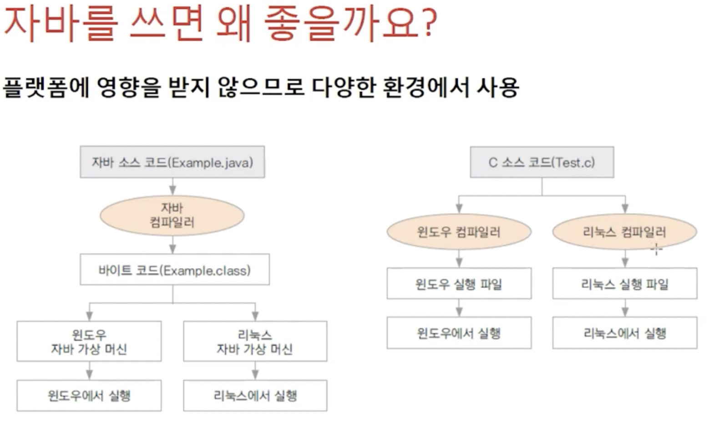

<link href="../../md/style.css" rel="stylesheet">

# 자바 기본

## 1) 프로그래밍이란?

- 컴퓨터에 일을 하도록 명령어를 만드는 것
- 컴파일 : 프로그래밍 언어를 컴퓨터가 알 수 있는 언어로 바꿔주는 일
- 컴파일러 : 컴파일을 하기 위해 사용되는, 기계어로 변역해주는 프로그램. 자바를 설치하면 자바 컴파일러도 설치 됨.

## 2) 자바의 장점

- 컴파일을 해주는 컴파일러에 대해 각 OS마다 결과가 다를 수 있는데, JVM에서 동작하므로 플랫폼에 영향을 받지 않음

  - Out file로 나오는 Example.class를 OS마다의 JVM을 통해 실행될 수 있음  
    

- 객체지향 언어라 유지보수가 쉽고 확장상이 좋음
- 프로그램이 안정적
- 풍부한 기능을 제공하는 오픈 소스
