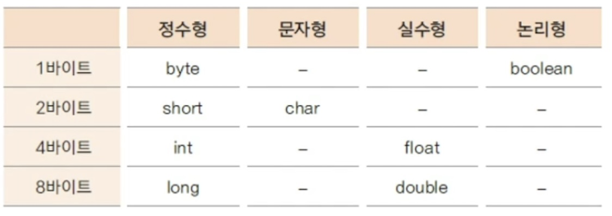
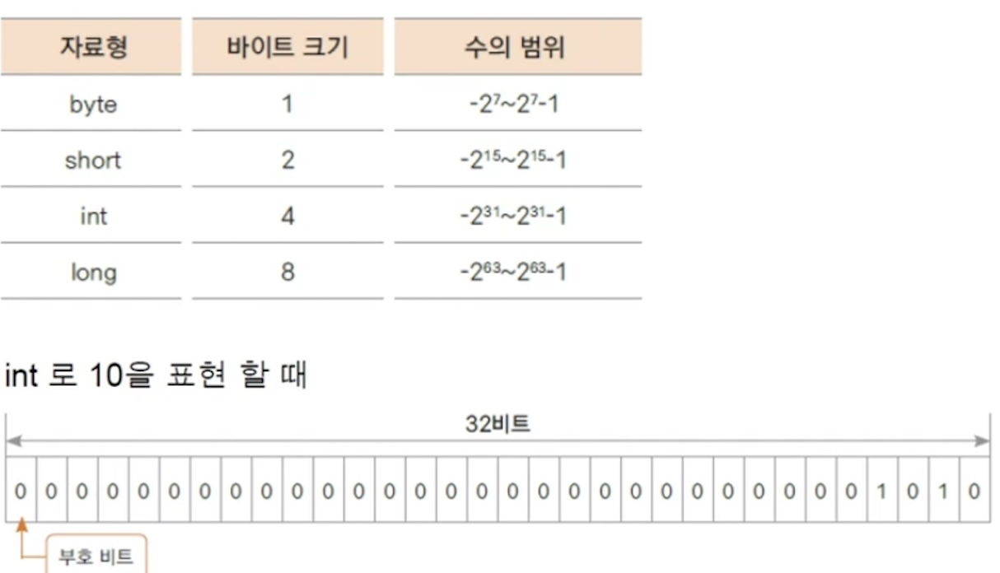
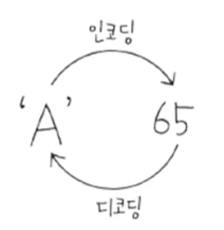
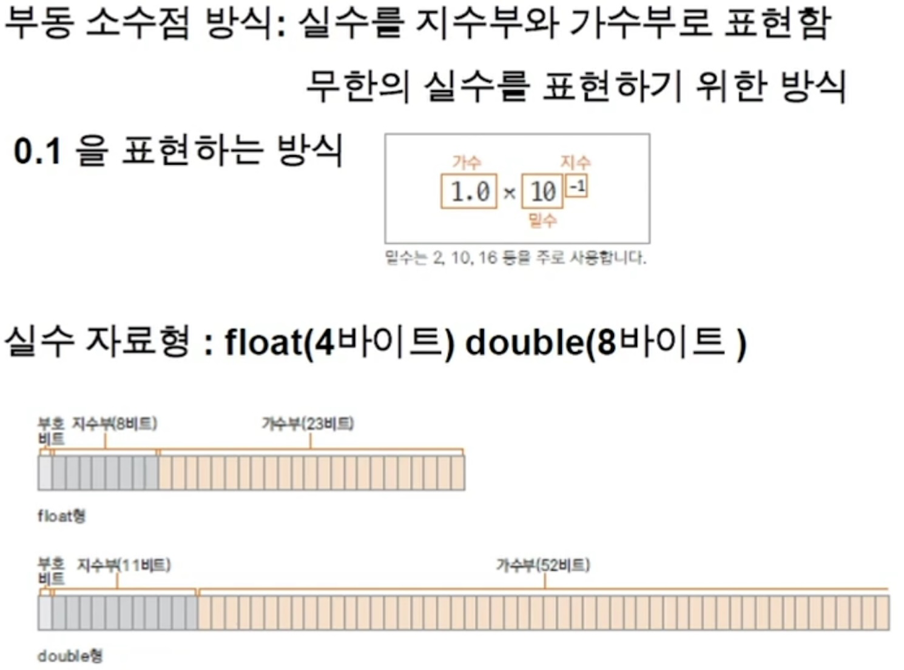
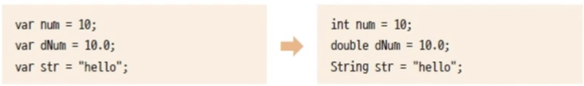

<link href="../../md/style.css" rel="stylesheet">

# 변수와 자료형 (2)

## 1) 변수

- 자료 저장 공간
- 메모리(주메모리) 주소 대신 부르는 이름
- 사용되기 이전에 선언
- 키워드 피할 것
- 대소문자 구분
- 이름 사이에 공백이 있을 수 없음
- 시작은소문자 + camel case로 하는 경우가 많음
- 숫자 자료형 다 signed로 포함해서 범위를 지정해놓음
- 종류  
    
  

  1. byte
     - 8비트 = 1바이트
     - 동영상 음악 등의 자료 처리에 좋은 자료형
  2. short
     - 2바이트 단위 자료형
     - c/c++ 언어 호환용 주로 사용
  3. int
     - 32 자리 비트 = 4 바이트
     - 프로그램에서 사용하는 모든 숫자(리터럴) 은 기본적으로 int
     - 32 비트 초과시 long 사용
  4. long

     - 리터럴(숫자 자체)가 int형의 범위 넘어서면 L을 붙여서 long 형임을 알게 해주는 것

  5. char
     - 컴퓨터는 문자도 기본적으로 내부에서 비트의 조합으로 표현
     - Java에서는 문자를 2바이트로 처리
     - 문자 세트
       - 정의 : 문자를 위한 코드값들을 정해놓은 세트(숫자값을 정해놓음)
       - 아스키 : 1바이트로 영문자, 숫자, 특수문자 등을 표현
       - 유니코드 : 영어 외의 한글과 같은 다국적 복합 언어를 표현하기 위한 표준 인코등(UTF-8, UTF-16등이 대표적)
       - 결과적으로 문자를 변수에 저장시, 문자에 해당하는 코드값이 저장
       - 자바는 utf 16을 사용
     - 인코딩 : 문자에 따른 특정 숫자값을 부여
     - 디코딩 : 숫자값을 원래 문자로 변환
     - 예시  
       
  6. Float & Double

     

  - 기본적으로 double 형으로 처리
  - Float로 사용하는 경우에 식별자 달아줌(리터럴에)

  7. Boolean
     - 참 거짓을 표현

## 2) 자료형 없이 변수 사용

- 자료형 필요 이유

  - 변수 선언시 변수가 사용할 메모리 크기와 타입을 구분하기 위해 자료형 사용
  - 지역 변수 자료형을 추론
  - 특징

    - 타입이 스크립트 언어와 다르게 자동으로 부여되고 다시 바뀔 수 없음
    - 지역 변수에서만 사용 가능

    
