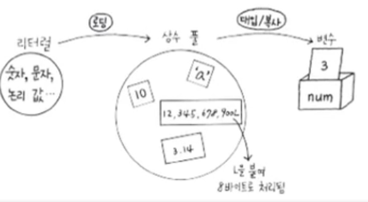
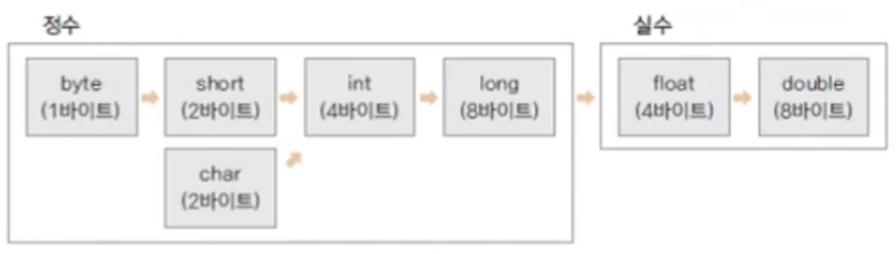

<link href="../../md/style.css" rel="stylesheet">

# 변수와 자료형 (3)

## 1) 상수

- 변하지 않는 값 / 변수
- final 키워드 사용
- 다른 값을 대입(변경)할 수 없음, 하면 오류 발생
- 상수는 convention이기 때문에, 대문자로 작성이 기본, enum과도 비슷

## 2) 리터럴

  

- 정의 : 프로그램에서 사용하는 모든 숫자, 값, 논리 값 <-> Constants 상수와 대비하기 위함
- 100, 3.14F 등이 리터럴
- 예시
  ```JAVA
    int num = 10;
  ```
  - 리터럴 10은 어디엔가 저장이 되어있고, 이 값이 num이라는 변수가 가르키는 포인터에 값이 복사되면서 넣어짐(즉 원본이 존재하고 복사됨)
  - 리터럴에 해당되는 값은 특정 메모리 공간인 상수 풀(Constant pool)에 있음
  - 필요한 경우 이 상수풀에서 가져와서 사용
  - 프로그램이 로드될 때(주메모리에 적재될 때), 사용하는 상수들은 상수풀에 자리 잡음[보통의 프로그램에 경우- excel 등]
  - 실수 : double, 정수 : int 로 기본 선택되어 저장되기 때문에, 특정 리터럴로 사용하고자 할 때, float / double로 명시해주어야 하는 것

## 3) 형 변환



- 자료형은 각각 사용하는 메모리 크기 / 방식이 다름
- 서로 다른 자료형의 값이 대입이 되는 경우 형변환이 일어남
- 정수 -> 실수의 방향으로 커지는 데이터 형식
- 종류
  1. 묵시적 형변환 : 작은수에서 큰수로(명시 안해줘도 자동으로), 큰수로 가는거는 묵시적으로 해도 정보가 잘려나가지 않기 때문에 묵시정 형변환 가능  
     즉 명시를 안해줘도 잘 형변환이 일어남
     ```JAVA
     long num = 3;
     ```
  2. 명시적 형변환 : 묵시적 경우의 반대, 변환되는 자료형을 명시를 해주어야함, 당연히 자료의 손실이 있음
     ```JAVA
     double dNum = 3.14;
     int num = (int)dNum; // 자료형 명시해주어야 함
     ```
- 예시

  ```JAVA
  // 1) 묵시적 형변환
  double dNum = fNum + num; // num이 float형으로 변환, 더해질 때 double로 형변환


  // 2) 명시적 형변환
  int iNum = 1000;
  byte bNum = (byte)iNum; // 작아지는 방향은 casting으로 명시를 할 것
  System.out.println(bNum); // int 4byte인데 bNum은 1byte이므로 1 바이트까지만 잘려버림 : -24

  // 명시적으로 소수점 버리는 경우
  double dNum = 3.14;
  iNum = (int)dNum;
  System.out.println(iNum); // 소수점 이하 잘려버림 : 3

  // 소수점 유실 : truncated
  float fNum = 0.9F;
  int num1 = (int)dNum + (int)fNum; // 3 + 0 => 3
  int num2 = (int)(dNum+fNum); // 4.1x => 4

  System.out.println(num1);
  System.out.println(num2);
  ```
