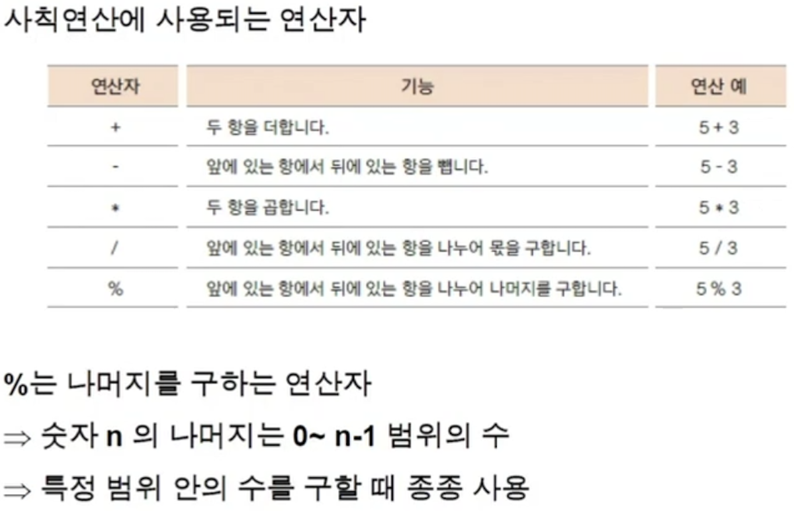
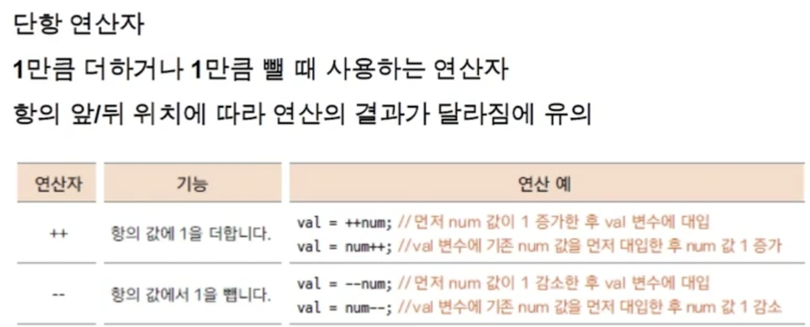

<link href="../../md/style.css" rel="stylesheet">

# 연산자 -1

## 1) 대입 연산자

- JAVA

  ```JAVA
    public class OperatorEx1 {

        public static void main(String[] args) {
            /**
            왼쪽 변수에 오른쪽 값을 대입
            우선순위가 가장 낮은 연산자

            */
            int age = 24;
            System.out.println(age);

            int num = 10;
            int num2 = -num;

            System.out.println(num);
            System.out.println(num2);
        }
    }
  ```

## 2) 산술 연산자



## 3) 증가 감소연산자



- JAVA

  ```JAVA
    public class OperatorEx2 {
        public static void main(String[] args) {
            int num = 10;

            System.out.println(num++); // 10을 리턴 후, 11이 됨
            System.out.println(++num); // 12가 되고 12 리턴
            System.out.println(num); // 12 리턴

        }
    }
  ```

## 3) 관계 연산자

- 부등호 (다른 언어랑 같음 - C)

## 4) 논리 연산자


## 5) 단락 회로 평가

- JAVA

  ```JAVA
    public class OperationEx1 {

        public static void main(String[] args) {
            int num1 = 10;
            int i = 2;

            boolean value = ((num1 = num1 + 10) > 10) && ((i = i + 2) > 10); // 여기서 앞에 항이 true여야 뒤로 가서 평가

            System.out.println("value = " + value);
            System.out.println("num1 = " + num1);
            System.out.println("i = " + i);
        }
    }
  ```

- Result - Terminal
  ```TEXT
    value = false
    num1 = 20
    i = 4
  ```
