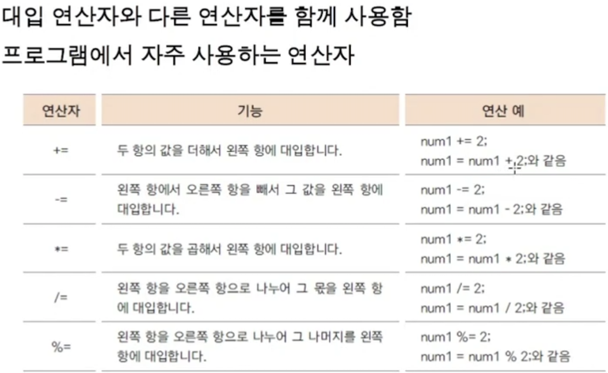
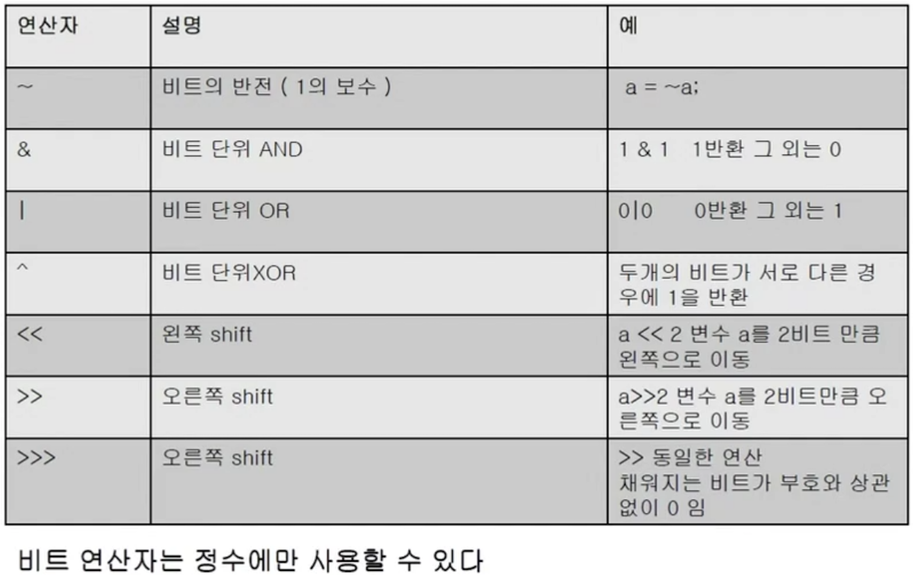

<link href="../../md/style.css" rel="stylesheet">

# 여러가지 연산자 2

## 1) 복합대입 연산자



- JAVA

  ```JAVA
    public class OperationEx2 {

        public static void main(String[] args) {

            int num1 = 10;

            System.out.println("num1 +=1 = ");
            System.out.println(num1 +=1);

            System.out.println("num1 %=10 = ");
            System.out.println(num1 %= 10);

        }
    }
  ```

- Result - Terminal
  ```TEXT
    num1 +=1 =
    11
    num1 %=10 =
    1
  ```

## 2) 조건 연산자


## 3) 비트 연산자




