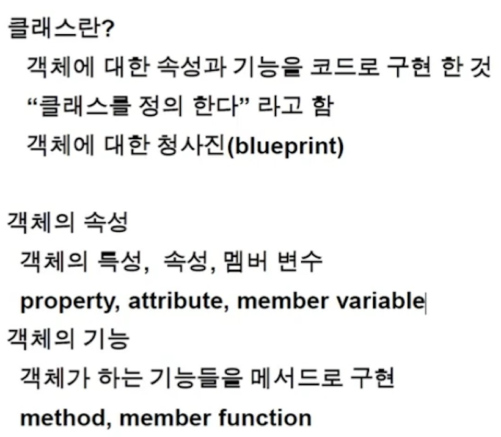
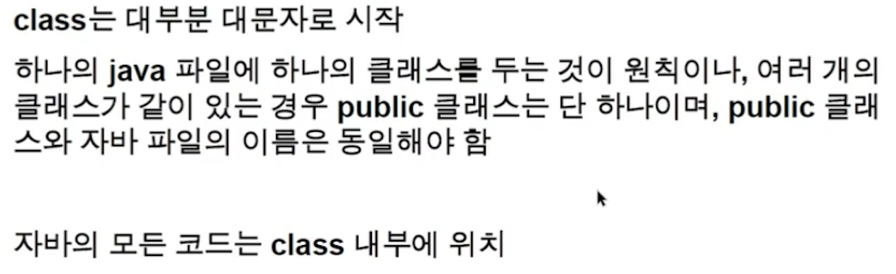
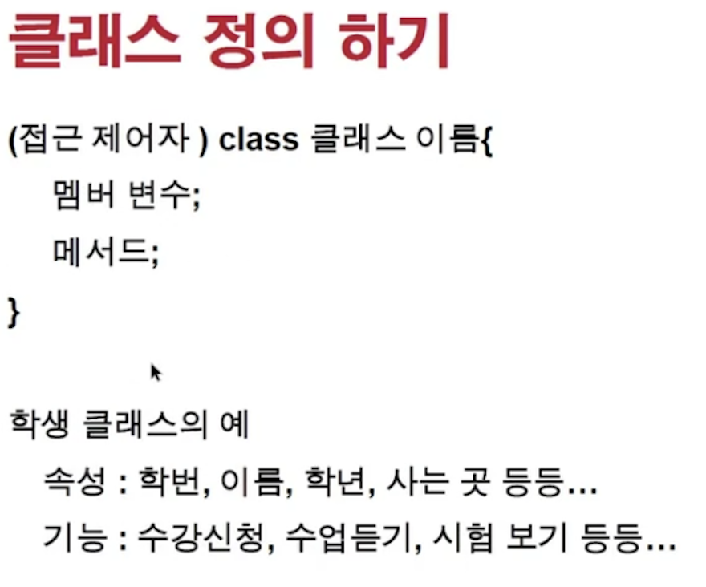
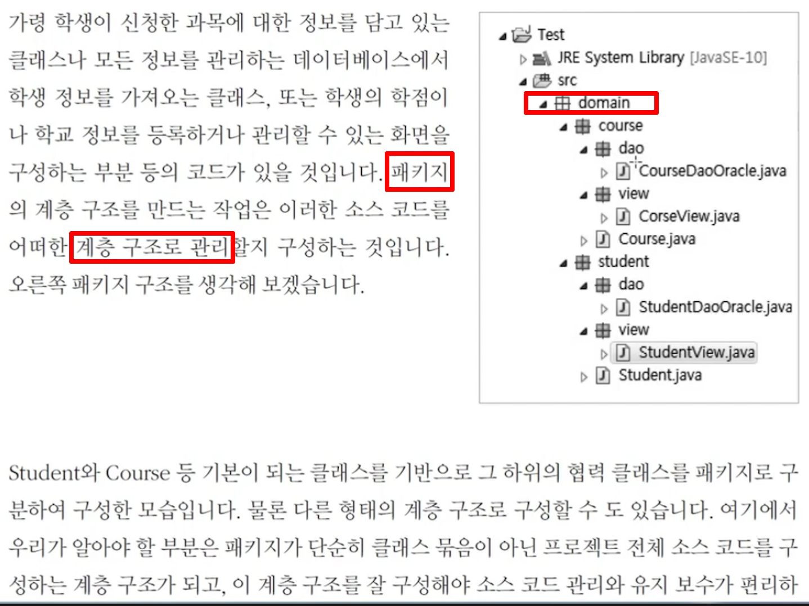

<link href="../../md/style.css" rel="stylesheet">

# 클래스와 객체

## 1) 객체지향 프로그래밍

- 역할과 구현으로 구분
- 객체들간의 협력을 중시
- 추, 캡, 상, 다
- SOLID 원칙을 지켜야 함

## 2) 클래스

- 클래스 특징 / 정의  
    
  

  - Package는 소문자로 하기
  - 여러개의 클래스가 한 .java파일 안에 존재하는 경우 Public을 갖는 클래스는 하나여야 함

- Syntax

    

- 접근 제어자로, public / private 설정 가능

  - 접근 제어자란?

    - [접근 제어자 참조 링크](http://tcpschool.com/java/java_modifier_accessModifier)
    - 정의

    ```TEXT
      접근 제어자(access modifier)

      객체 지향에서 정보 은닉(data hiding)이란 사용자가 굳이 알 필요가 없는 정보는 사용자로부터 숨겨야 한다는 개념입니다.
      그렇게 함으로써 사용자는 언제나 최소한의 정보만으로 프로그램을 손쉽게 사용할 수 있게 됩니다.

      자바에서는 이러한 정보 은닉을 위해 접근 제어자(access modifier)라는 기능을 제공하고 있습니다.
      접근 제어자를 사용하면 클래스 외부에서의 직접적인 접근을 허용하지 않는 멤버를 설정하여 정보 은닉을 구체화할 수 있습니다.

      자바에서는 다음과 같은 네 가지의 접근 제어자를 제공합니다.

      1. private
      2. public
      3. default
      4. protected
      5. staic
      6. final
    ```

## 3) 클래스 구성

- JAVA

  - 여기서 public static void main 은 JDK가 인식하여 돌려주는 부분(거의 프레임워크..?)
  - 이부분을 메인 메써드라고 함
  - 반드시 포함되는 부분은 아님, 구동부

  ```JAVA
    package com.main.Chapter2.classpart;

    public class Student {
        // String은 문자열 취급하기 위한 JDK에서 제공하는 API
        int studentID;
        String studentName;
        int grade;
        String address;

        public Student(int studentID, String studentName, int grade, String address) {
            this.studentID = studentID;
            this.studentName = studentName;
            this.grade = grade;
            this.address = address;
        }

        public void ShowStudentInfo(){
            System.out.println("studentName = " + studentName);
            System.out.println("address = " + address);
        }

        public static void main(String[] args) {
            Student studen_Lee = new Student(1, "Yang HoJun", 100, "146 Street");
            studen_Lee.ShowStudentInfo();
        }
    }
  ```

- Result - Terminal
  ```TEXT
    studentName = Yang HoJun
    address = 146 Street
  ```

## 4) 패키지 묶음



- 패키지 별로 연관성이 있는것을 묶어서 관리하는 것
- 소스의 묶음