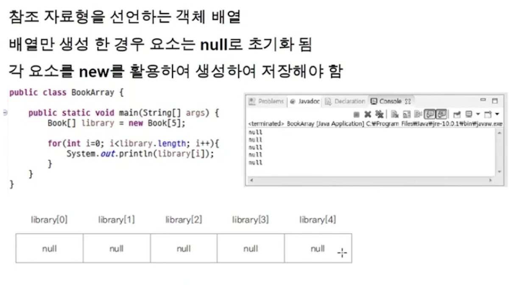
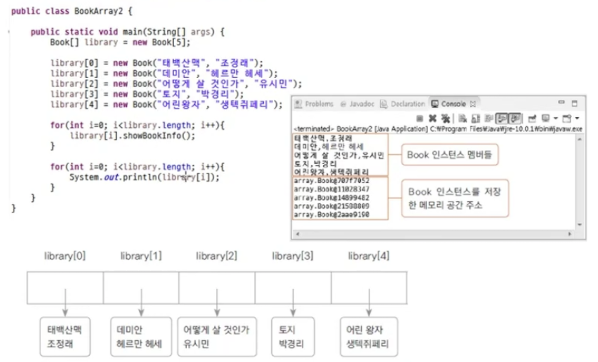
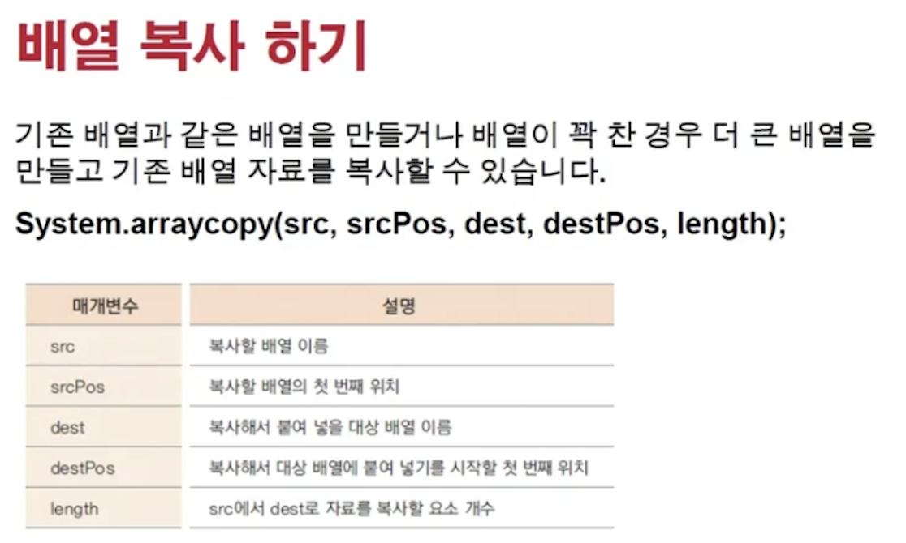
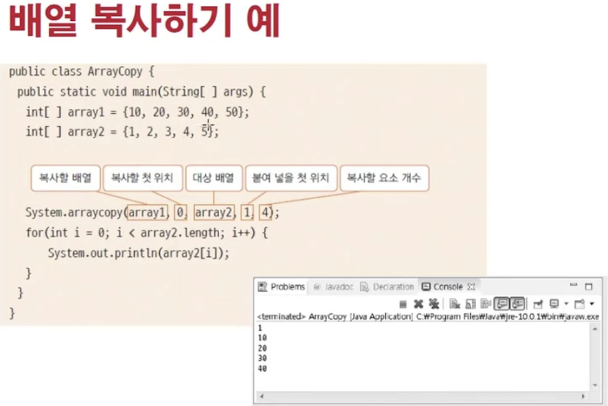
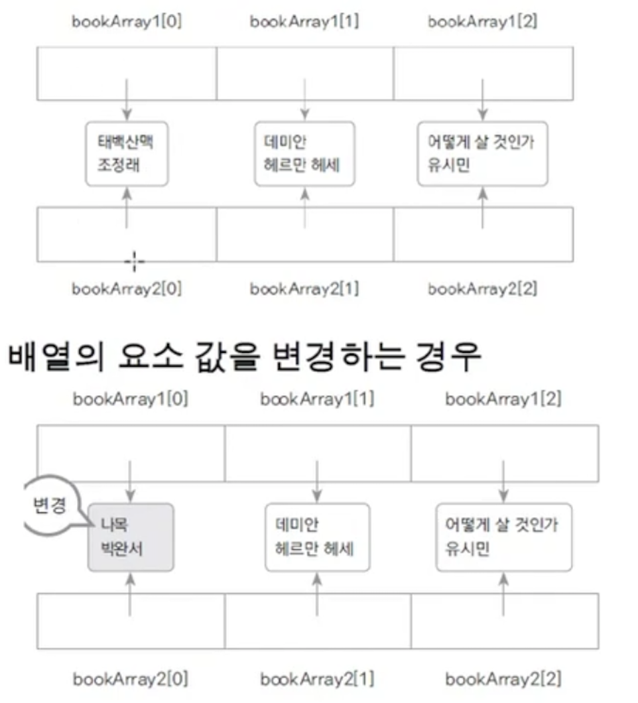
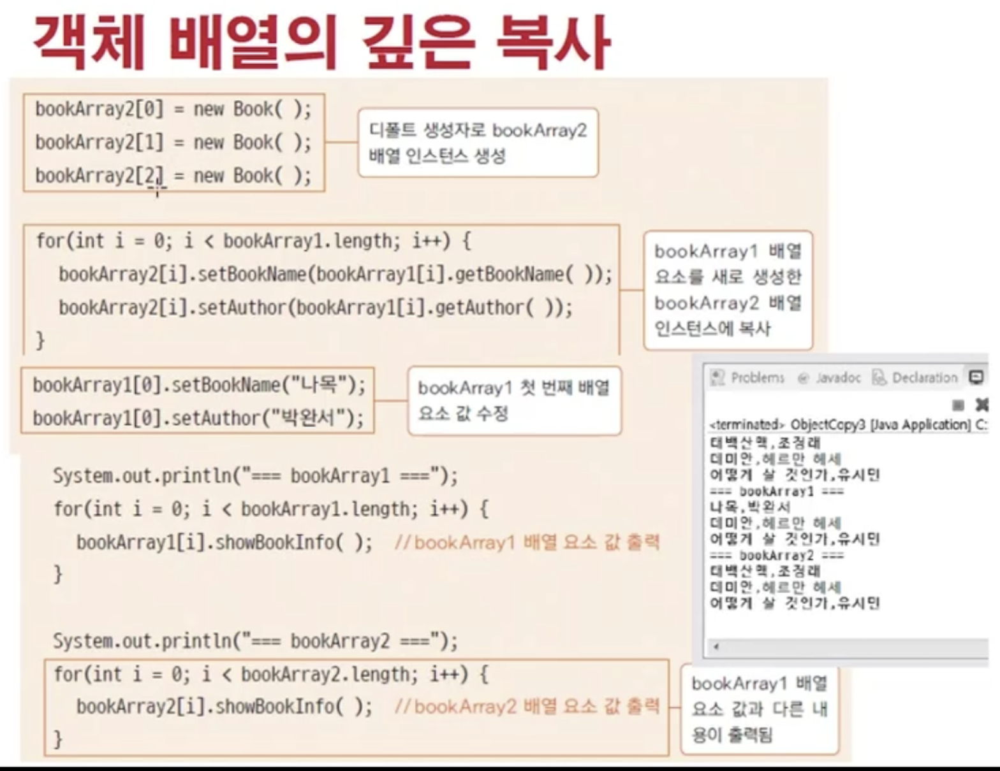

<link href="../../md/style.css" rel="stylesheet">

# 객체를 index 값으로 갖는 배열

## 1) 객체 배열 만들기

  


- 각 한칸의 array는 메모리 상에서 물리적으로 붙어있으며, 4byte (primitive int 형과 같은 크기)임
- 기본 자료형과 다른 점은  
  **`초기화가 null로 되며, container로서 사용되는 array 및 자료구조를 초기화 시켜야한다는 점`**

## 2) 배열 복사하기

  


## 3) Object 배열 복사허기

<br>



<br>

- Example

  - JAVA

    ```JAVA
      public static void main(String[] args) {
          Book[] bookArr1 = new Book[3];
          Book[] bookArr2 = new Book[3];

          bookArr1[0] = new Book("책1", "호준");
          bookArr1[1] = new Book("책2", "호준");
          bookArr1[2] = new Book("책3", "호준");

          for (int i = 0; i < bookArr1.length; i++) {
              System.out.println("i = " + i);
              System.out.println("bookArr1 = " + bookArr1[i]);
          }

    //        Shallow copy - Heap의 주소가 복사되어 들어가는 것
          System.arraycopy(bookArr1,0,bookArr2, 0, 3);
          for (int i = 0; i < bookArr2.length; i++) {
              System.out.println("i = " + i);
              System.out.println("bookArr2 = " + bookArr1[i]);
          }
    ```

  - Result - Terminal
    - 출력된 인스턴스의 주소가 인덱스별로 동일함
      ```TEXT
        i = 0
        bookArr1 = com.main.Chapter2.array.Book@3796751b
        i = 1
        bookArr1 = com.main.Chapter2.array.Book@67b64c45
        i = 2
        bookArr1 = com.main.Chapter2.array.Book@4411d970
        i = 0
        bookArr2 = com.main.Chapter2.array.Book@3796751b
        i = 1
        bookArr2 = com.main.Chapter2.array.Book@67b64c45
        i = 2
        bookArr2 = com.main.Chapter2.array.Book@4411d970
      ```

## 4) 객체 배열의 깊은 복사

- 그냥 하나씩 new 생성자로 default constructor 불러 **`생성해서`** heap에 만들어주는 식으로 함..(?)


