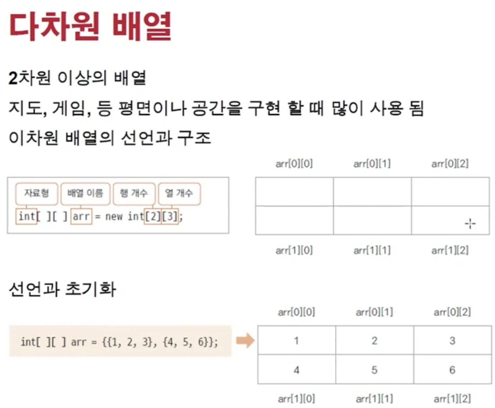
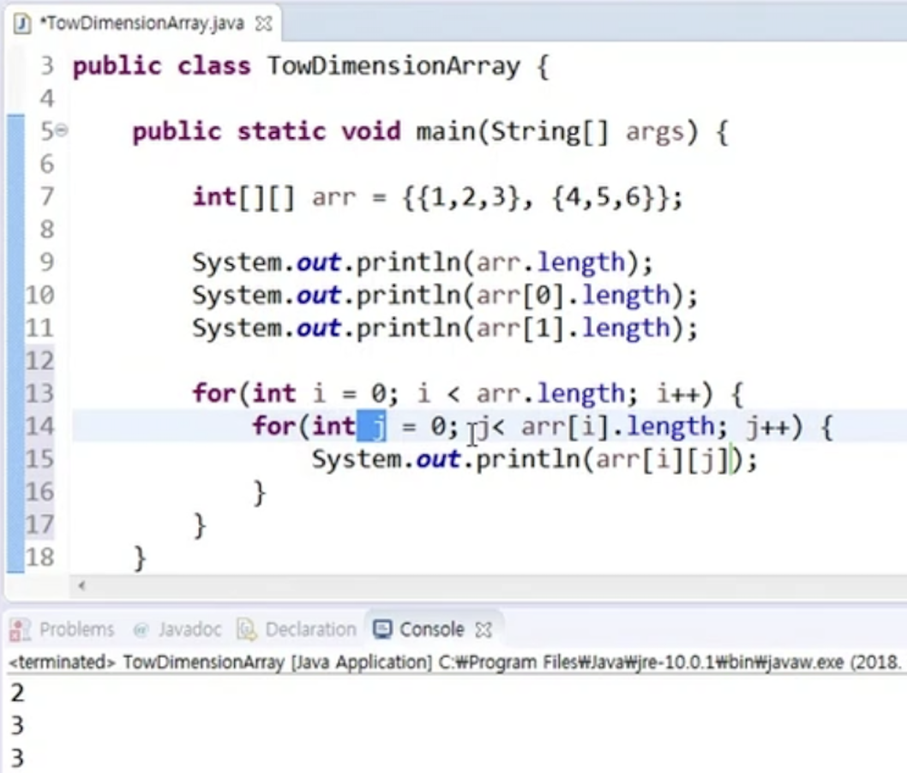

<link href="../../md/style.css" rel="stylesheet">

# 다차원 배열

<br>



<br>

## 1) 배열 접근

- 대괄호 2번 써서 indexing - 다른 언어와 동일
- 행 -> 다음 열로 선택됨

- Example

  - JAVA

    ```JAVA
      public class TwoDimensionArray {

          public static void main(String[] args) {
              int[][] arr = new int[2][3];

              System.out.println("arr.length = " + arr.length);

              System.out.println("arr[0].length = " + arr[0].length);
          }

      }

    ```

  - Result - Terminal

    ```TEXT
      arr.length = 2
      arr[0].length = 3

    ```

## 2) 이중 for문으로 접근


