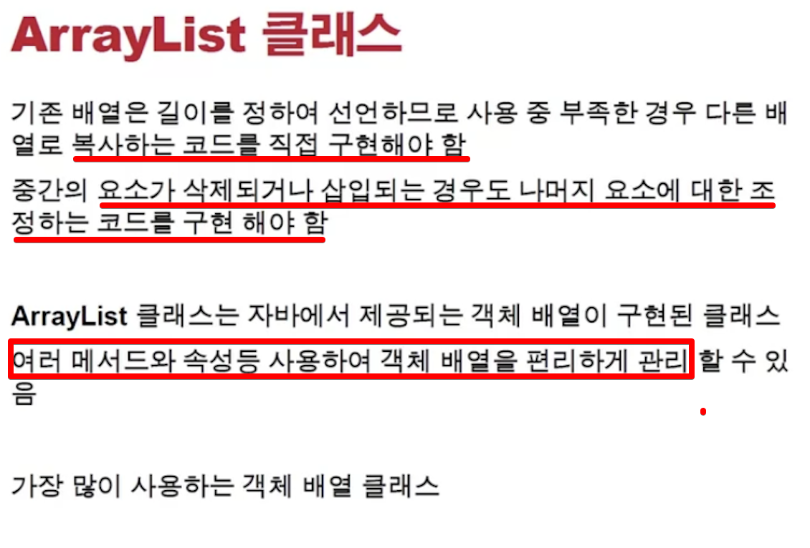
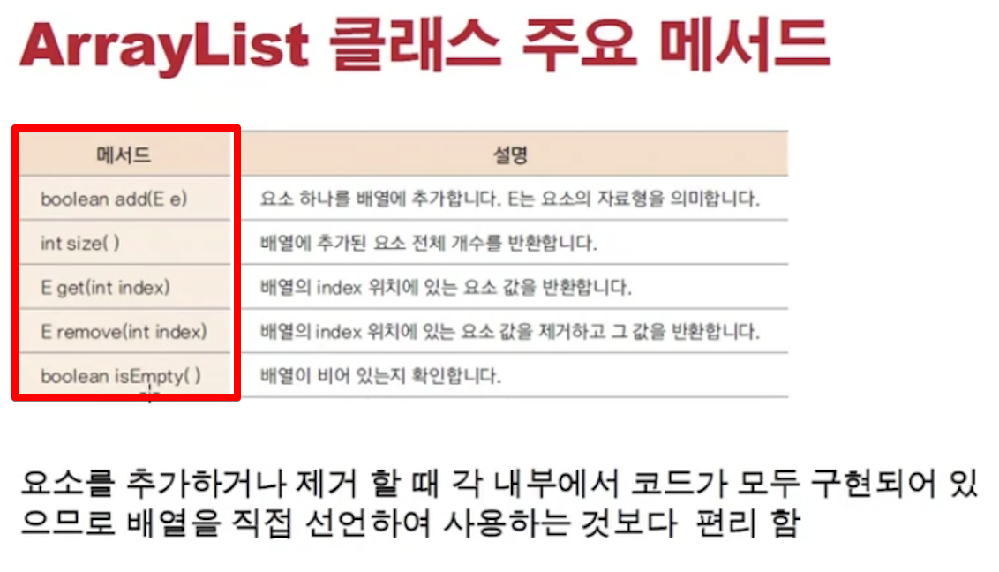

<link href="../../md/style.css" rel="stylesheet">

# ArrayList 클래스

<br>



<br>



<br>

- 참고 :

  - Type parameters: \<E> – the type of elements in this list, Generic Type(객체를 받아야 함)!
  - 상속을 받아서 생성된 ArrayList 임
  - Syntax : \< E > 에 object 타입을 넣어서 사용

- 내부 배열을 사용하고, fixed가 아니며, indexing은 list 처럼 동작(유일무이 값이 아님)
- 객체 배열을 쓸 때 가장 많이 쓰는 클래스

## 1) Array list 사용법

- Example

  - JAVA

    - 요즘은 무조건 \<E> 명시해서 작성하는 것이 원칙
    - ArrayList 에서는 index 연산자가 제공되지 않고, get을 써야 함

    ```JAVA
      public static void main(String[] args) {
          ArrayList<String> arrayList = new ArrayList<String>();
          arrayList.add("AAA");
          arrayList.add("BBB");

          for (int i = 0; i < arrayList.size(); i++) {
              System.out.println("arrayList = " + arrayList.get(i));
          }

      }

    }
    ```

  - Result - Terminal

    ```TEXT
      arrayList = AAA
      arrayList = BBB

    ```

## 2) Array list를 데이터로 사용

- Example

  - JAVA

    ```JAVA
      public class ListSubject {


          private String subjectName;
          private int scorePoint;

          public ListSubject(String name) {
              this(name, 0);
          }

          public ListSubject(String name, int scorePoint) {
              this.subjectName = name;
              this.scorePoint = scorePoint;
          }

          public String getSubjectName() {
              return subjectName;
          }

          public void setSubjectName(String subjectName) {
              this.subjectName = subjectName;
          }

          public int getScorePoint() {
              return scorePoint;
          }

          public void setScorePoint(int scorePoint) {
              this.scorePoint = scorePoint;
          }
      }

      class ListStudentTest {

          ListStudent listStudent = new ListStudent(123, "호준");

          @Test
          void addSubjects() {
              listStudent.addSubject("Java", 100);
              listStudent.addSubject("Python", 200);

              listStudent.showStudentInfo();

          }

      }
    ```

  - Result - Terminal
    ```TEXT
      subject.getSubjectName() = Java
      subject.getSubjectScore() = 100
      subject.getSubjectName() = Python
      subject.getSubjectScore() = 200
    ```
