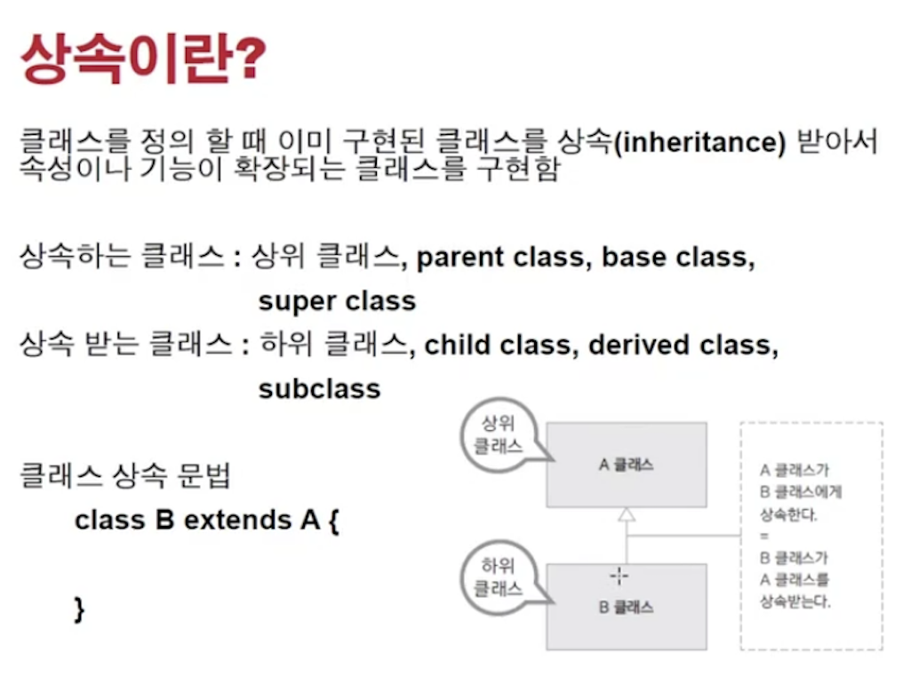
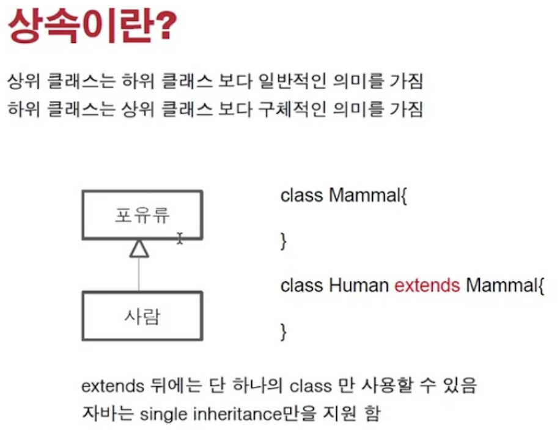
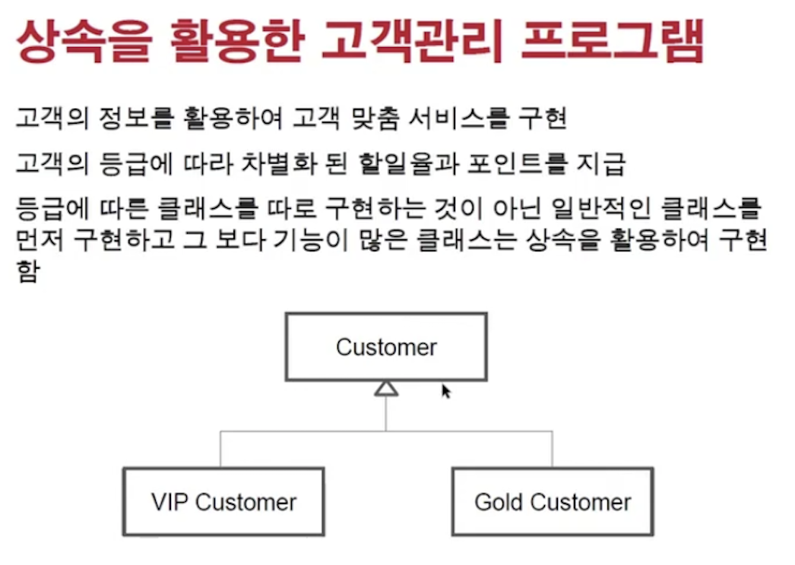

<link href="../../md/style.css" rel="stylesheet">

# 상속과 다형성

- 프로그램의 구조를 잘 잡아야 하는 것
- 리팩터링 대상( 클린코드 + 유지보수의 효율성을 잡기 위함 ) -> 유지보수할 때 객체지향적으로 구현할 것

## 1) 상속이란?



- Super, parent class
- extends syntax 사용

## 2) 상속의 개념

<br>



<br>

- "상속 = 재사용"의 equal의 개념은 아님
- 기능의 확장(추상화, 캡슐화, 상속, 다형성) 중에 상속 -> 구체적인 것을 받는 것
- 자바는 single inheritance를 사용하고, 필요한 경우 interface는 여러개를 적용할 수 있음(역할, 필수적으로 가져야 하는 것)

<br>

- 다음의 경우와 구분할 것

  1. Point라는 클래스와 이를 활용하는 Circle -> extend 할것은 아님

     - JAVA

       ```JAVA
         public class Point {

             private int x;
             private int y;

             public int getX() {
                 return x;
             }

             public void setX(int x) {
                 this.x = x;
             }

             public int getY() {
                 return y;
             }

             public void setY(int y) {
                 this.y = y;
             }
         }

         ...

         public class Circle {

             Point point; // has-a  <->  상속은 is-a 관계
             private int radius;

         }
       ```

  2. 언제 상속을 쓰는가?
     - 이미 구체적인 클래스가 작성이 되어있고(기능들이 있는), 그 기능을 가져다가 더 구체적인 클래스를 작성하고자 할 때
     - Python에서 thread 상속 이후, run 매서드 호출하는 새로운 클래스가 필요할 때 상속하는 경우 생각하면 쉬울 듯

## 3) 상속 예제



<br>

- 1개의 등급 고객에서 서비스가 발전하여, 기여도가 높은 고객을 분리해야할 때
- 일반 고객의 기능 + 등급이 높아진 경우에 대해 더 기능을 작성하는 경우
- Protected : 상속관계에서는 사용가능하고, 그 외에는 private처럼 동작하는 것

## 4) **`생성자와 빌더 패턴`**

[링크 참조](https://johngrib.github.io/wiki/builder-pattern/)

- Example

  - JAVA

    ```JAVA
      // Effective Java의 Builder Pattern
      public class NutritionFacts {
          private final int servingSize;
          private final int servings;
          private final int calories;
          private final int fat;
          private final int sodium;
          private final int carbohydrate;

          public static class Builder {
              // Required parameters(필수 인자)
              private final int servingSize;
              private final int servings;

              // Optional parameters - initialized to default values(선택적 인자는 기본값으로 초기화)
              private int calories      = 0;
              private int fat           = 0;
              private int carbohydrate  = 0;
              private int sodium        = 0;

              public Builder(int servingSize, int servings) {
                  this.servingSize = servingSize;
                  this.servings    = servings;
              }

              public Builder calories(int val) {
                  calories = val;
                  return this;    // 이렇게 하면 . 으로 체인을 이어갈 수 있다.
              }
              public Builder fat(int val) {
                  fat = val;
                  return this;
              }
              public Builder carbohydrate(int val) {
                  carbohydrate = val;
                  return this;
              }
              public Builder sodium(int val) {
                  sodium = val;
                  return this;
              }
              public NutritionFacts build() {
                  return new NutritionFacts(this);
              }
          }

          private NutritionFacts(Builder builder) {
              servingSize  = builder.servingSize;
              servings     = builder.servings;
              calories     = builder.calories;
              fat          = builder.fat;
              sodium       = builder.sodium;
              carbohydrate = builder.carbohydrate;
          }
      }
    ```

  - Builder 1
    ```JAVA
      NutritionFacts.Builder builder = new NutritionFacts.Builder(240, 8);
      builder.calories(100);
      builder.sodium(35);
      builder.carbohydrate(27);
      NutritionFacts cocaCola = builder.build();
    ```
  - Builder 2
    ```JAVA
      // 각 줄마다 builder를 타이핑하지 않아도 되어 편리하다.
      NutritionFacts cocaCola = new NutritionFacts
          .Builder(240, 8)    // 필수값 입력
          .calories(100)
          .sodium(35)
          .carbohydrate(27)
          .build();           // build() 가 객체를 생성해 돌려준다.
    ```
