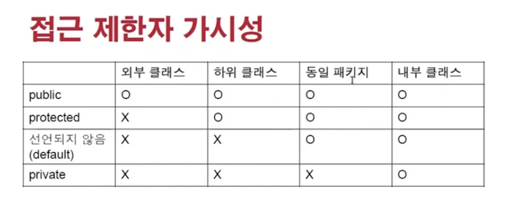
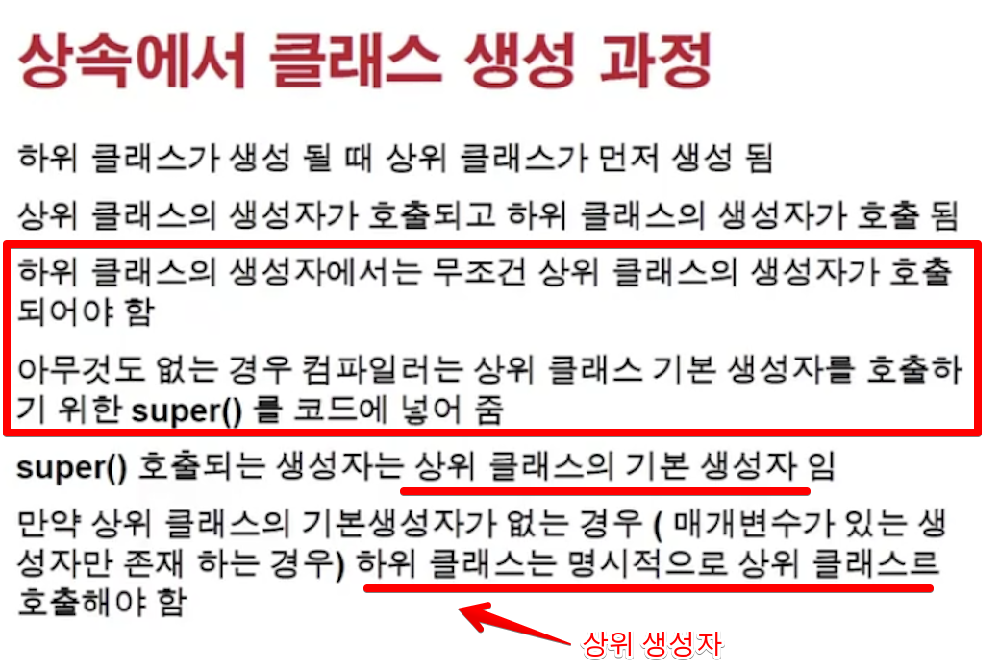
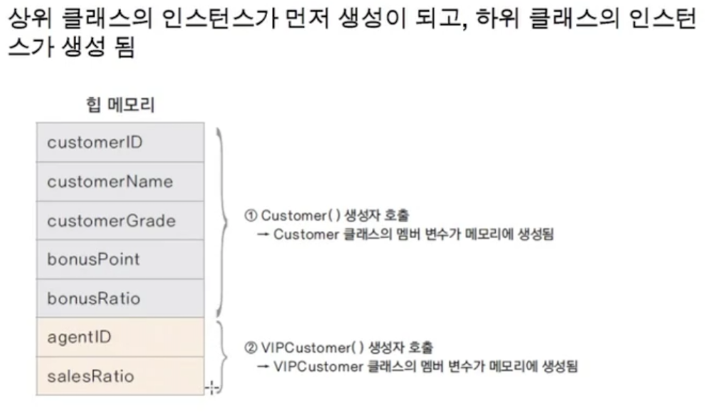
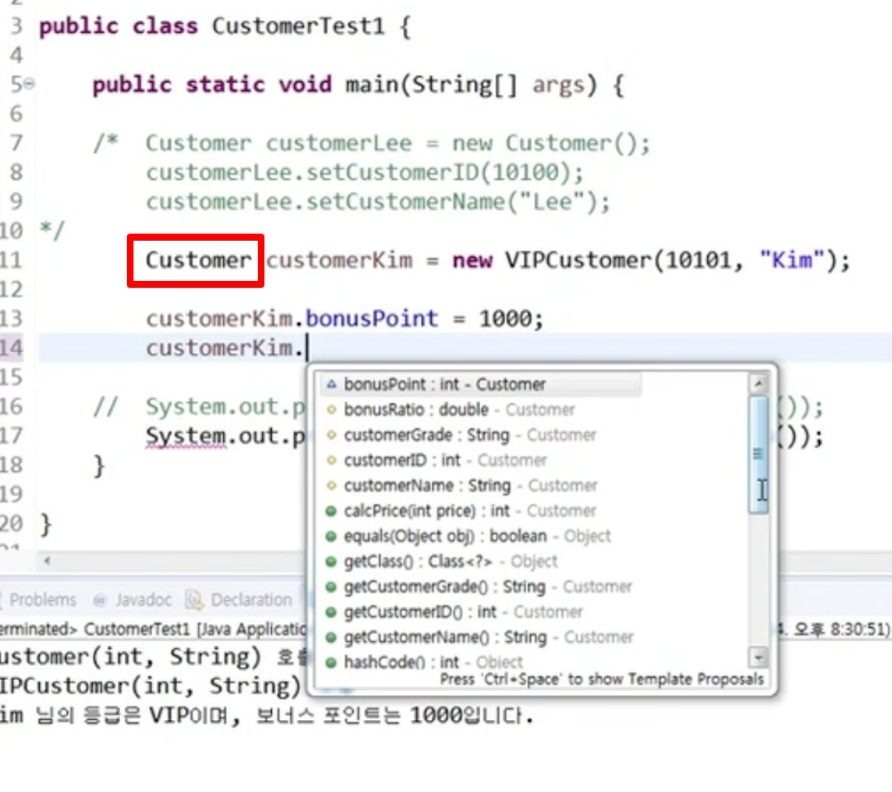
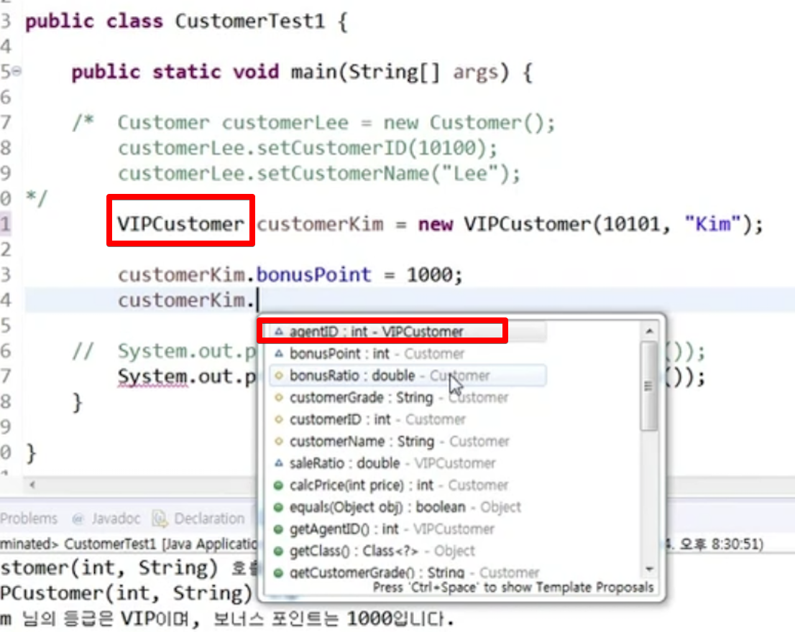
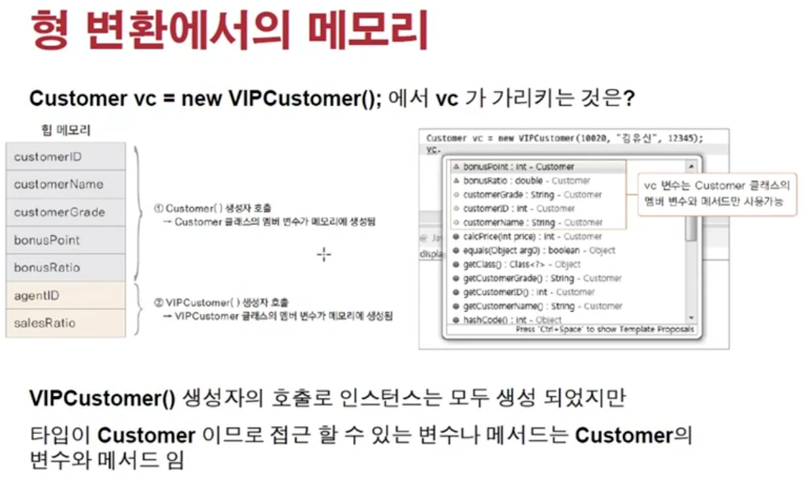

<link href="../../md/style.css" rel="stylesheet">

# 상속과 다형성 2



## 1) 상속에서 클래스 생성 과정



- 여기서, 이전 상속과 다형성-(1)의 예제에서 상위는 Customer, 하위는 VIPCustomer
- VIPCustormer에서 상위 Customer 그대로 access 가능!
- 상속을 사용한 경우, 상위 클래스가 먼저 생성되고난 후, 하위클래스가 생성됨(생성자가 불린다는 뜻)  
  -> **`다만, 기본 생성자가 호출되고, 인자를 가진 생성자는 명시적으로 작성해야주어야 함`**
  **`Default constructor를 super에서 안쓰는 경우, 명시적으로 init해주어야 함`**
  -> **`super()를 하위 생성자의 생성자에 넣어줌(컴파일러가 프리컴파일 단계에서 넣어줌)`**

## 2) 상속에서의 메모리 상태, 생성자 제어하기



- 기본 생성자에서 접근이 안되는 private 변수들인 경우도 있기 때문에, super를 init해주는 것이 중요
- super.set_XXX 가 제공되는 경우에 이를사용하여 set을 해주어야할 수도 있음
- Example

  - JAVA

    ```JAVA
      public Customer(int customerID, String customerName){
        this.customerID = customerID;
        this.customerName = customerName;
        customerGrade = "SILVER";
        bonusRatio = 0.01;
      //	System.out.println("Cusomer(int, String) ������ ȣ��");
      }

      ...

      public VIPCustomer(int customerID, String customerName) {
        super(customerID, customerName); // 이부분에서 Customer 생성자 사용 - 명시적
        customerGrade = "VIP";
        bonusRatio = 0.05;
        saleRatio = 0.1;
      }
    ```

## 3) 상송과 형변환


- 하위 -> 상위 : 가능
  - VIPCustomer는 Customer 인스턴스 가능
- 상위 -> 하위 : 부분적(상속인 경우)

  - 어떤 Customer(상속이 된 VIP)는 VIP 인스턴스 가능

- Example

      
    

  - 업캐스팅으로 하위 클래스의 인스턴스 변수들이 사라짐
  - 묵시적 형변환(primitive에서는 메모리 사이즈 증가 방향으로 묵시적 형변환, 이외는 명시적이며 정보 loss)

    <br>

  - JAVA
    ```JAVA
      Customer example = new VIPCustomer(); // 이것을 사용했을 때
      /*
      1. 메모리는 VIP Customer가 가진 모든 클래스 변수/메서드 들이 heap에 올라가게 됨
      2. 업캐스팅으로 access는 할수 없게 됨(heap에는 VIP 전용 인스턴스변수들이 access가 안됨)
      3. Customer의 instace variable / method만 볼 수 있음
      4. 이렇게 사용하는 이유 -> 오버라이딩 & 다형성 과 관련이 있음
      */
    ```

## 4) 결론


