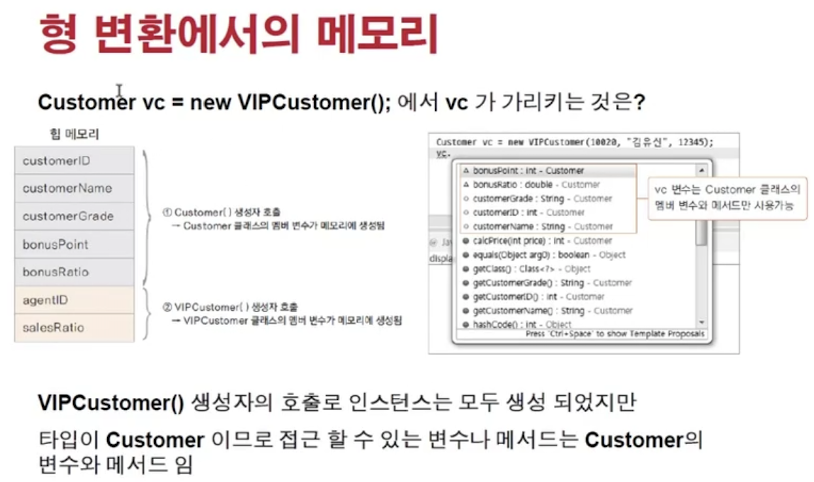
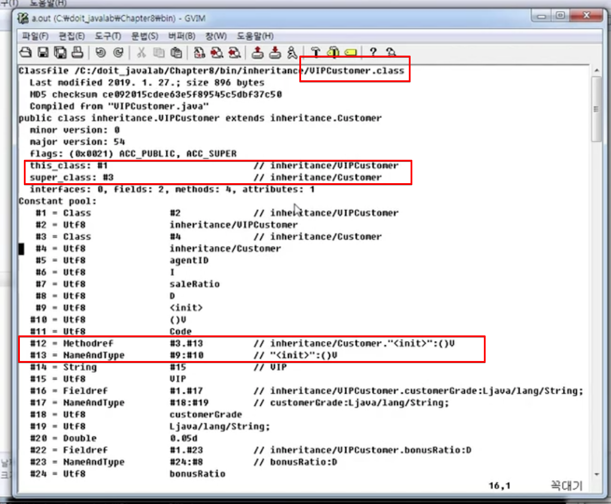
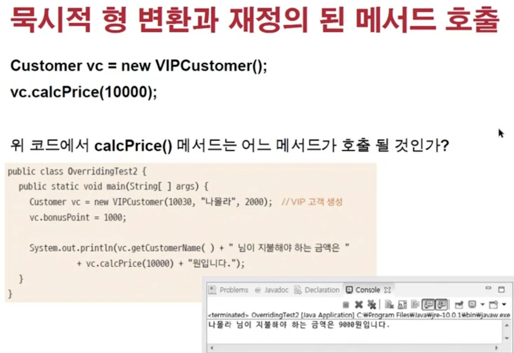
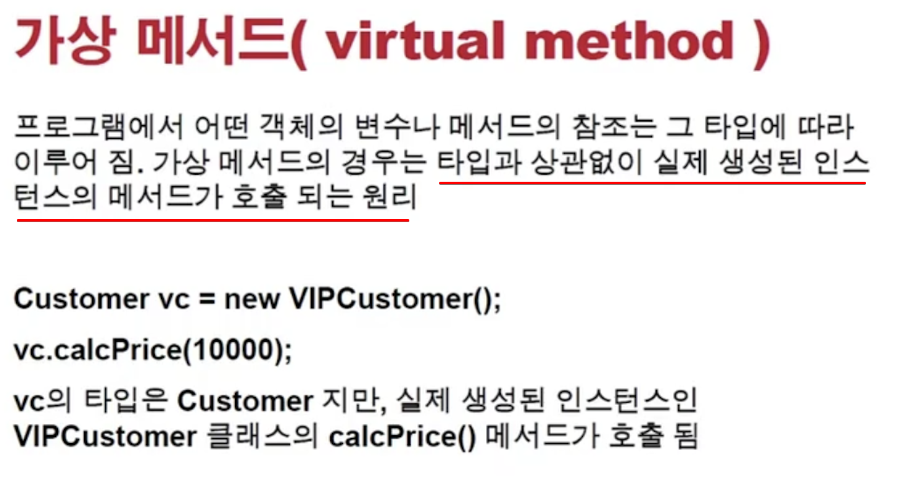
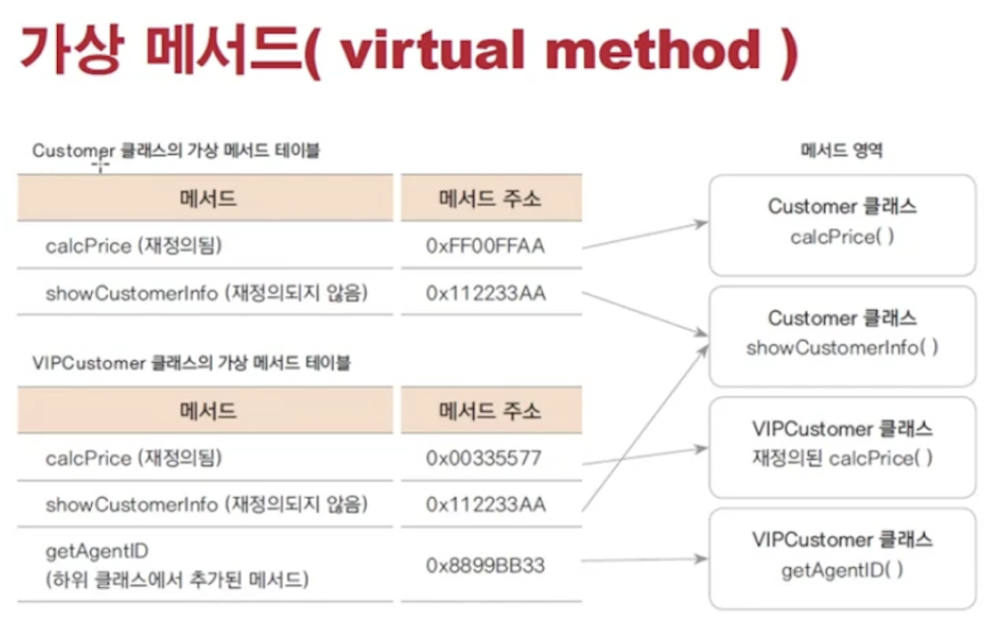
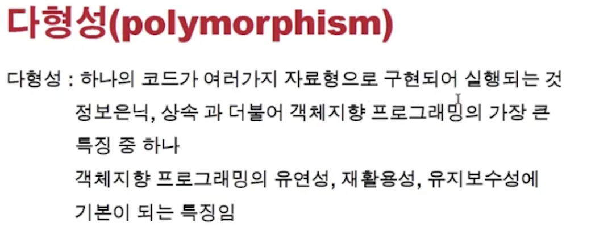
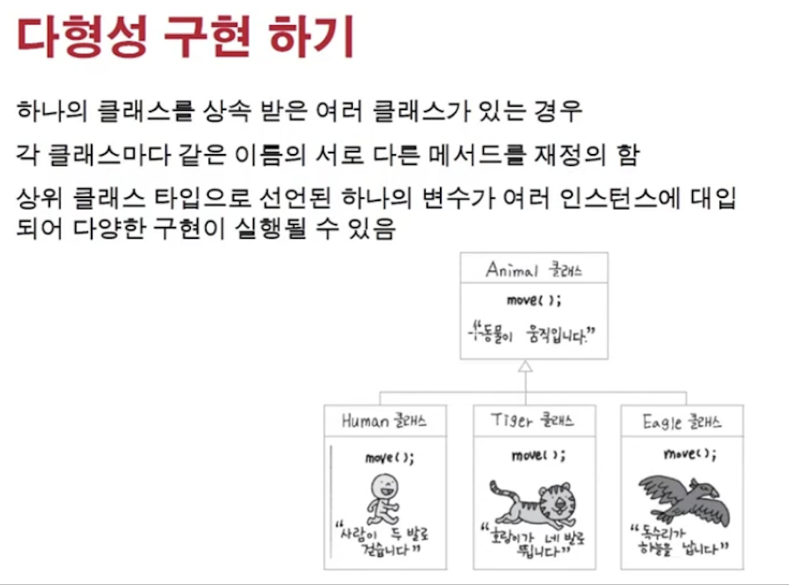
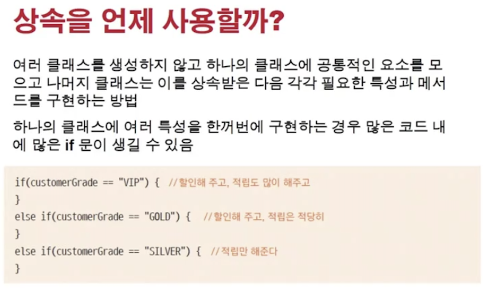

<link href="../../md/style.css" rel="stylesheet">

# 오버라이딩과 다형성

## 1) 업캐스팅 복습



<br>



- 자신의 상위 클래스의 정보들을 내포하고 있고, 그 정보때문에 "업캐스팅"이 가능

## 2) 오버라이딩

- 상위 클래스에 있는 매서드를, 하위 상속 클래스에서 맞게 사용할 수 있도록 변경하는 것

## 3) 가상메서드

- 가상 메서드

  - 묵시적 형변환에도, 오버라이딩 된 매서드가 불림
  - 오버라이딩이 아닐시, 상위 메서드가 불림
  - C#/C++등에서는 virtual이라고 붙여주어야하지만, Java에서는 모든 매서드는 가상메서드; 실제 생성인스턴스 메서드가 불림

    

    <br>

    

- 가상 메서드 원리



- 매서드가 class로 컴파일되어 heap 메모리 영역에 올라감
- 이때, 상속 클래스의 오버라이딩된 메서드는 다른 heap 영역에 올라가게 됨
- 메서드가 호출될 때, 재정의되어있다면 type에 의해 호출되는 것이 아닌, 인스턴스가 가르키고 있는 heap의 메서드가 불리게 됨; 이것이 가상 메서드
- 재정의 되어있지 않은 메서드는 heap의 메서드 영역에 있는 1개가 호출이 됨
- **`이 가상 메서드를 통한 오버라이딩에 의해 다형성이 구현될 수 있음`**

## 4) 다형성과 상속/메소드 오버라이딩 관계



<br>



- Example

  - JAVA

    ```JAVA
      public class AnimalTest {

          static class WrapperAnimal{

              static void moveAllAnimals() {
                  WrapperAnimal.moveAnimal(new Human());
                  WrapperAnimal.moveAnimal(new Tiger());
                  WrapperAnimal.moveAnimal(new Animal());
              }

              static void moveAnimal(Animal animal) {
                  // 다형성, 코드는 1줄인데 가상 메서드의 도움으로 기능 추가된 객체들도 같은 메서드를 객체별로 사용하고, 인터페이스격의 메서드를 동일하게 취급할 수 있음
                  animal.move();
              }
          }

          @Test
          void callAllAnimals() {

              WrapperAnimal.moveAllAnimals();
          }
      }

    ```

  - Result - Terminal
    ```TEXT
    사람이 두발로 걷습니다.
    호랑이가 네발로 뜁니다.
    동물이 움직이고 있습니다.
    ```

## 5) 상속을 사용하면 좋은 경우



- 객체를 분리하여 다루면 좋을 때
- 기능을 추가한 객체가 필요할 때
