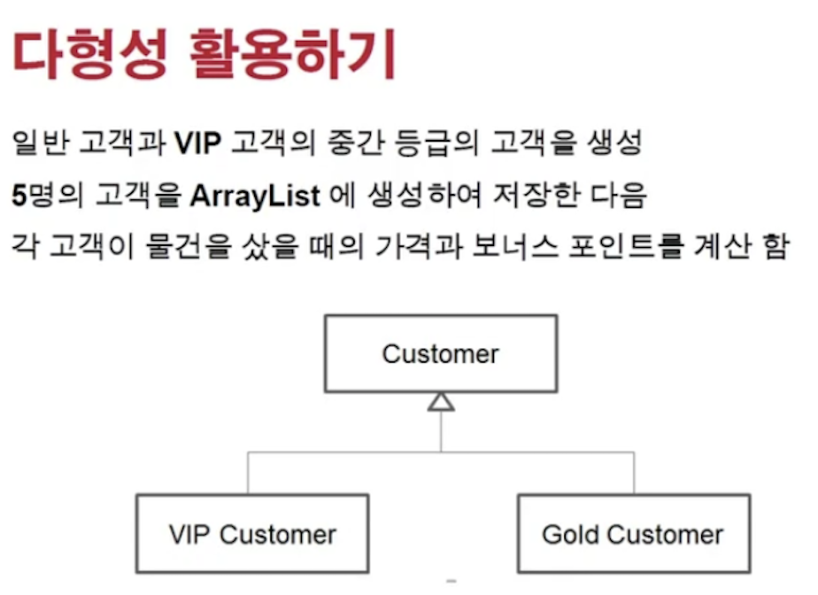
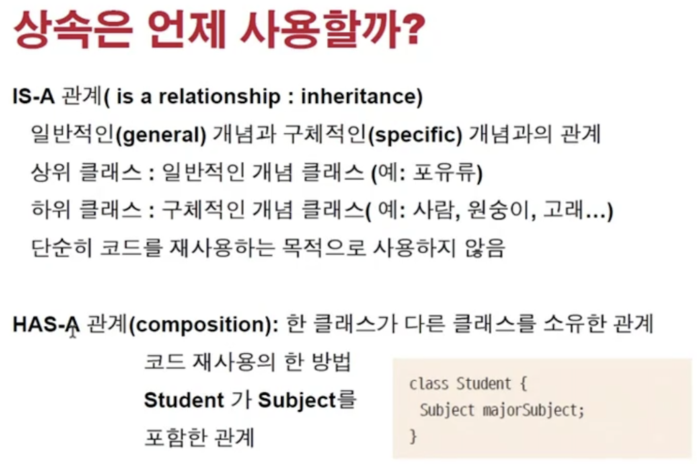

<link href="../../md/style.css" rel="stylesheet">

# 다형성 활용과 다운캐스팅



<br>

## 1) 상속사용의 경우



- is - a : 상속받아 다형성으로 기능 확장
- has - a : 한 클래스에 구현된 기능들을 단순이 가져다가 쓰기위함

## 2) 다운 캐스팅

- 오버라이딩이 최우선적으로 고려가 되어야 함
  - 그럴 수 없을 때, 다운캐스팅을 활용을 할 수 있음
- 혹은 상속된 인스턴스의 메서드에 접근해야 할 때 다운캐스팅으로 접근이 가능하면 다운캐스팅 사용

  - Example

    - JAVA

      ```JAVA

        public class AnimalTest {

            static class WrapperAnimal{

                static void moveAllAnimals() {
                    WrapperAnimal.moveAnimal(new Human());
                    WrapperAnimal.moveAnimal(new Tiger());
                    WrapperAnimal.moveAnimal(new Animal());
                }

                static void moveAnimal(Animal animal) {
                    // 다형성, 코드는 1줄인데 가상 메서드의 도움으로 기능 추가된 객체들도 같은 메서드를 사용하고
                    // 인터페이스의 메서드를 동일하게 취급할 수 있음
                    animal.move();

                    if (animal instanceof Human) {
                        ((Human) animal).read(); // 다운캐스팅을 해야 인스턴스의 해당 메서드를 사용할 수 있음
                    } else if (animal instanceof Tiger) {
                        ((Tiger) animal).hunt();
                    }
                }
            }

            @Test
            void callAllAnimals() {

                WrapperAnimal.moveAllAnimals();
            }

        }

      ```

    - Result - Terminal
      ```TEXT
        사람이 두발로 걷습니다.
        사람이 책을 읽습니다.
        호랑이가 네발로 뜁니다.
        호랑이가 사냥을 합니다.
        동물이 움직이고 있습니다.
      ```
