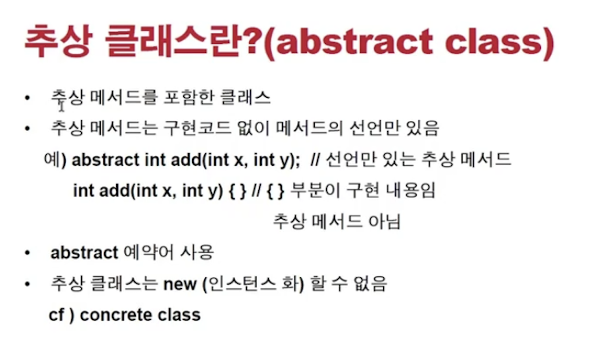
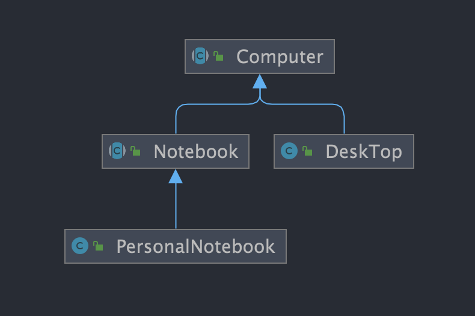

<link href="../../md/style.css" rel="stylesheet">

# 추상 클래스 활용하기



## 1) 추상 메서드

- 추상메서드가 하나도 없어도 추상 메서드가 될 수 있음
- 다음과 같이 'Body'영역이 없으면, abstract로 만들 수 있음

  

## 2) 추상클래스 Syntax

- Abstract로 선언된 메서드가 있을 것; 이때 클래스도 abstract 클래스로 선언되어야 함
- 추상 클래스는, 상속하기 위해 만들어진 클래스이며, 인스턴스화가 되지 않는다
- Example

  - **`추상 클래스안의 모든 매서드가 반드시 추상 메서드일 필요는 없으며, 일반 메서드를 작성해도 됨`**
  - JAVA

    ```JAVA
      public abstract class Computer {

          public abstract void display();
          public abstract void typing();

          public void turnOn() {
              System.out.println("전원을 켰습니다.");
          }
          public void turnOff() {
              System.out.println("전원을 껐습니다.");
          }

      }
    ```

  - Result - Class Diagram

    - 일부분만 Overriding하고, 다시 상속받은 클래스를 추상 클래스로 만들 수 있음

      

## **`언제 추상 메서드를 사용하는가?`**

- 언제 사용하는가?

  - **`현재 클래스에서 "역할"은 지정을 해놓았지만, 실제 구현은 상속되는 하위 클래스에서 해야 할때`**
  - 안드로이드의 리스트 뷰 같은 곳에서, 이미 구현해둔 것을 상속받고, 나머지 채워넣어야 할 때(프레임워크)

- 실제로 상속받는 곳에서 구현해야함에 유의! -> 이런 상황에서 사용; 구현에 책임이 있는 하위 클래스, 구현에 책임이 있다고 말함
- 하위 클래스에서, 상위 클래스에 구현된 메서드 오버라이딩도 당연히 가능(상속이기 때문)

<br>

- 인스턴스 생성이 안되지만 다음처럼 추상메서드 body 채워서 사용도 가능

  - JAVA

    ```JAVA
      Computer com1 = new Computer() {
          @Override
          public void display() {
              System.out.println("Com 원래 인스턴스 안됨, 이방식도 있음");
          }

          @Override
          public void typing() {
              System.out.println("Com 원래 인스턴스 안됨, 이방식도 있음");

          }
      };
    ```

## 3) 통째로 abstract인 경우
- 문법이 full로 구현되어있어도 abstract를 사용하면, 보통 "무조건 상속" 용으로 사용하고 싶을 때 그렇게 구현