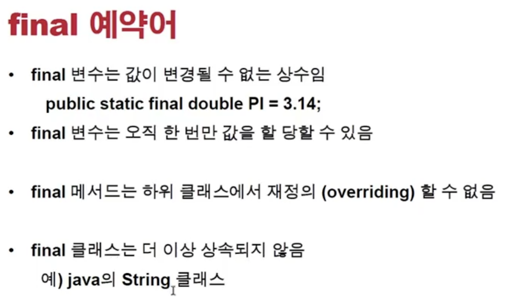
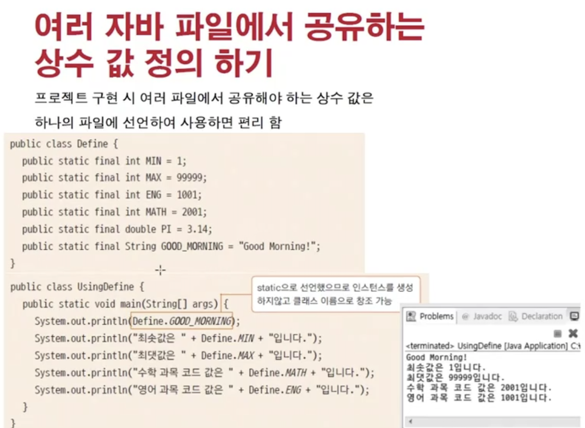
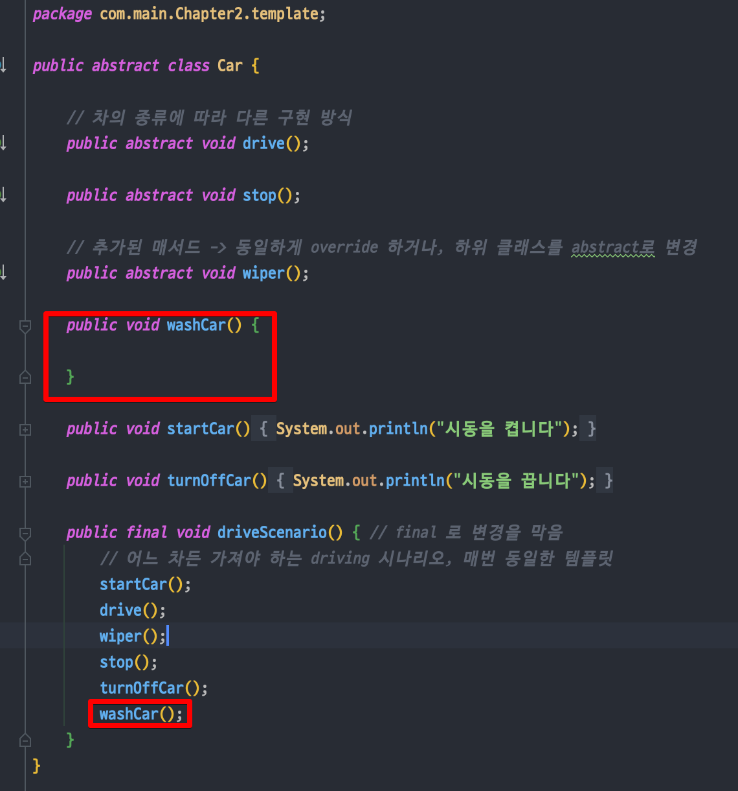
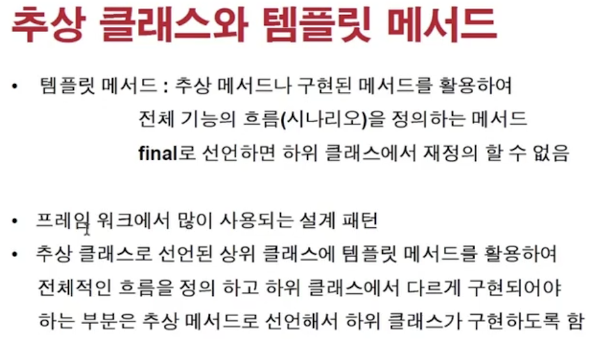
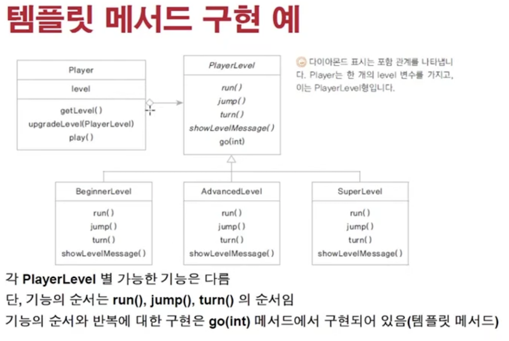

<link href="../../md/style.css" rel="stylesheet">

# 추상 클래스와 템플릿 메서드 활용

## 1) 템플릿 메서드 작성

- Example

  - 왜 이것을 많이 사용하는가?

    - 프로그램 진행방식을 정의하는 매서드(시나리오) 등이 있음
    - 이 부분이 상속된 클래스에서도 재정의/오버라이딩이 되는 것을 막는 것이 목적
    - **`원래 이 역할 모음은 불변이므로`**
    - **`final 키워드를 사용하여 메서드를 불변으로 만듦`**  
      -> 동일하지만, heap에 올라가며 주소공간에 위치(heap에 메서드 관리 영역)
    - 반드시 동작해하는 역할 모음 -> **`템플릿 메서드`** 라고 함

  - JAVA

    ```JAVA
      public abstract class Car {

          // 차의 종류에 따라 다른 구현 방식
        public abstract void drive();
          public abstract void stop();

          public void startCar() {
              System.out.println("시동을 켭니다");
          }

          public void turnOffCar() {
              System.out.println("시동을 끕니다");
          }

          public final void driveScenario() { // final 로 변경을 막음
              // 어느 차든 가져야 하는 driving 시나리오, 매번 동일한 템플릿
              startCar();
              drive();
              stop();
              turnOffCar();
          }
      }
    ```

- Final class 특징

  - 상속이 안된다는 점이 특이....
  - Enum을 쓰는것과의 차이? [참고 자료](https://velog.io/@kyle/자바-Enum-기본-및-활용)
      
    

## 2) 템플릿의 사용의 장점

- 추가된 상위 메서드의 오버라이드 여부를 하위 클래스에서 잘 파악할 수 있음
- 또, 그 매서드를 템플릿에 추가하기가 쉬움

## 3) Hook 매서드



- 구현은 되어있지만, 필요시 기능을 추가하여 오버라이딩하여 사용할 수 있는 것
- **`기능 추가를 위해 있는 것이 핵심`**

## 4) 언제 템플릿 메서드를 자주 쓰는가?



## 5) 템플릿 메서드를 게임구현에 적용 예제



- 배울 것
  - 클래스 다이어그램 위에서 확인
  - TDD 작성
- 레벨에 따른 플레이어 클래스의 변형이 핵심(밑에 참조)
- **`굉장히 tight하게 연관된 구조가 상속!`**

<br>

### 특징

- State 별로 나누는 것

  - **`State Pattern`** 이라고도 함
  - 장점, 써야하는 이유
    - 만약 템플릿을 안썻다면? -> 난잡한 코드
      1. level마다 if문을 따로 매우 여러개 사용
      2. Player안에 동작을 넣야하고, 마찬가지로 if문을 따로 매우 여러개 사용
    - 쓴것의 장점
      1. Level별로 동작을 상속하고 오버라이딩하고, 매서드 템플릿을 player 클래스에서 불러와서 사용
  - [내 코드 참조]()

- 분석
  1. 어떻게 보면 Player입장에서 서비스라고 쳤을 때,
  2. Level은 생성자 주입(Setter방식)으로 동작하고 있는 셈, Dependency Inversion 일어나지 않음
  3. Level의 인터페이스가 잘 정의되어있고, OCP + LSP 잘 지켜짐
