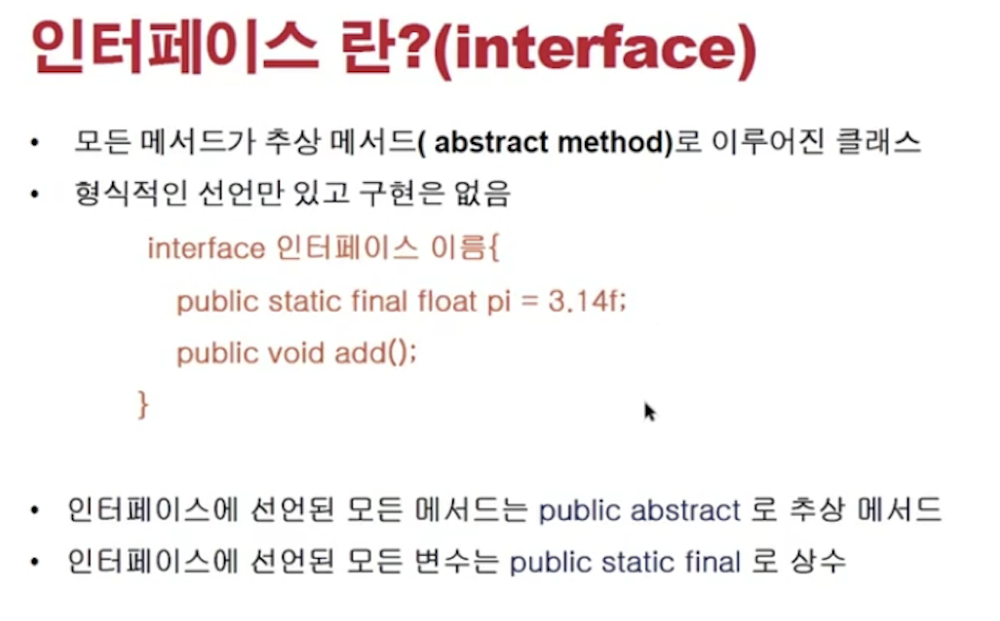
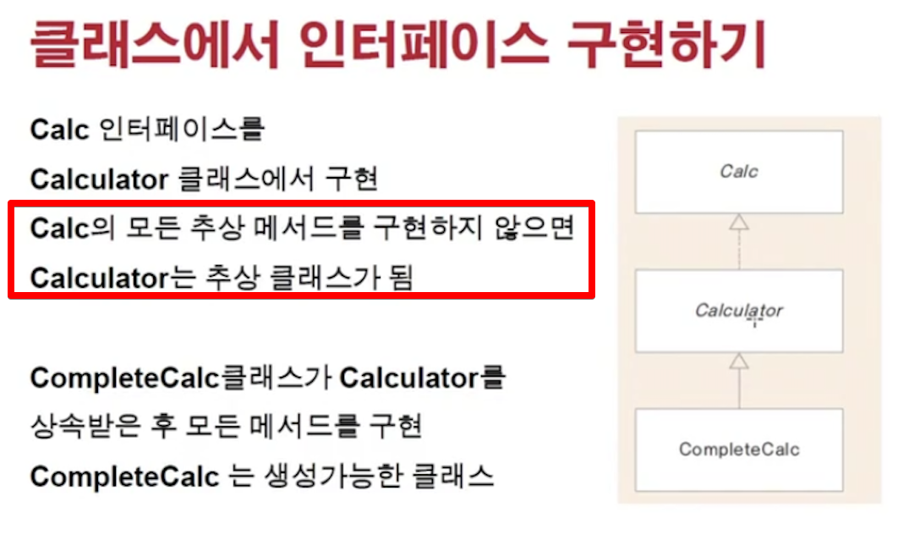
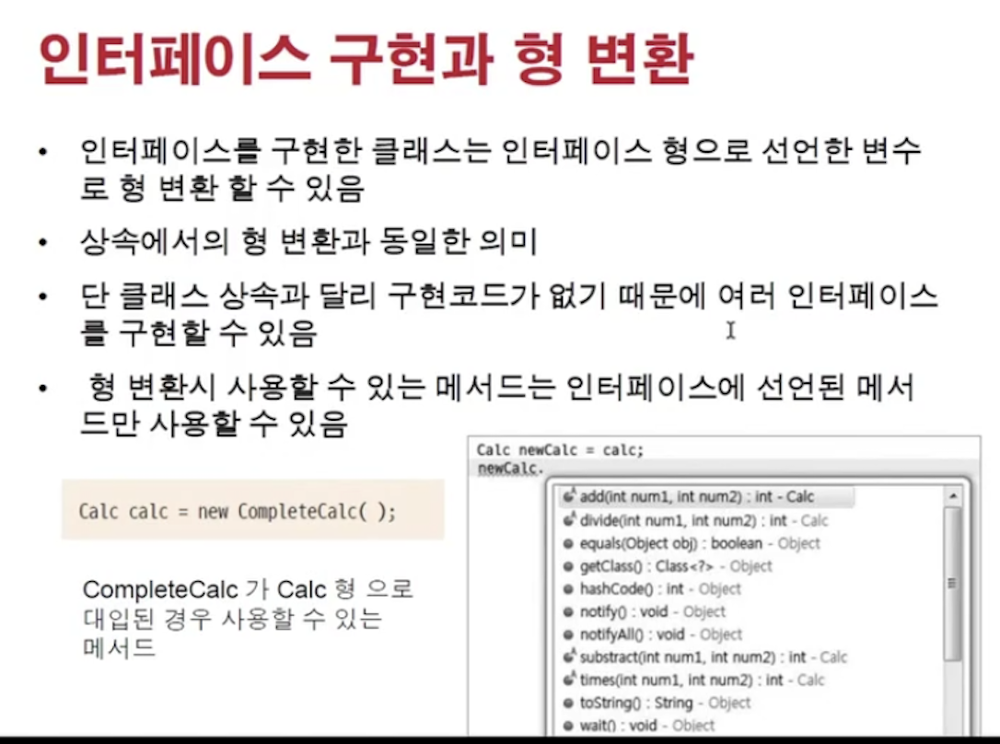
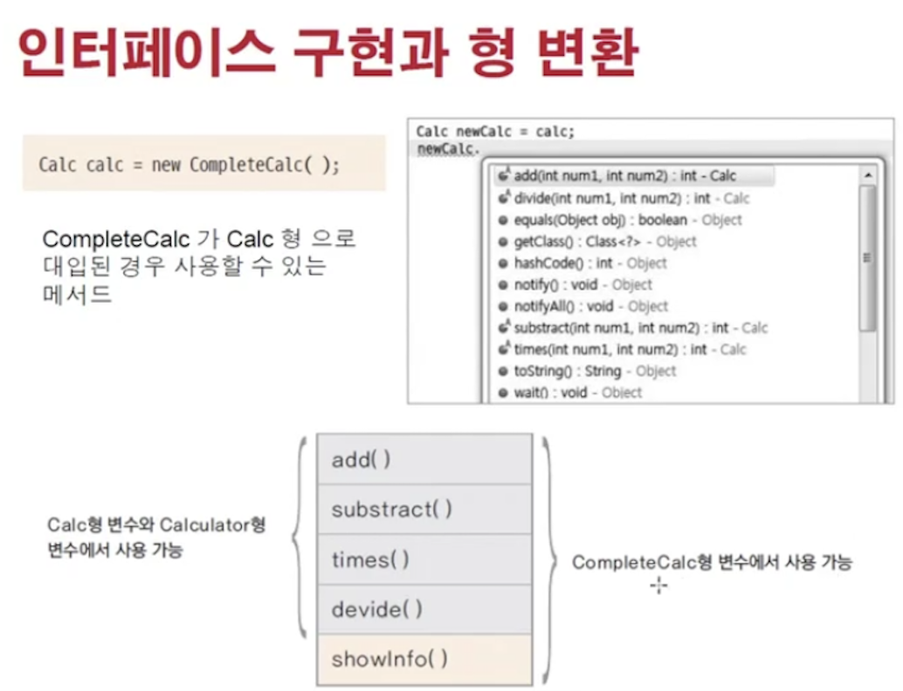

<link href="../../md/style.css" rel="stylesheet">

# 인터페이스 선언과 구현하기

## 1) 인터페이스 사용 이유

- 추상화 클래스에서 구현 코드가 아예 빠진 것이라고 이해하면 됨
- 상속은 1개까지 가능하지만, implement는 여러개 할 수 있음
- "역할" 과 "구현" 으로 구분하여 OOP로 작성할 때 아주 유용한 Java의 기능
- **`설계를 하기 위한 것`**
- 서버 & 클라이언트
  - 서버 : 서비스 (API)를 제공하는 쪽
  - 클라이언트 : 서버가 제공하는 것을 가져다가 사용하는 쪽
  - 인터페이스를 포함한 클래스를 "가져다가 쓰는 쪽이 Client" & "제공하는 곳이 Server"

## 2) 과정



- 한 interface를 작성하면, 안의 메서드들은 public abstract로 자동 변환이 precompile 단계에서 일어나게 됨
- Example

  - JAVA

    - 상수 & 추상메서드만 선언이 된다!

    ```JAVA
      public interface Calc {

          double PI = 3.14; // 자동으로 public static final double PI = 3.14; 로 변환
          int ERROR = -999999999;

          int add(int num1, int num2); // 자동으로 public abstract int add() 로 변환

          int subtract(int num1, int num2);

          int times(int num1, int num2);

          int divide(int num1, int num2);
      }
    ```

## 3) 구현 특징



- 모두 구현을 안하면, 추상 클래스로 설정을 해주어야 함
- 종류
  - 인터페이스 상속을 하여 구현을 하는 것(Calculator class) -> implements keyword 사용 ; Type 상속이라고도 함
  - 일반 상속(Calculator -> CompleteCalc), 상속받고 나머지 구현을 채워줌 ; 구현 상속이라고도 함
- Example

  - JAVA

    ```JAVA

      public abstract class Calculator implements Calc {

          @Override
          public int add(int num1, int num2) {
              return num1 + num2;
          }

          @Override
          public int subtract(int num1, int num2) {
              return num1 - num2;
          }
      }
    ```

## 4) 인터페이스 구현과 형변환

  


- 상속은 여러개 못하도록 되어있음
- 대신 implements는 여러개를 할 수 있음
- **`상위 implementation에 정의되어있는 것은 다 access할 수 있음! Upcasting이라도( 가상메서드로 인스턴스의 메서드가 불리므로 )`**
