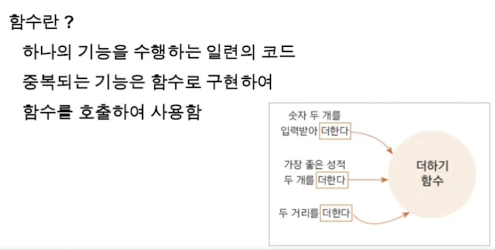
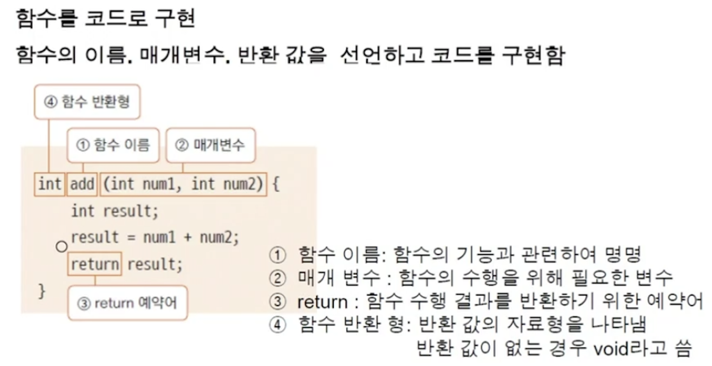
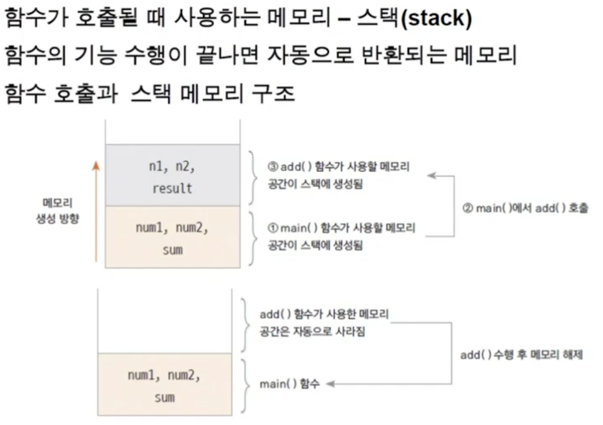

<link href="../../md/style.css" rel="stylesheet">

# 클래스와 객체1 - 2

## 1) 매서드

- 함수의 일종
- 객체에 기능을 제공하기 위해 클래스 내부에 구현되는 함수
- 함수는 하나의 기능을 위해 동작

    
  

## 2) 함수 사용의 의의

- 필요한 기능을 구현해놓고, 최대한 중복을 없앤 후, in / output에 관심을 갖기 위함
- 기능을 가져와서 사용하는 형식이 되므로, 1번의 수정으로 관리가 가능함(유지/보수의 장점)
- 구현시 고려
  1) 가능한 하나의 일만 할 것
  2) param은 최대 2~3개 이하로
  3) 최대한 작게 작성

## 3) 함수와 스택 메모리

- Public Static Void Main으로 매서드를 호출할 시 다음과 같이 동작
- 스택에 쌓인 후 반환되고 리턴값을 받음
- 로컬 변수도 스택에 쌓임

 

