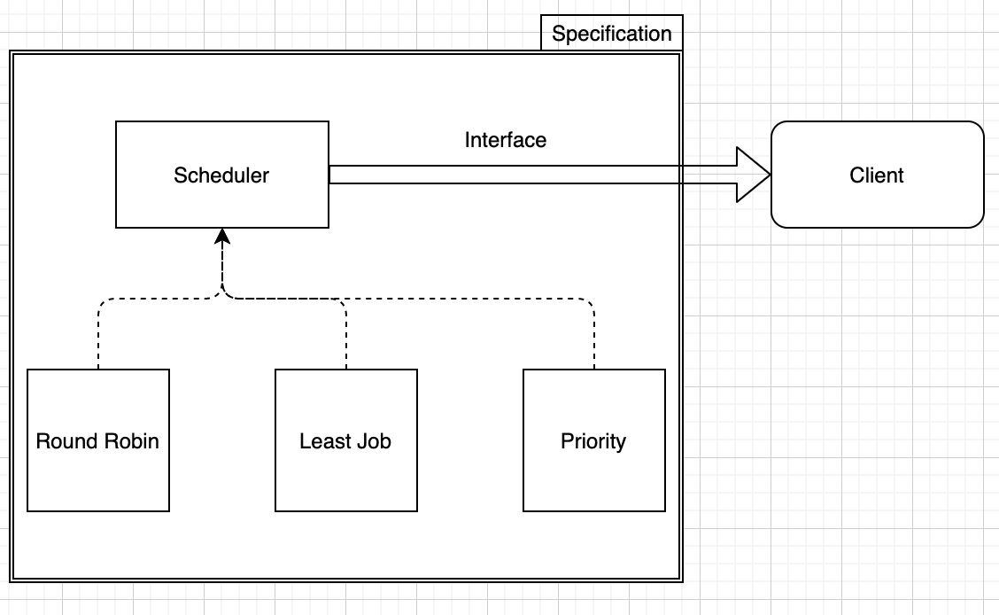

<link href="../../md/style.css" rel="stylesheet">

# 인터페이스와 다형성 구현


- 클라이언트가 만들어진 객체를 가져다 쓴다
- 통싱 서버는 기능을 제공해주는 곳
- 서버의 인터페이스로 객체의 형을 선언
- **`인터페이스 사용 이유; 클라이언트, 가져다 쓰는 쪽에서 구현에 일일히 관심이 없고 대표 인터페이스 기능만관심이 있기 때문!`**

  - 클라이언트 코드 Example

    - JAVA

      ```JAVA

        public class CompleteCalcTest { // 클라이언트 부분(or 다른 서버코드를 가져다 쓰는 서버일 수도)

            @Test
            void completeCalcTest() {

                int num1 = 2;
                int num2 = 4;

                // 인터페이스는 약속!
                // 인터페이스의 명세만 보고 Client는 객체를 사용할 수 있음(ex JDBC)
                Calc calc = new CompleteCalc(); // 인터페이스 + 인터페이스 클라스 ; 클라이언트 코드 라고도 함(서버/기능 가져다 쓰기)
                Assertions.assertEquals(calc.add(num1, num2), 6);
            }
        }
      ```

## 1) 인터페이스와 클래스 다이어그램



- 인터페이스를 통해 select된 객체의 서비스를 가져다가 씀
- Note : Test에서는 public static void main으로 불러야 Intellij 콘솔에서 input 받을 수 있음
- Example

  - JAVA

    ```JAVA
      @Test
      @DisplayName("스케쥴러 테스트")
      public static void main(String[] args) {
          schedulerTest();
      }

      static void schedulerTest() {
          System.out.println("전화 상담 배분방식을 선택하세요 : R, L, P");

          try {
              int ch = System.in.read();
              Scheduler scheduler = null;
              switch (ch) {
                  case 'R':
                  case 'r':
                      scheduler = new RoundRobin();
                      break;
                  case 'L':
                  case 'l':
                      scheduler = new LeastJob();
                      break;
                  case 'P':
                  case 'p':
                      scheduler = new Priority();
                      break;
                  default:
                      System.out.println("지원하지 않는 기능입니다!");
              }
              if (scheduler != null) {
                  // 다형성에 인해서 가능한, 객체의 메서드가 불리도록 하게 됨
                  scheduler.getNextCall();
                  scheduler.sendCallToAgent();
              }
          } catch (Exception e) {
              System.out.println("error happened : " + e);
          }


          }
      }
    ```

## 2) JDBC


- Connection 이란 interace를 받아서 사용
- 구현부는 자동으로 Oracle, Mysql, ... SQL / RDBM 에서 채워서 사용(컴파일 단계에서...?)
- 여기서, Connection의 명세만 보고 활용, 어떤 형식의 DB에 연결되는지는 나에게 중요하지 않음

## 3) 인터페이스의 요소


