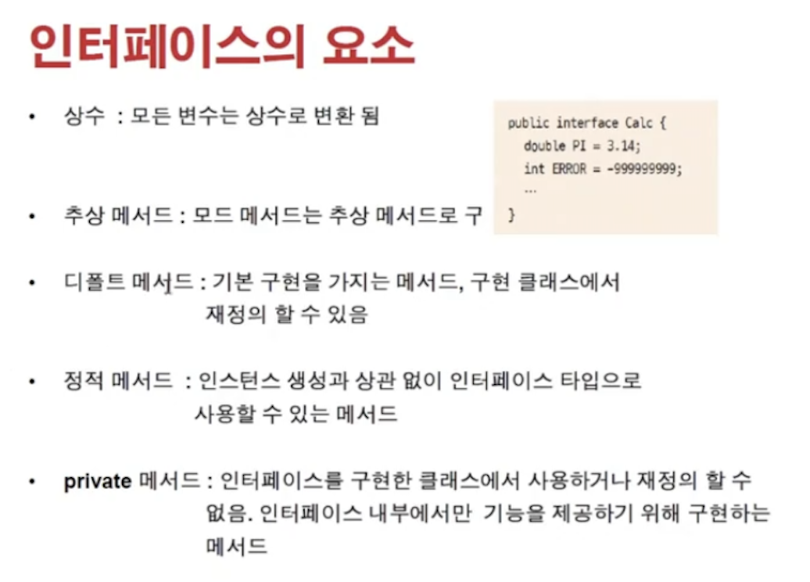

<link href="../../md/style.css" rel="stylesheet">

# 인터페이스 활용하기

- 인터페이스의 상속방법
- 인터페이스들의 요소
- Class 상속과 interface implements 같이 한 클래스에서 사용하기

## 1) 인터페이스의 요소



- 인터페이스에 선언한 변수는 모두 final 취급(상수)
- 인터페이스는, 구현코드가 없는 추상 메서드와 동일
- 인터페이스 매서드들

  1. 디폴트 메서드 : 추상 메서드 처럼, 일부분을 공통된 기능을 가진 메서드로 인터페이스에서도 구현이 가능  
     -> implement 하는 곳에서 overriding 안하는 경우
  2. 정적 메서드 : 인스턴스 생성과 상관 없이, 인터페이스 타입으로 사용할 수 있음 상
     -> Static하지 않은 메서드들은 new로 생성자체가 안되므로(abstract, interface 메서드 안에 구현 코드가 없으므로) 안되지만, Static하게 생성하면 메서드 자체를 인스턴스 생성없이 사용가능
  3. Private 메서드 : 인터페이스 내부에서만 기능제공용(사용하는 클래스에서 사용할 수 없음)

<br>

## 2) 예제

### a) 디폴트 메서드 정의

- JAVA

  ```JAVA
    public interface Calc {

        double PI = 3.14; // 자동으로 public static final double PI = 3.14; 로 변환
        int ERROR = -999999999;

        int add(int num1, int num2); // 자동으로 public abstract int add() 로 변환

        int subtract(int num1, int num2);

        int times(int num1, int num2);

        int divide(int num1, int num2);

        default void description() {
            // 공통적으로 사용하는 메서드(원래는 제한자 default...)
            // 또한, Overriding을 통해 재정의를 할 수 있음 -> 가상 메서드!
            System.out.println("정수 계산기를 구현합니다");

        }
    }
  ```

### b) Static 매서드 정의

- JAVA

  ```JAVA
    public interface Calc {

        double PI = 3.14; // 자동으로 public static final double PI = 3.14; 로 변환
        int ERROR = -999999999;

        static int calculateTotalInArr(int[] arr) {

            int total = 0;
            for (int i = 0; i < arr.length; i++) {
                total += arr[i];
            }

            return total;
        }


    ...

    @Test
    @DisplayName("Test static method of interface")
    void interfaceStaticTest() {
        int[] arr = new int[]{
                10, 15, 40
        };

        Assertions.assertEquals(Calc.calculateTotalInArr(arr), 65);
    }
  ```

### c) Private method


## 2) 두개의 인터페이스 구현하기

  
  


- 클래스는 다중 상속 안된다! -> Diamond problem; 모호함이 있으므로
- 인터페이스는 여러개 사용 / 구현 가능
- 위의 예시처럼, 한 객체에 대해서 기능 제한을 UpCasting으로 만들 수 있음
