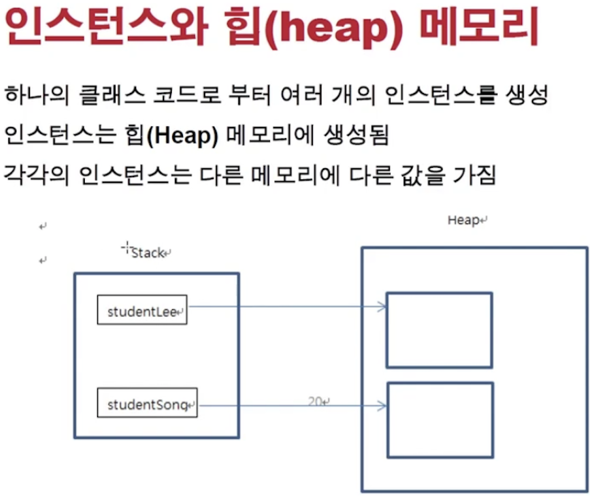
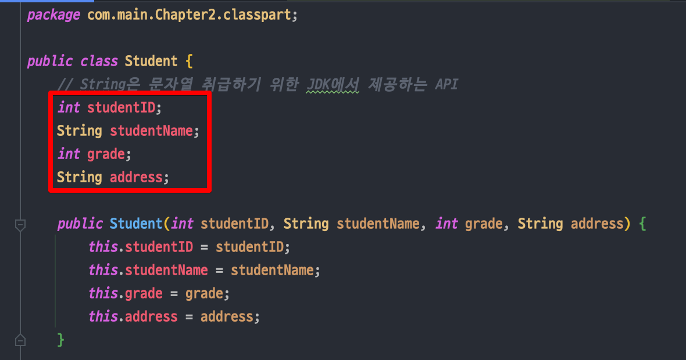
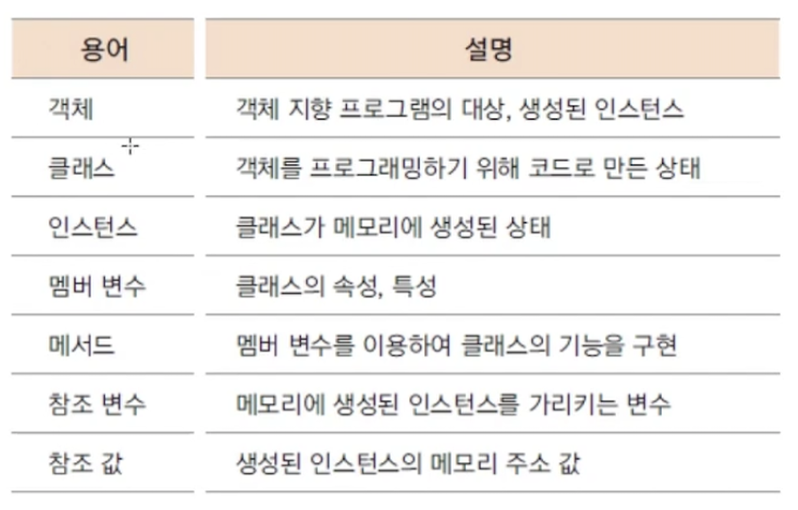
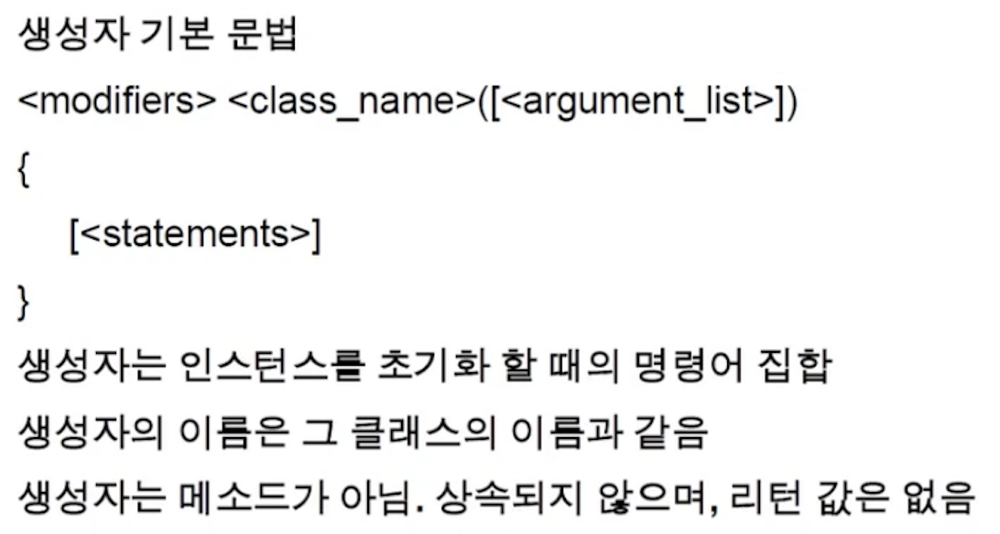
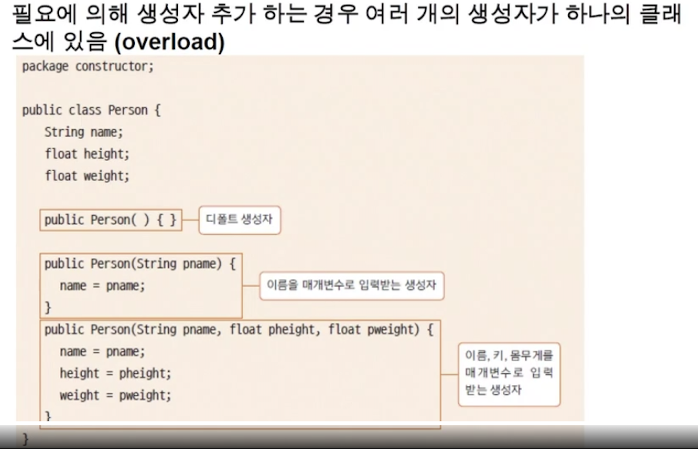

<link href="../../md/style.css" rel="stylesheet">

# 클래스와 객체1 - 3

## 1) Class & Instance


<br>

- Static으로 선언한 것은 클래스 네임으로 접근해야 함, 인스턴스 메서드로 접근 못함
- 상태
  - 클래스
    - Static Code
  - 인스턴스화
    - 클래스가 변수로써 메모리에 올라가는 것

## 2) 클래스 생성

- 클래스 사용을 위해서는 클래스를 생성하여야 함
- 생성자(Constructor) 신택스 사용
- new 예약어를 사용하여 생성(반드시 사용)

  - JAVA
    ```JAVA
      클래스형_변수_이름 = new 생성자;
      Student studentA = new Student();
    ```

## 3) Main 매서드

- JVM이 호출하는 코드, 클래스의 함수와는 다름
- 먼저 수행되도록 하는 부분

## 4) 자바 클래스 & 인스턴스의 메모리



<br>

- Stack에는 4byte로 heap 영역의 인스턴스의 주소값만을 가짐
- Heap에서는 동적으로 메모리가 형성되고(나중에 가비지 컬렉터 등에 의해 반환/관리) 인스턴스 관련 메모리를 들게되는 부분

<br>



- 이 부분들이 heap 영역에 들어가게 됨
- 인스턴스 변수는 heap 영역에 해당 인스턴스 메모리 공간을 알고 있음, acceess를 할 때 주소를 참조

## 5) Reference variable, reference value

- 참조변수 : 객체 변수
- 참조값 : 객체 변수의 주소 값

  - 주소값은 4byte값 8자리로 총 32bit짜리 주소값임

- JAVA

  ```JAVA
    @Test
    @DisplayName("객체 주소값 찍어보기")
    void getStudentInstanceAddress(){

        System.out.println(testStudent); //com.main.Chapter2.classpart.Student@35d019a3

    }
  ```

## 6) 클래스, 인스턴스, 참조변수, 참조값 정리



- 멤버변수(필드) : 클래스 내부 변수
  - Access할 때는, 객체 변수시 this.XXX 사용 / 그대로 변수명 사용
  - 클래스 상단에 멤버변수(필드) 추가하고 사용

<br>

## 7) 생성자 - Constructor





- 매서드인데, 클래스 이름과 동일한 매서드로 생성자를 만들어줌
- 생성자가 없을시 자바 컴파일러가 알아서 default 생성자를 넣어주도록 되어있음, param 없이
- **`언제 쓰는가?`**
  - 객체를 생성하면서, 필요한 초기값들을 받고 / 실행할 메서드 등을 수행해야 할 부분을 넣어주는 것
