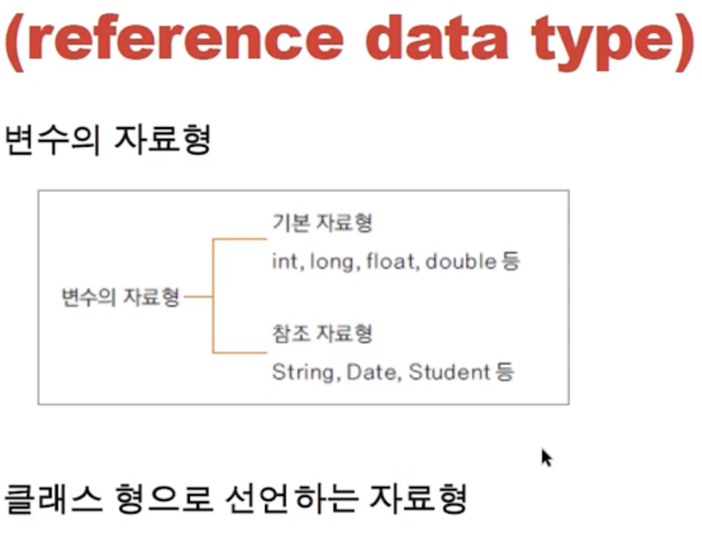
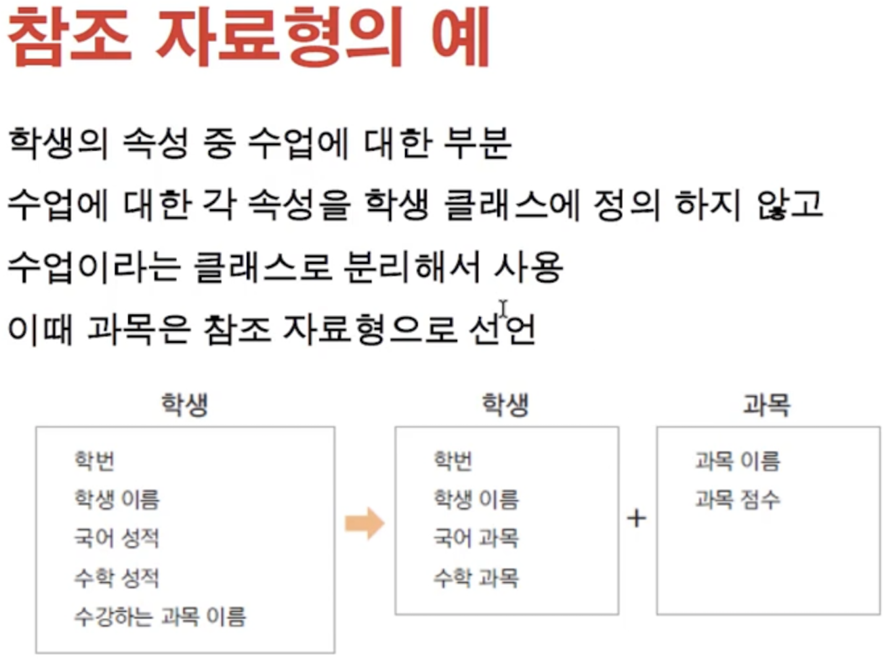
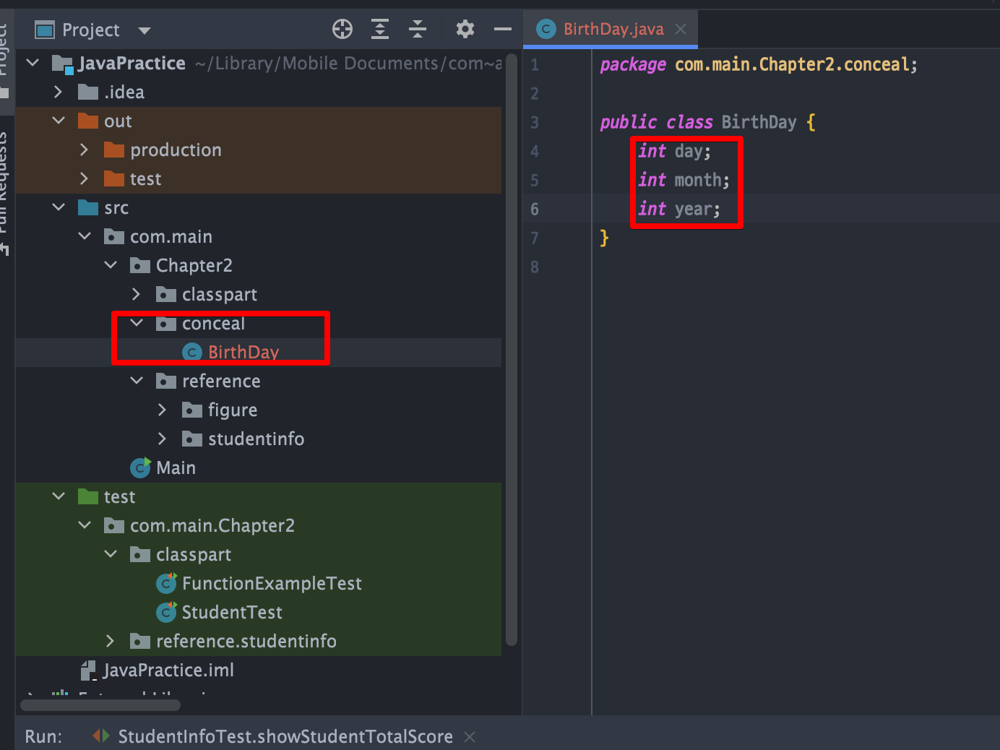

<link href="../../md/style.css" rel="stylesheet">

# 클래스와 객체1 - 4

## 1) 참조 자료형

- JDK에서 제공하는 참조 자료형들이 있음

  

- 다음과 같이 만들어서 사용할 수도 있음

  

<br>

- JAVA

  ```JAVA
    ...

      public void setSubjectKorean(String subjectName, int subjectScore) {
          this.korean = new Subject(subjectName, subjectScore); // new keywaord
      }

      public void setSubjectMath(String subjectName, int subjectScore) {
          this.math = new Subject(subjectName, subjectScore); // new keywaord
      }

    ...

    /* Subject.java */
    package com.main.Chapter2.reference.studentinfo;

    public class Subject {

        String subjectName;
        int subjectScore;

        public Subject(String subjectName, int subjectScore) {
            this.subjectName = subjectName;
            this.subjectScore = subjectScore;
        }

        public String getSubjectName() {
            return subjectName;
        }

        public void setSubjectName(String subjectName) {
            this.subjectName = subjectName;
        }

        public int getSubjectScore() {
            return subjectScore;
        }

        public void setSubjectScore(int subjectScore) {
            this.subjectScore = subjectScore;
        }
    }

  ```

## 2) 정보 은닉

- OOP 특징 : 추상화, 캡슐화, 상속, 다형성 중 / 캡슐화에 의미
- 필요한 정보만 보여주고, 필요없는 정보는 보여주지 않음;
  - JAVA에서는 위를 private으로 선언하여 멤버 변수(=클래스변수 =필드변수), 메서드 등을 외부에서 사용하지 못하도록 함
  - 꼭 필요한 경우, get / set 메서드를 제공(되도록이면 지양)

### a) 디폴트



- 위와 같이 아무것도 작성하지 않으면, 같은 package 내부에서는 접근 가능

### b) 캡슐화

- read-only, data-integrity를 검사하여 set하는 기능도 추가할 수 있음
- 다음과 같이 getter / setter로 분리

  - JAVA

    - getter setter 안의 메서드를 사용해서 filtering도 구현할 수 있음

    ```JAVA
      public class BirthDay {
          private int day;
          private int month;
          private int year;

          public BirthDay(int day, int month, int year) {
              this.day = day;
              this.month = month;
              this.year = year;
          }

          public int getDay() {
              return day;
          }

          public void setDay(int day) {
              this.day = day;
          }

          public int getMonth() {
              return month;
          }

          public void setMonth(int month) {
              this.month = month;
          }

          public int getYear() {
              return year;
          }

          /*  Readonly로 바꿔서 사용
          public void setYear(int year) {
              this.year = year;
          }
          */
      }

      /*  Data integrity 를 위한 무결성 검사  */
      public void setDay(int day) {
        if (month == 2) {
            if (day < 1 || day > 28) {
                System.out.println("2월 날짜 오류입니다.");
            }
        } else {

            this.day = day;
        }
      }
    ```
