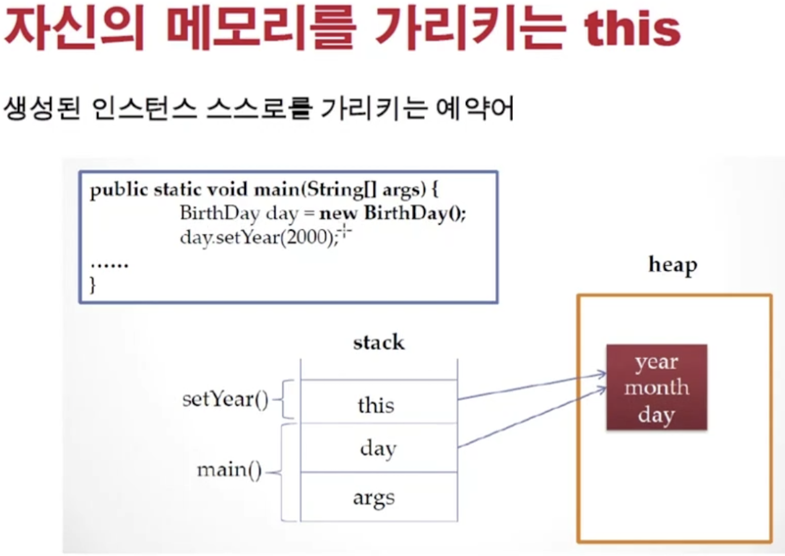
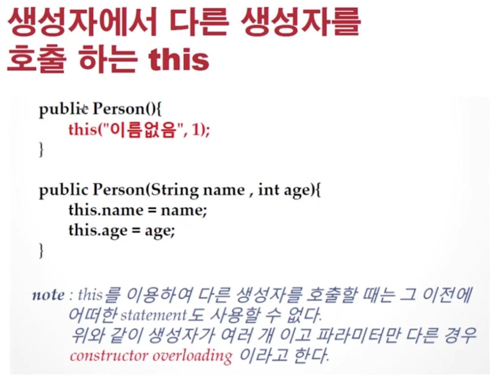

<link href="../../md/style.css" rel="stylesheet">

# 클래스 2 (1)

## 1) This

- 자신의 메모리를 가르킴
- 생성자에서 다른 생성자 호출
- 자신의 주소를 반환

  - 만약 this를 사용하지 않으면, 바로 위에서 대입되는 param으로 돌아가게 되므로, 잘 사용해야 함

  

- Example

  - JAVA

    ```JAVA
      package com.main.Chapter2.classpart;

      import com.main.Chapter2.conceal.BirthDay;

      class BirthDayLocal{
          int day;
          int month;
          int year;

          public int getDay() {
              return day;
          }

          public void setDay(int day) {
              this.day = day;
          }

          public int getMonth() {
              return month;
          }

          public void setMonth(int month) {
              this.month = month;
          }

          public int getYear() {
              return year;
          }

          public void setYear(int year) {
              this.year = year;
          }

          public void printLocalThis() {
              System.out.println(this);
          }
      }

      public class ThisExample {
          public static void main(String[] args) {

              BirthDayLocal b1 = new BirthDayLocal();
              BirthDayLocal b2 = new BirthDayLocal();

              System.out.println(b1);
              b1.printLocalThis();
              System.out.println(b2);
              b2.printLocalThis();

          }
      }

    ```

  - Result
    ```TEXT
        com.main.Chapter2.classpart.BirthDayLocal@75bd9247
        com.main.Chapter2.classpart.BirthDayLocal@75bd9247
        com.main.Chapter2.classpart.BirthDayLocal@7d417077
        com.main.Chapter2.classpart.BirthDayLocal@7d417077
    ```

## 2) This 사용 이유

- 다른 생성자를 부를 때 사용



- JAVA

  ```JAVA
    class Person{
        String name;
        int age;

        public Person() {
          // this가 맨 처음 불려야, heap에 메모리가 할당되고, 사용될 수 있음 따라서 다음과 같이 못함;
          // int name = "Test name"
            this("이름 없음", 1); // Dummy 등 initalizer 생성자 param 세팅 값이 모자라는 경우 등에 응용하여 사용가능
        }

        public Person(String name, int age){
            this.name = name;
            this.age = age;
        }
    }

    public class CallAnotherConst {

        public static void main(String[] args) {
            Person p1 = new Person();
            System.out.println("p1.name = " + p1.name);
        }
    }
  ```

- Result - Terminal

  ```TEXT
    p1.name = 이름 없음
  ```
