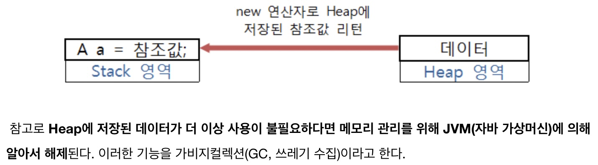
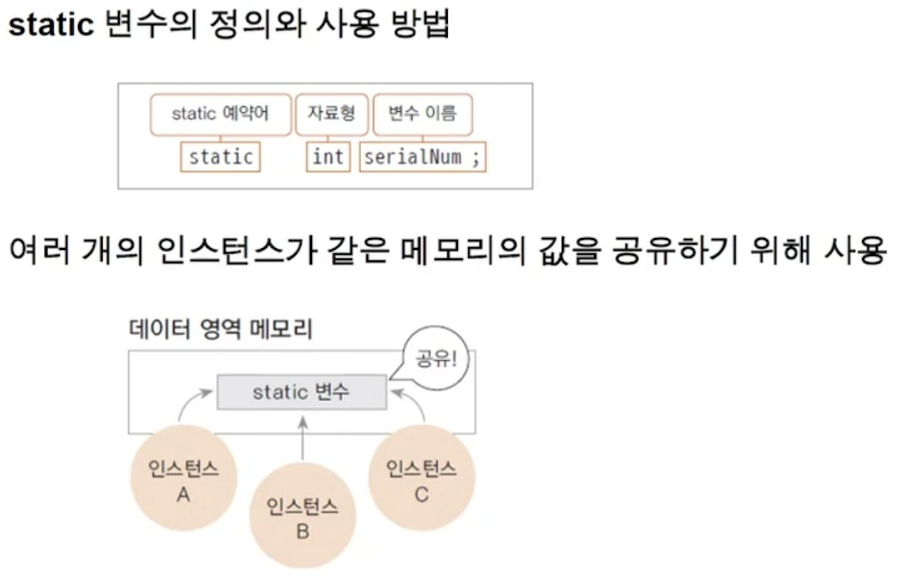
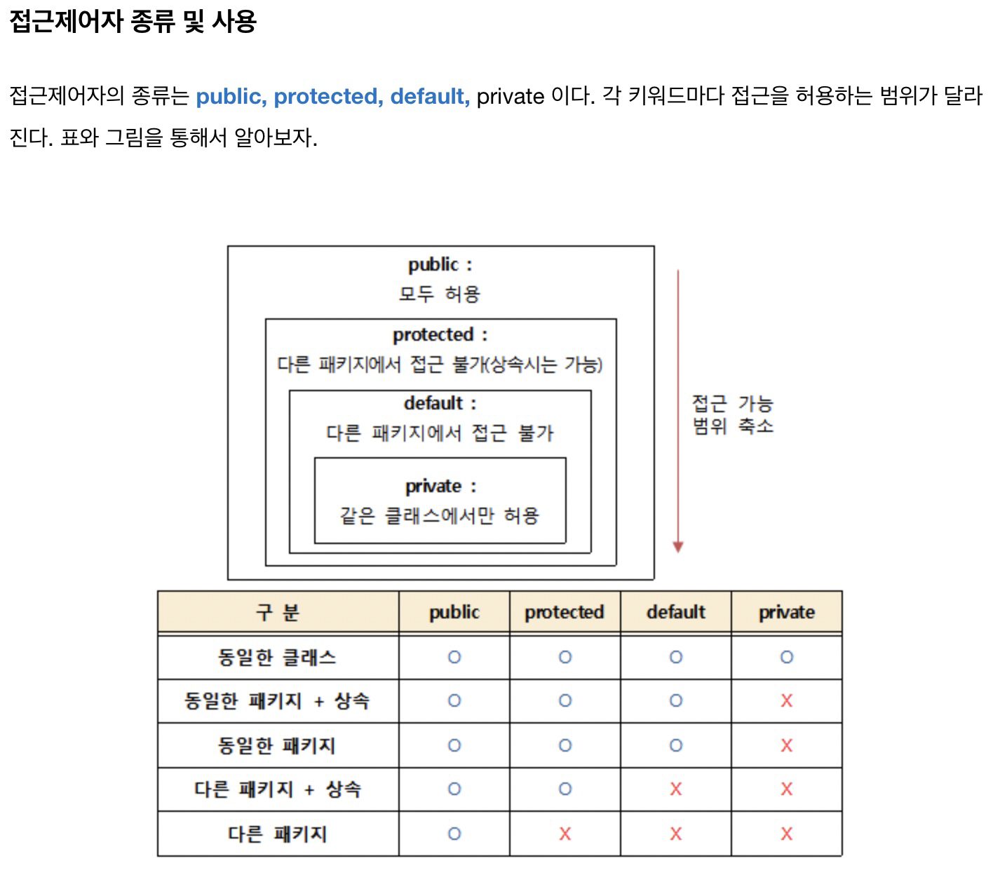
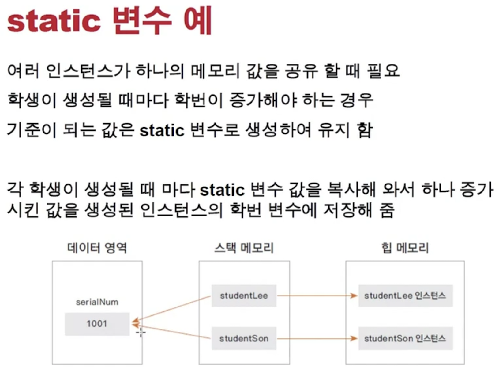
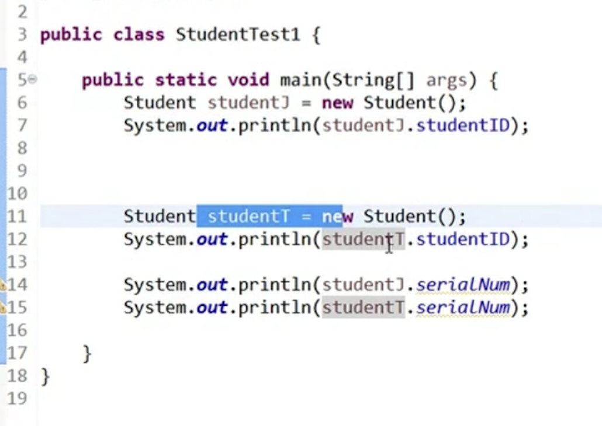
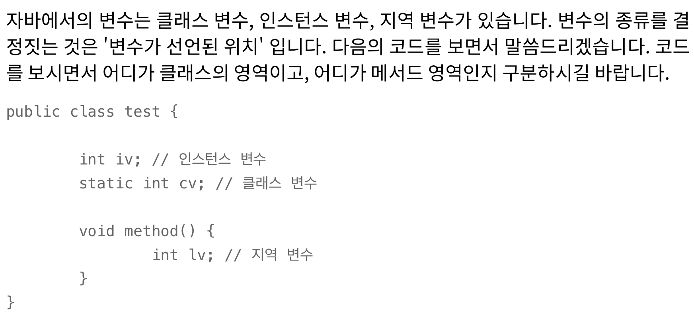
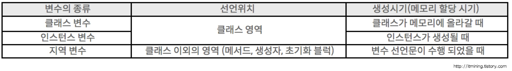
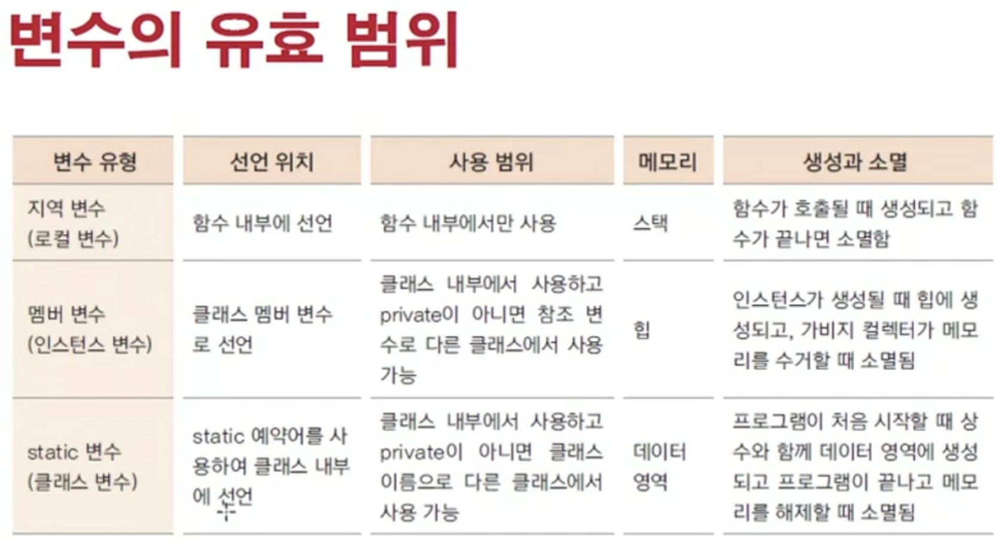
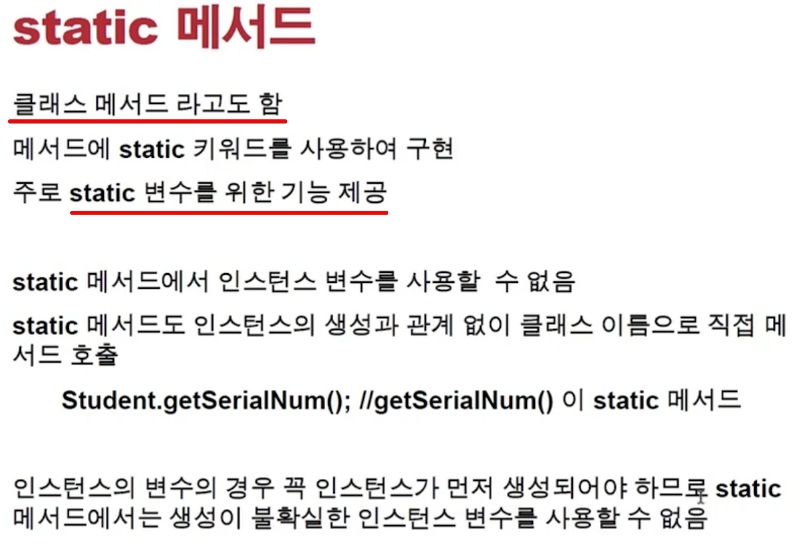
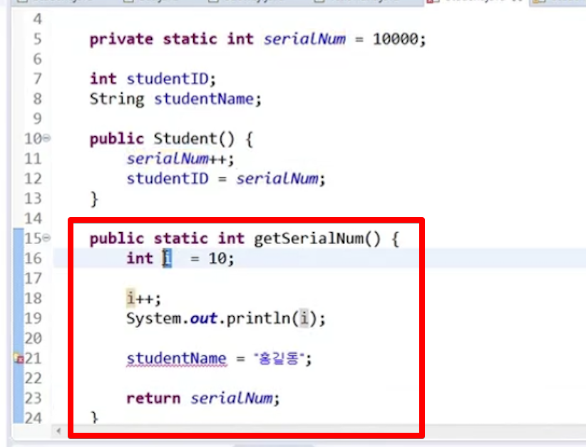

<link href="../../md/style.css" rel="stylesheet">

# 클래스 & Static 변수

- [Static & Stack & Heap 참조글 1](https://m.blog.naver.com/heartflow89/220954420688)

<br>

> Note 1  
> 하나의 JAVA 파일은 크게 필드(field), 생성자(constructor), 메소드(method)로 구성된다.  
> 그중 필드 부분에서 선언된 변수(전역변수)와 정적 멤버변수(static이 붙은 자료형) Static 영역에 데이터를 저장한다.  
> Static 영역의 데이터는 프로그램의 시작부터 종료가 될 때까지 메모리에 남아있게 된다.  
> 다르게 말하면 전역변수가 프로그램이 종료될 때까지 어디서든 사용이 가능한 이유이기도 하다.  
> 따라서 전역변수를 무분별하게 많이 사용하다 보면 메모리가 부족할 우려가 있어 필요한 변수만 사용할 필요가 있다.

<br>

> Note 2  
> 참조형(Reference Type)의 데이터 타입을 갖는 객체(인스턴스), 배열 등은 Heap 영역에 데이터가 저장된다.  
> 이때 변수(객체, 객체변수, 참조변수)는 Stack 영역의 공간에서 실제 데이터가 저장된 Heap 영역의 참조값(reference value, 해시코드 / 메모리에 저장된 주소를 연결해주는 값)을 new 연산자를 통해 리턴 받는다.  
> 다시 말하면 실제 데이터를 갖고 있는 Heap 영역의 참조 값을 Stack 영역의 객체가 갖고 있다.  
> 이렇게 리턴 받은 참조 값을 갖고 있는 객체를 통해서만 해당 인스턴스를 핸들 할 수 있다.

<br>



---

<br>



<br>

- 용어 설명

  - 인스턴스 : 클래스에서 생성된 heap 메모리에 다이나믹하게 할당되는 참조변수명
  - Heap

    - 동적으로 할당(동적 메모리부분 \<-> 정적 메모리 영역 / data 부분과 대비)
    - 사용되고 나서 JVM garbge collector에 의해 관리되다가 없어짐
    - **`new 키워드를 사용할 때 할당 됨`**

  - Static
    - 프로그램 전체가 메모리에 할당될 때(load될 때 한꺼번에 load)
      - 예시 변수로: 상수, 리터럴, Static 변수 등이 올라감
    - 정적 변수
    - 정적 메모리 영역 / aka. Data 영역 이라는 곳에 할당 됨
    - 인스턴스끼리 공유해야하는 변수, 객체 등이 있을 때 사용될 수 있음
    - static 변수는 자바가 실행되면서 할당됨
    - 변수, 함수(메서드) 앞에 가도 되며, 블록으로 설정할 수도 있음
    - **`너무 많은 변수 / 큰 변수 등을 static에 할당하면, 프로그램이 사용가능한 data 메모리 자체가 제한이 있기 때문에 지양해야 함`**
    - 결론적으로 **`Static 영역에 참조변수를 할당하고, new 키워드로 이를 수행하는 것`**

- 제한자

  - [참조 링크](https://m.blog.naver.com/PostView.naver?blogId=heartflow89&logNo=220961166980&targetKeyword=&targetRecommendationCode=1)
  - 제한자에 대한 설명

    - 접근제어자(접근제한자)

      - 접근제어자란 클래스나 클래스의 멤버에 대한 접근을 제한하는 역할을 한다.  
        조금 더 자세히 알아보면 클래스를 제한하여 다른 패키지에서 클래스의 접근을 막거나, 생성자를 제한하여 클래스에서 객체의 생성을 막거나, 필드 및 메소드를 제한하여 중요한 정보를 갖고 있는 필드(변수)나 메소드의 접근을 막는 것을 말함

    - 접근제어자 사용 이유
      - 그러면 왜 접근을 막는 것일까?
      - 프로그램의 사용자가 개발자의 작성한 코드에 대해서 쉽게 접근할 수 있다면 악의적으로 프로그램을 망가트릴 수도 있고 잘못된 접근으로 많은 에러를 발생시킬 수 있다.  
        (보호되지 않은 인스턴스에 바로 접근하여, 코드 작성과정에서도 문제가 생길 수 있음)
      - 따라서 외부로부터 데이터의 보호가 필요하고 사용자가 사용하는데 필요 없는 로직들을 숨기기 위해서 사용된다.  
        (이러한 것을 은닉화/캡슐화라고 함)

    <br>
    

---

## 1) Static 변수



<br>

- StudentT / J 각각 studentLee, studentSon 대응
- **`이부분(참조변수 객체)은 스택 메모리에 올라감; 참조 값인 인스턴스 자체는 heap에 올라감, 참조 변수 객체 안의 static은 데이터 영역에 있음`**

  

<br>

- 인스턴스 생성시 마다 다른 메모리를 가지는 것이 아니라, 프로그램이 메모리에 적재될 때 "데이터 영역"의 메모리에 생성
- 따라서 인스턴스 생성과 관계없이 클래스 이름으로 직접 참조 가능(인스턴스로 접근하지 말것)
- **`클래스 변수와 인스턴스 변수를 구분할 것`**

- [참조 링크](https://itmining.tistory.com/20)

   

   <br>

   

   <br>

      
   
  - 설명

  - 인스턴스 변수

    - 인스턴스 변수는 인스턴스가 생성될 때 생성됩니다. 그렇기 때문에 인스턴스 변수의 값을 읽어오거나 저장하려면 인스턴스를 먼저 생성해야합니다.  
      인스턴스 별로 다른 값을 가질 수 있으므로, 각각의 인스턴스마다 고유의 값을 가져야할 때는 인스턴스 변수로 선언합니다.

  - 클래스 변수

    - 클래스 변수는 인스턴스 변수에 static만 붙여주면 됩니다. 인스턴스 변수는 각각 고유한 값을 가지지만 클래스 변수는 모든 인스턴스가 공통된 값을 공유하게 됩니다.  
      한 클래스의 모든 인스턴스들이 공통적인 값을 가져야할 때 클래스 변수로 선언합니다.  
      클래스가 로딩될 때 생성되어(그러므로 메모리에 딱 한번만 올라갑니다.) 종료 될 때 까지 유지되는 클래스 변수는 public 을 붙이면 같은 프로그램 내에서 어디서든 접근할 수 있는 전역 변수가 됩니다.  
      또한 인스턴스 변수의 접근법과 다르게 인스턴스를 생성하지 않고 클래스이름.클래스변수명 을 통해서 접근할 수 있습니다.

  - 지역 변수
    - 메서드 내에서 선언되며 메서드 내에서만 사용할 수 있는 변수입니다. 메서드가 실행될 때 메모리를 할당 받으며 메서드가 끝나면 소멸되어 사용할 수 없게 됩니다.

## 2) 예시

- Example

  - JAVA

    ```JAVA
      public class StudentStatic {
          private int studentID;
          String studentName;
          static int studentIDStatic = 1000;

          public StudentStatic() {

              this("Dummy Student");
          }
          public StudentStatic(String studentName){
              this.studentName = studentName;
              System.out.println("studentIDStatic Before = " + StudentStatic.studentIDStatic);
              StudentStatic.studentIDStatic += 1;
              System.out.println("studentIDStatic After = " + StudentStatic.studentIDStatic);
              this.setStudentID();
          }

          public void setStudentID() {
              System.out.println("studentID Before = " + studentID);
              this.studentID = StudentStatic.studentIDStatic;
              System.out.println("studentID After = " + studentID);
          }

          public int getStudentID() {
              return studentID;
          }
      }

      @Test
      @DisplayName("스태틱 클래스 변수 테스트")
      void staticVariableTest() {
          StudentStatic student1 = new StudentStatic("Student 1");
          StudentStatic student2 = new StudentStatic("Student 2");

          Assertions.assertEquals(student1.getStudentID() + 1, student2.getStudentID() );
      }
    ```

  - Result - Terminal
    ```TEXT
      studentIDStatic Before = 1000
      studentIDStatic After = 1001
      studentID Before = 0
      studentID After = 1001
      studentIDStatic Before = 1001
      studentIDStatic After = 1002
      studentID Before = 0
      studentID After = 1002
    ```

## 3) private Static

- Static으로 선언하여 모두 참조할 수 있으나, private으로 선언할 경우
- 기준값(클래스 내부에서)이 되면서, java loading과 함께 값이 세팅되지만, 클래스 밖에서는 변경이 불가능하게 됨
- **`get으로 외부에서 읽기만 가능하게 하려고 할 때, public static 으로 선언해줄 것`**

## 5) Static 매서드



## 6) Static 메서드 안에 인스턴스 변수를 사용하지 말것



- 지역변수는 가능, i ; 스택에 쌓이다가 없어짐, 메서드가 시작되고 끝날 때 없어짐
- studentName의 멤버변수(인스턴스 변수)는 new 키워드 사용시 생성되는 변짐
