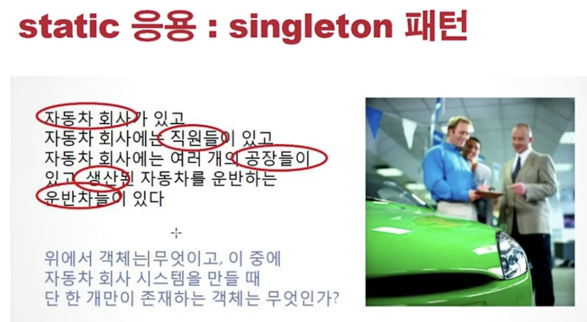
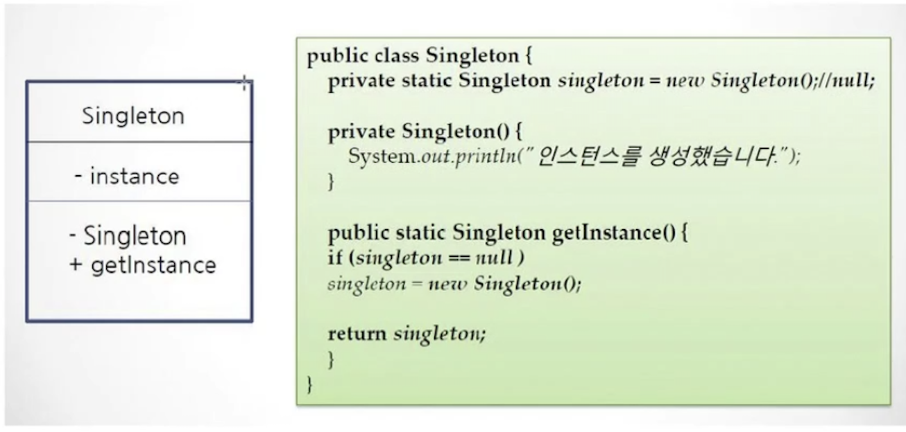

<link href="../../md/style.css" rel="stylesheet">

# 싱글톤 패턴



- 회사라는 것은 단 하나의 객체로만 존재해야 함  
  (회사 안에 직원들이 속해있을 때, 매번 회사객체가 생성되고 직원 객체를 불러오는 식으로 구현이 되면 안되는 것)
- 싱글톤을 사용하는 경우
  1. 웹 애플리케이션의 역할 부분
  2. 날짜(TimeZone); Calender 라는 패턴에서 가져다 씀
- 자바에서는 c에서 처럼 global 변수가 없으므로, static으로 선언해서 사용해야 함

## 1) 싱글톤 구현 방법


<br>



- Class diagram; 네모 박스로 다이아그램 작성

- Example

  - JAVA

    ```JAVA
      public class CompanySingleton {

          // instance또한 외부에서 접근하면 안되므로 private으로 막아줌
          // final로 변경을 막아줌
          // static으로 전역에서 접근 가능하도록 함
          private final static CompanySingleton instance = new CompanySingleton();

          private CompanySingleton() {
              // 컨스트럭터 없으면 JVM이 pre-compile 단계에서 만들어줌
              // 만약 이 blank를 선언하지 않으면 자동으로 public으로 선언되고, new 키워드로 여러개의 인스턴스를 생성할 수 있게 됨
              // private으로 차단
          }

          // static 변수 이므로, 인스턴스 메서드 말고 클래스 메서드로 선언
          public static CompanySingleton getInstance() {
              return instance;
          }

      }

      @Test
      @DisplayName("동일 인스턴스 비교")
      void compareSameInstance() {
          CompanySingleton companySingleton1 = CompanySingleton.getInstance();
          CompanySingleton companySingleton2 = CompanySingleton.getInstance();

          Assertions.assertEquals(companySingleton1, companySingleton2);
      }
    ```
