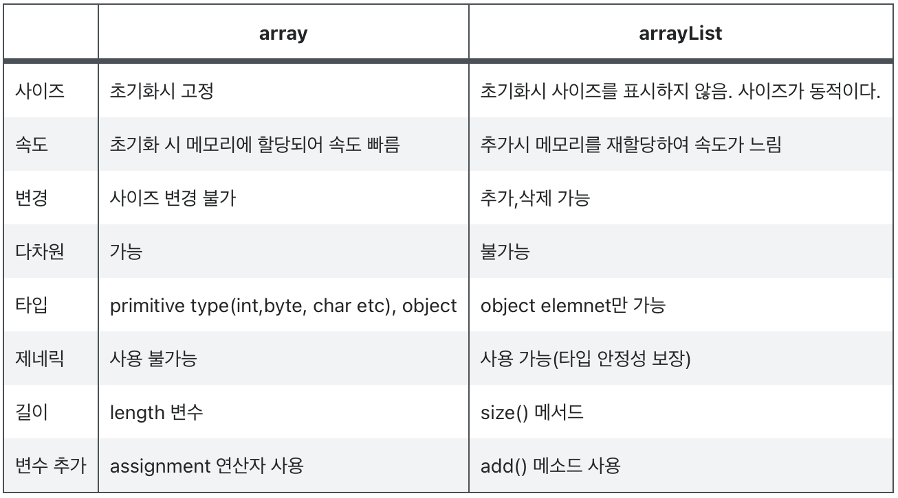
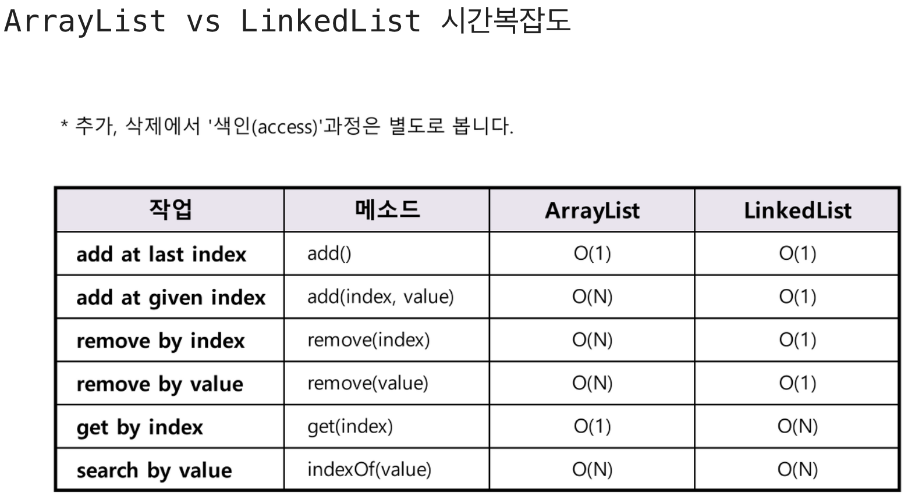
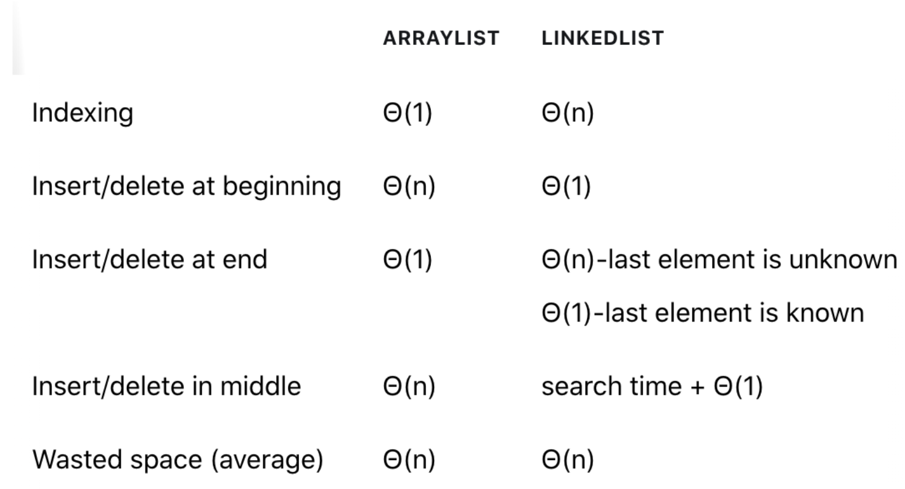
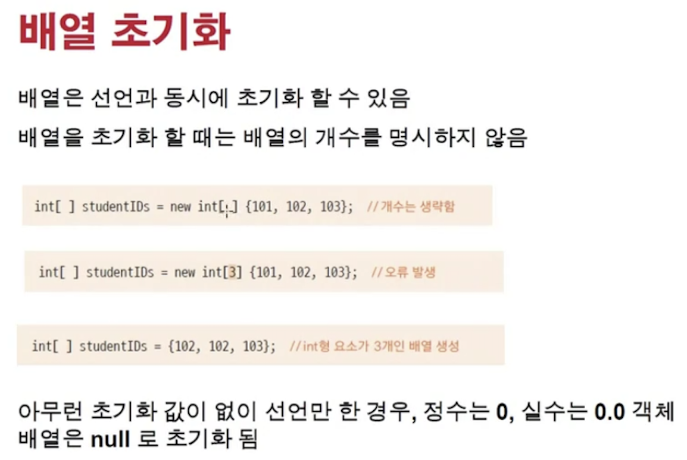
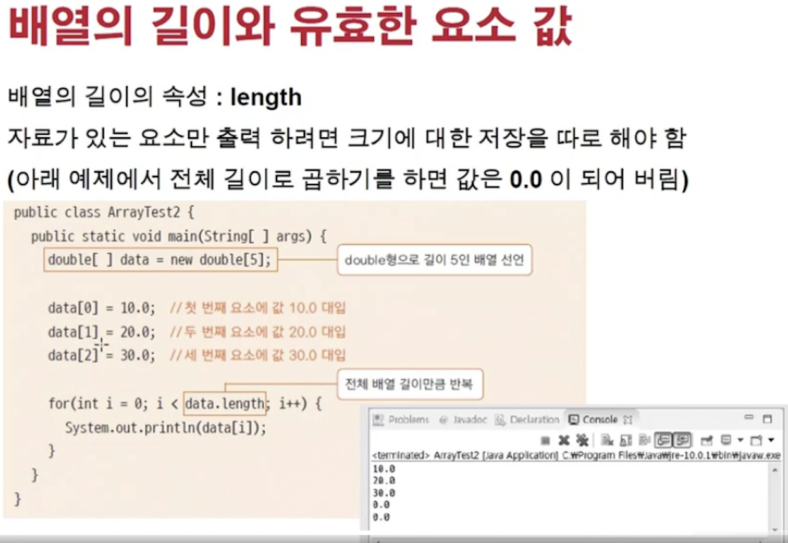

<link href="../../md/style.css" rel="stylesheet">

# Array list

- 배열은 동일한 자료형의 변수를 한꺼번에 순차적으로 관리할 때 사용
  > Note : 다음 자료구조 링크 참조
  >
  > [언어별 Array 와 리스트](https://wayhome25.github.io/cs/2017/04/17/cs-18-1/)  
  > [Java Array, ArrayList (1)](https://velog.io/@humblechoi/자료구조-Array-vs-ArrayList)  
  > [Java Array, ArrayList (2)](https://com-on-bappool.tistory.com/50)  
  > [Java ArrayList, LinkedList](https://devlog-wjdrbs96.tistory.com/64)

<br>

> Note : Array VS ArrayList VS LinkedList

- 이런 데이터 자체가 필요한 이유는, 많은 변수를 다루어야할 때 모든 변수에 대해 변수 선언을 하면 비효율적이므로
- 반복문과 결합하면 강력
- 관련성이 있는 데이터들을 관리하기 위함

<br>

> Note : 언어별 특징
>
> 1. C : Array 만 제공, List 없고 구현하거나 library 사용해야 함
> 2. Java : Array / List 구분
> 3. Python : List 만 존재, 이걸로 Array를 대신함

1. Array

   - 배열 크기 고정(길이 바꿀 수 없음) === 인덱스가 변하지 않음
   - 4byte씩 끊어서 할당되게 됨(1 크기가 4byte, 전체 갯수(길이)는 선언때 지정)
   - 자료들이 메모리상에서 붙어있어 다시 조회시 cache hit이 잘 일어나므로 효율적
   - index에 대한 데이터가 유일무이함, 유일무이한 식별자로 활용가능;
   - 필요없는 데이터 발생시 -> null로 바뀌게 되고 메모리 낭비가 발생  
     고로 삭제가 빈번하면 비효율적, 대신 조회를 자주하고 잘 변하지 않을 때 효율적
   - 삽입 삭제때, 완전 복사이후 새로 array를 만들어야 함

2. List

   - Array와 다르게, index는 몇번째 데이터인지의 의미를 가짐(유일무이의 식별자는 아님, "순서" 식별하는 기능만을 수행)
   - 불연속적으로 메모리에 데이터가 위치(Array list 제외)

   1. ArrayList

      - Array와 거의 비슷
        - 동일하게 내부적으로 배열을 사용하므로 조회가 빠르나 삽입 삭제가 느림
      - Array와 차이점
        - 데이터 추가를 가변적으로 할 수 있음
        - 내부적으로 capacity를 조정하여 크기가 변경된 새로운 배열을 사용하고, copy를 통해 통째로 옮긴후 새 데이터 추가 -> 느림

   2. LinkedList
      - 메모리 상에 양방향으로 포인터가 연결되어있어 삽입 / 삭제가 용이
      - 데이터 추가를 가변적으로 할 수 있음

3. 표로 확인하기

   1. Array VS ArrayList

      

   2. ArrayList VS LinkedList

        
      

---

## 1) 배열 특징



- 반드시 new 키워드를 붙여주어야 사용 가능

- Example

  1. integer 배열

     - JAVA

       ```JAVA
         public static void main(String[] args) {
             // new는 반드시 넣어야 함
             int[] array1 = new int[10]; // 10개짜리, 40byte
             int[] array2 = new int[] {0, 1, 2};
             int[] array3 = {4, 5, 6};
             //int[] array4 = new int[];
             // array4 = {1,2,3} 은 사용할 수 없음!

             array1[0] = 1;
             array1[1] = 2;
             array1[2] = 3;
             array1[7] = 7;

             // for(int i = 0; i++; i < array1.length)
             for (int i = 0; i < array1.length; i++) {
                 System.out.println("array1[i] = " + array1[i]);
             }


         }
       ```

     - Result - Terminal
       ```TEXT
         array1[i] = 1
         array1[i] = 2
         array1[i] = 3
         array1[i] = 0
         array1[i] = 0
         array1[i] = 0
         array1[i] = 0
         array1[i] = 7
         array1[i] = 0
         array1[i] = 0
       ```

  2. char 배열

     - JAVA

       ```JAVA
        public static void main(String[] args) {

            char[] alphabets = new char[26];
            char ch = 'A';

            // OR for (int i = 0; i < alphabets.length; i++, ch++)
            for (int i = 0; i < alphabets.length; i++) {
       //            alphabets[i] = (char) ((char)(int) ch + i);
                alphabets[i] = (char) (ch + i); // 자동 형변환 수행
            }

            for (char alphabet : alphabets) {
                System.out.println("alphabet = " + alphabet);
            }
        }
       ```

     - Result - Terminal
       ```TEXT
        alphabet = A
        alphabet = B
        alphabet = C
        alphabet = D
        alphabet = E
        alphabet = F
        alphabet = G
        alphabet = H
        alphabet = I
        alphabet = J
        alphabet = K
        alphabet = L
        alphabet = M
        alphabet = N
        alphabet = O
        alphabet = P
        alphabet = Q
        alphabet = R
        alphabet = S
        alphabet = T
        alphabet = U
        alphabet = V
        alphabet = W
        alphabet = X
        alphabet = Y
        alphabet = Z
       ```

## 2) 배열의 길이와 유효 요소 값



- 유효값 필터링 등은 if 문 등으로 처리
- OR 유효한 index를 다른 변수에 저장해놓고 필터링을 하는 방식으로 사용
