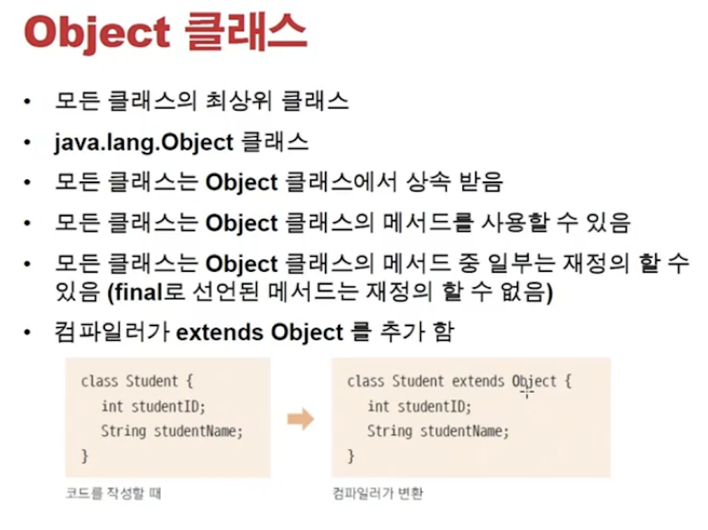
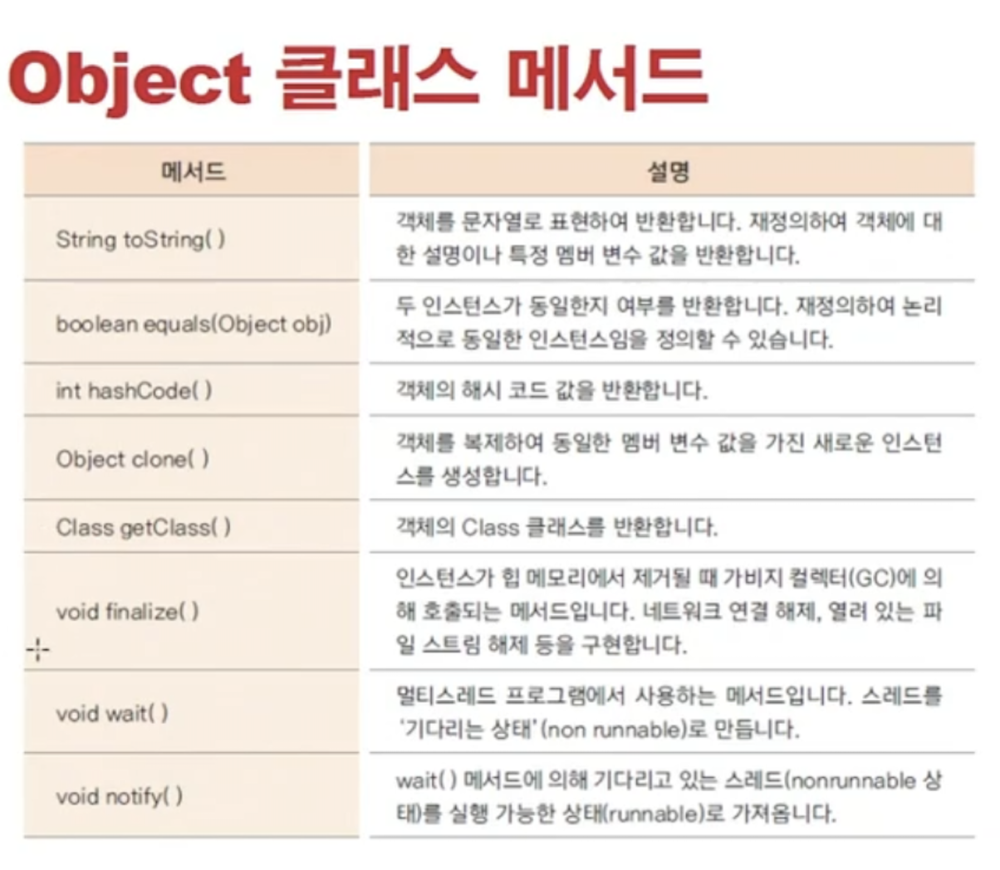
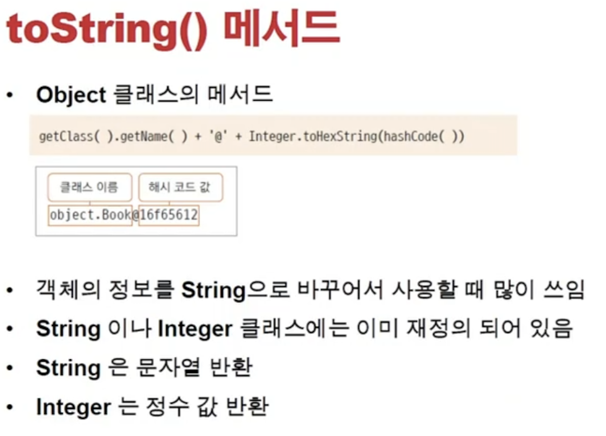
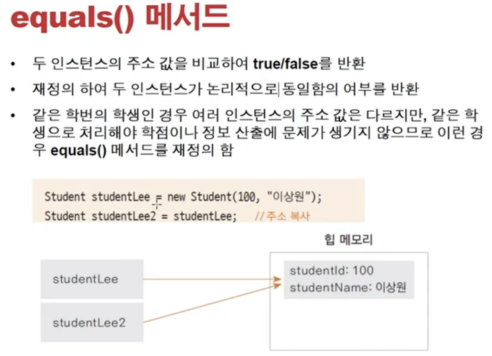
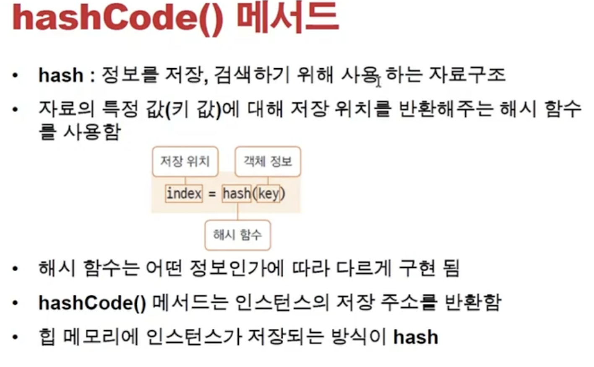
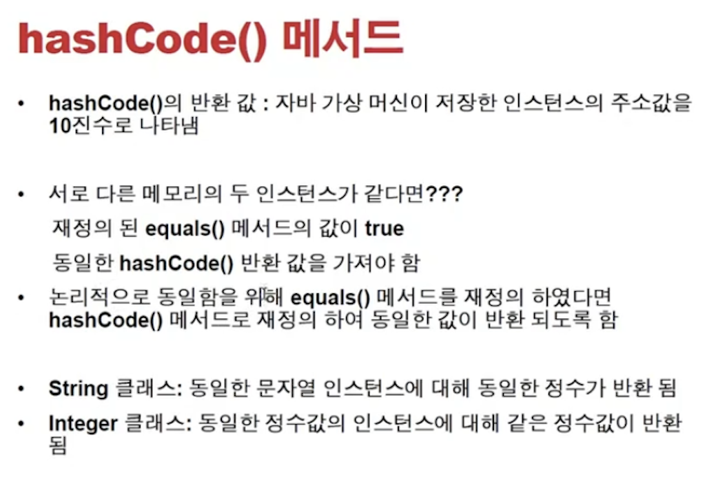
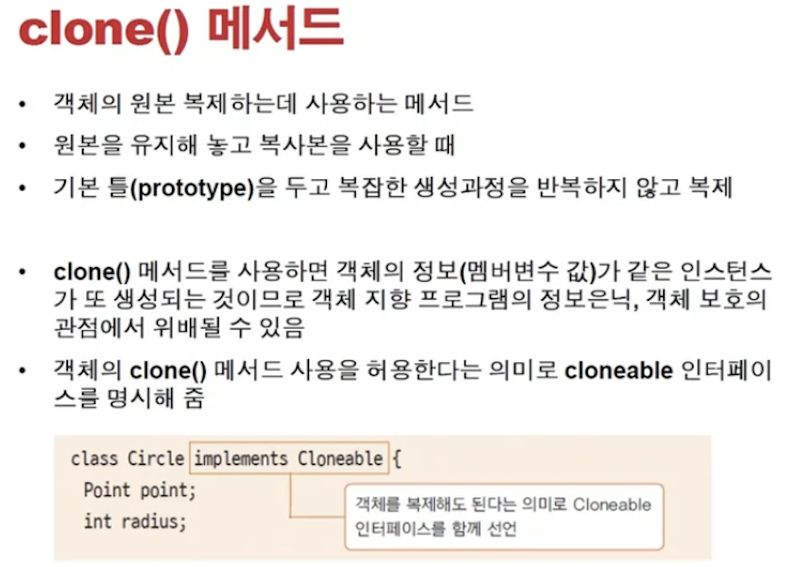

<link href="../../md/style.css" rel="stylesheet">

# 기본 클래스 - 1

# JDK

- Java Development Kit
- 참조 링크
  1. [참조링크 1](https://velog.io/@shelly/JAVA-JDK란)
  2. [참조링크 2](https://m.blog.naver.com/cjhol2107/221781711556)

## 1) java.lang 클래스

- 자동으로 import 되는 클래스(import 하지 않아도 자동으로 import)
- 많이 사용하는 기본 클래스들이 속한 패키지
- String, Integer, System 등...

## 2) Object 클래스들이

    


- 모든 Class들의 원형, 이들은 Object를 상속받음
- Object 없으면 컴파일 시점에 추가해줌
- Final로 선언시, 재정의 불가능; Wait, Notify 등

### a) toString 매서드



- toString의 원형, 변환해서 사용할 수 있음(오버라이딩)
- Integer 등은 이미 재졍의되어있음
- Example

  - JAVA

    ```JAVA

      class Book {
          String title;
          String author;

          Book(String title, String author) {
              this.title = title;
              this.author = author;
          }

          @Override
          public String toString() {
              String tmp = "";
              tmp += "title = " + title + '\n';
              tmp += "author = " + author;
              return tmp;
          }
      }


      public class ToStringEx {
          public static void main(String[] args) {
              Book book = new Book("두잇자바", "은종님");
              System.out.println(book);

              String str = new String("Test");
              System.out.println(str);
          }

      }
    ```

  - Result - Terminal
    ```TEXT
      title = 두잇자바
      author = 은종님
      Test
    ```

### b) equals() 메서드



- 인스턴스가 달라도, 클래스가 같은지 비교하는 것
- 인스턴스로 비교하는게 아닌(이때는 == 써서 비교) / 클래스가 같은지 비교하는 것
- eqauls 기본은 overriding 안되어있으면(==)와 동일하게 돌아감
- Example

  - JAVA

    ```JAVA

      class Student {

          private int studentID;
          private String studnetName;

          public Student(int studentID, String studentName) {
              this.studentID = studentID;
              this.studnetName = studentName;
          }

          @Override
          public boolean equals(Object obj) {
              if (obj instanceof Student) {
                  return this.studnetName == ((Student) obj).studnetName && this.studentID == ((Student) obj).studentID;
              } else {
                  return false;
              }
          }
      }


      public class EqualsTest {

          public static void main(String[] args) {
              String str1 = new String("Hi");
              String str2 = new String("Bye");
              String str3 = new String("Bye");

              // (1) 메모리 끼리 비교
              System.out.println("str1 == str2 = " + str1 == str2);
              System.out.println("str2 == str3 = " + str2 == str3);

              // (2) 재정의 안하면 (1)과 동일, String의 경우 string 값을 비교하므로 True
              System.out.println("str1.equals(str2) = " + str1.equals(str2));
              System.out.println("str2.equals(str3) = " + str2.equals(str3));

              Student st1 = new Student(1, "St_1");
              Student st2 = new Student(2, "St_2");
              Student st3 = new Student(2, "St_2");
              Student st4 = new Student(3, "St_2");

              System.out.println("st1.equals(st2) = " + st1.equals(st2));
              System.out.println("st2.equals(st3) = " + st2.equals(st3));
              System.out.println("st3.equals(st4) = " + st3.equals(st4));

          }
      }
    ```

  - Result - Terminal
    ```TEXT
      false
      false
      str1.equals(str2) = false
      str2.equals(str3) = true
      st1.equals(st2) = false
      st2.equals(st3) = true
      st3.equals(st4) = false
    ```

### c) hashCode() 매서드

- [중요 참조 링크 - Hashtable VS HashMap](https://devlog-wjdrbs96.tistory.com/253)
- [중요 참조 링크 - hashCode](https://brunch.co.kr/@mystoryg/133)
- [참조링크 1](https://velog.io/@kkw9312/javaHash)
- [참조링크 2](https://jroomstudio.tistory.com/10)

<br>



- **`오버라이딩 되지 않은 경우, 보통 객체 주소를 기반으로 한(heap 영역)의 메모리를 hash function에 통과시켜 나온 index를 유일성을 가진 정수 값을 받을 수 있고, 이를 통해 같으 객체인지 아닌지 판변하는 등에 사용할 수 있음`**
- Hash, HashMap, HashCode가 있음
  - Object의 hashCode는 메모리 주소를 반환해줌
- hash : key, value로 되는 자료구조
  - hash( ) 함수의 return 은 index이고 이를 hash table에서 바로 access할 수 있음
- JVM이 hash를 통해 메모리를 관리

<br>



- equals 를 재정의 하였을 때, hashCode도 같은 결과가 나와야지 JDK hashMap 등을 쓸 수 있음
- Integer, String 등은 값에 의해 hashCode()/equals() 가 판단되어야함

### d) Clone() 메서드



- 기본적으로 객체를 parameter로 넘기면 reference로 넘어감
- 따라서, 원본을 유지하고 복제를 해야할 때 Clone method 사용해야함
- 복제하는 instance를 모두 복제, 따라서 private 같은 객체지향에 사용되는 information hiding 등이 지켜지지 않으므로  
  인터페이스를 사용해서 명시해주어야, clone 메서드를 사용할 수 있음
- **`protected : default(같은 패키지 내 access가능) + 다른 패키지에서 상속의 경우 access 가능`**
- **`Cloneable interface를 Class에 implement 해주어야 함!`**

