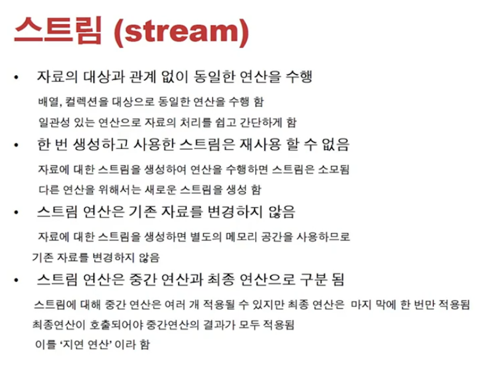
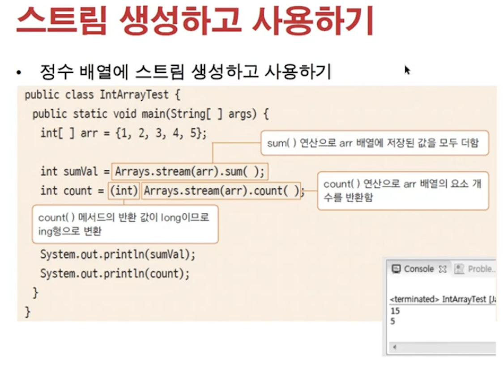
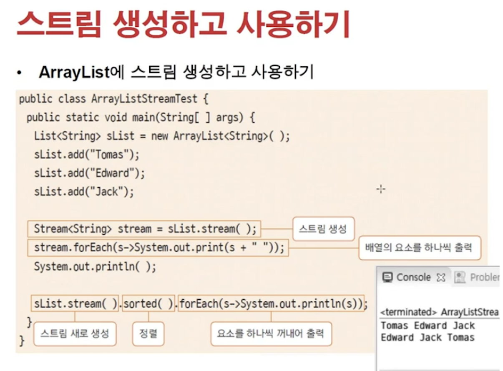
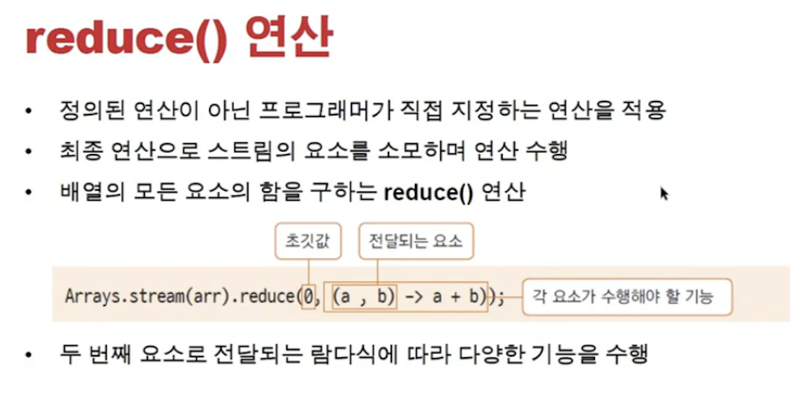
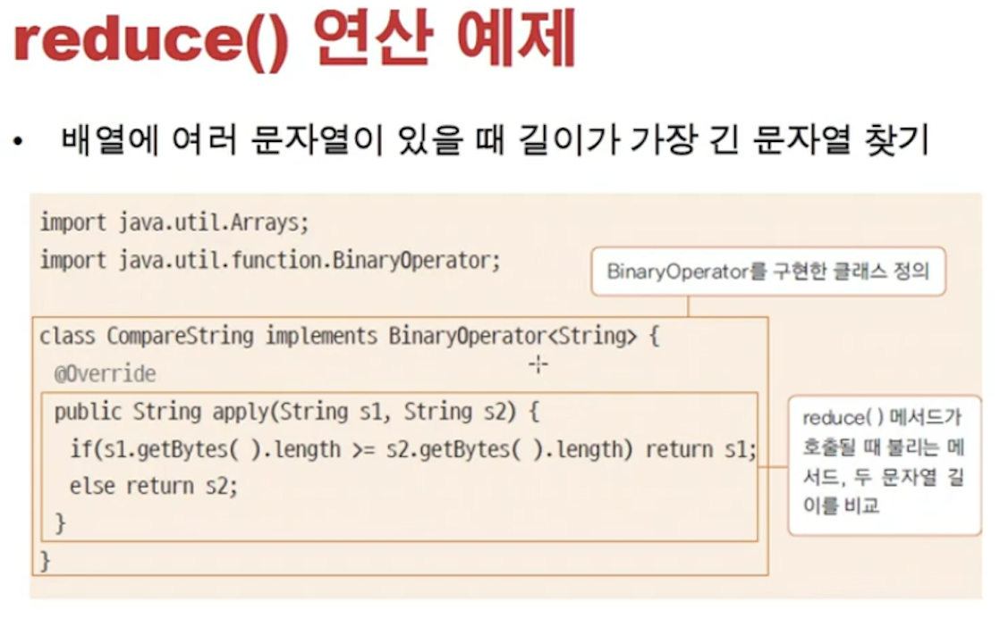
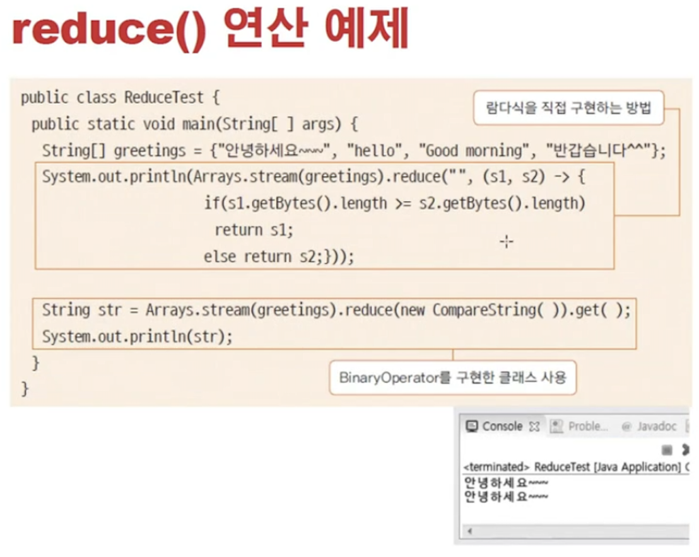
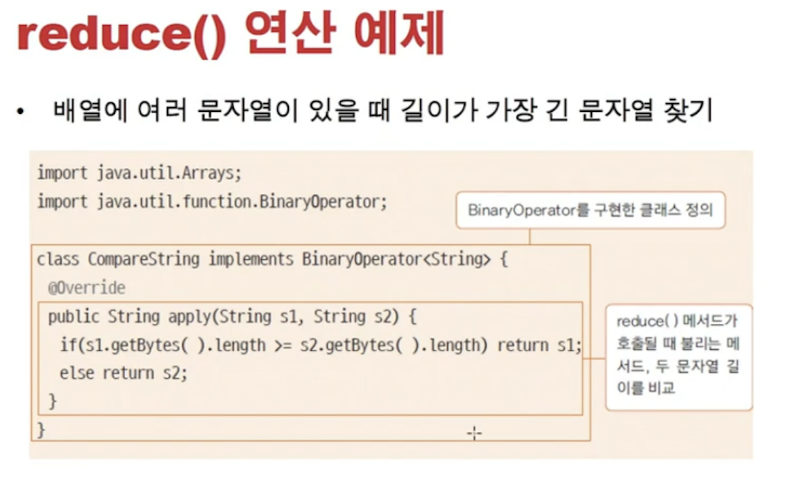

<link href="../../md/style.css" rel="stylesheet">

# 내부 클래스 - Stream

## 1) 스트림 특징



- 스트림 연산이란?

  - **`데이터의 흐름`**
  - 자료가 이미 있을 때, 배열 / Collection 등에 대해서 더 효율적으로 연산 및 처리를 하는 것
  - 스트림 자체는 소모성, 다시 사용을 못함 -> 다시 연산하려면 새 Stream을 사용
  - 입출력에서의 Stream과는 다름
  - 기존 자료를 사용하지 않고 Copy를 "다른 메모리에 생성"을 떠서 연산을 수행 -> Functional Programming의 연산 방식과 매우 비슷
  - 최종연산까지 수행해야하고, 중간의 결과를 알 수 없음 -> Lazy Evaluation

- 참조 링크

  1. [참조링크1](https://futurecreator.github.io/2018/08/26/java-8-streams/)
  2. [참조링크2](https://futurecreator.github.io/2018/08/26/java-8-streams-advanced/)

- 중요 참조

  > Note  
  > [String\[\]::new 의 역할](https://stackoverflow.com/questions/44310226/what-does-stringnew-mean)  
  > [String\[\]::new 의 역할 - ArrayList를 Array로 변환할 때](https://codechacha.com/ko/java8-convert-stream-to-array/)  
  > [다양한 Stream의 사용법](https://ryan-han.com/post/dev/java-stream/)

- 자바 스트림 ~= Python functional programming(map, reduce, filter, all, any, sum, sort ...)

## 2) 예제 구현


<br>

<br>

### a) Array

- JAVA

  ```JAVA

    public class IntArrayTest {

        public static void main(String[] args) {

            // array 기준
            int[] arr = {1, 2, 3, 4, 5};
            //        int[] arr1 = new int[]{1, 2, 3, 4, 5};
            //        int[] arr2 = new int[5];
            //        arr2[0] = 1;
            //        arr2[1] = 2;


            // 기본 Stream
            IntStream intStream = Arrays.stream(arr);
            int sumed = Arrays.stream(arr).sum();
            int count = (int) Arrays.stream(arr).count(); // 새로 Arrays.stream 메서드를 호출해야 소비된 Stream 말고, 새로 생성된 Stream 사용 가능
            System.out.println("sumed = " + sumed);
            System.out.println("count = " + count);

        }
    }
  ```

- Result - Terminal
  ```TEXT
    sumed = 15
    count = 5
  ```

### b) ArrayList

- JAVA

  ```JAVA

    public class IntArrayListTest {

        public static void main(String[] args) {
            List<String> stringList = new ArrayList<String>(); // List가 ArrayList 보다 상위, 업캐스팅

            stringList.add("Item1");
            stringList.add("UareMyLove");
            stringList.add("Item2");
            stringList.add("isMyVariable1");
            stringList.add("Item3");


            // 1) Stream 으로 순회하기
            Stream<String> stream = stringList.stream();
            stream.forEach(s -> System.out.println("s = " + s)); // 최종 연산자, Stream 소비

            // Buffer에서 꺼내서 쓰기 때문에 소비가 되는듯, Cursor 처럼
            System.out.println("stringList.stream().count() = " + stringList.stream().count()); // 새 Stream 사용
            System.out.println("(long) stringList.size() = " + (long) stringList.size()); // 새 Stream 사용
            // 동일 구문, 순회하기
            for (String string : stringList) {
                System.out.println("string = " + string);
            }


            // 2) Stream으로 Sorting 하기
            // Chaining 처럼 사용 가능 -> 각 부분에서 익명함수 사용가능 -> return은 계속 Stream 타입으로 반환됨
            stringList.stream().sorted().forEach(s -> System.out.println("s = " + s));
            String[] toArray = stringList.stream().sorted().toArray(String[]::new); // String[]::new -> String으로 데이터 바꿔주는 부분, 데이터 크기에 맞춰서


        }


    }
  ```

- Result - Terminal
  ```TEXT
    s = Item1
    s = UareMyLove
    s = Item2
    s = isMyVariable1
    s = Item3
    stringList.stream().count() = 5
    (long) stringList.size() = 5
    string = Item1
    string = UareMyLove
    string = Item2
    string = isMyVariable1
    string = Item3
    s = Item1
    s = Item2
    s = Item3
    s = UareMyLove
    s = isMyVariable1
  ```

## 3) 다른 Stream 연산들

### a) Reduce 연산


<br>


- 반복 연산을 수행하는 것
- 구현 방법

  1. 람다식 OR Stream

     

  2. Binary Operator 상속 클래스를 이용

     

- Example

  - JAVA

    ```JAVA

      class CompareString implements BinaryOperator<String> {
          @Override
          public String apply(String s1, String s2) {
              if (s1.getBytes().length <= s2.getBytes().length) { // 람다식에서 Binary Operator를 직접 구현
                  return s1;
              } else return s2;
          }

      }


      public class ReduceTest {

          public static void main(String[] args) {
              String[] strings = {"Hello!", "hi", "Nice to meet you!"};

              String result1 = method1(strings);
              String result2 = method2(strings);


          }

          public static String method1(String[] inputString) {
              String s = Arrays.stream(inputString).reduce("", (s1, s2) -> {
                  if (s1.getBytes().length >= s2.getBytes().length) { // 람다식에서 Binary Operator를 직접 구현
                      return s1;
                  } else return s2;
              });
              System.out.println("s = " + s);

              return s;
          }

          public static String method2(String[] inputString) {
              String s = Arrays.stream(inputString).reduce(new CompareString()).get();
              System.out.println("s = " + s);
              return s;
          }
      }

    ```

  - Result - Terminal
    ```TEXT
      s = Nice to meet you!
      s = hi
    ```
