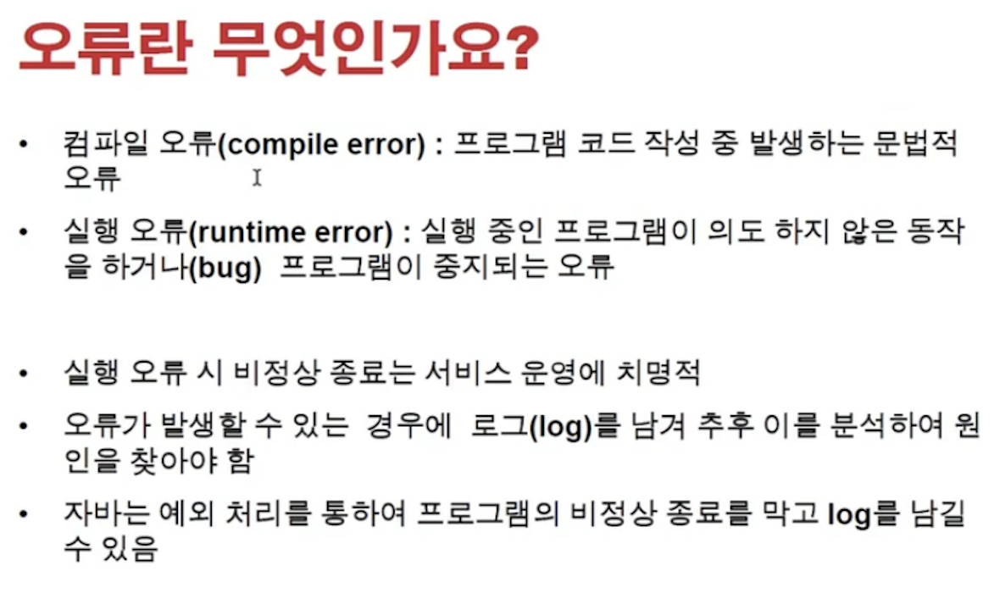
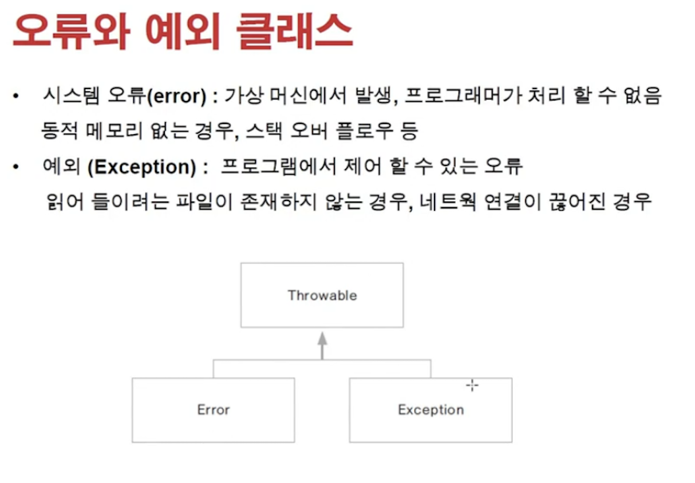
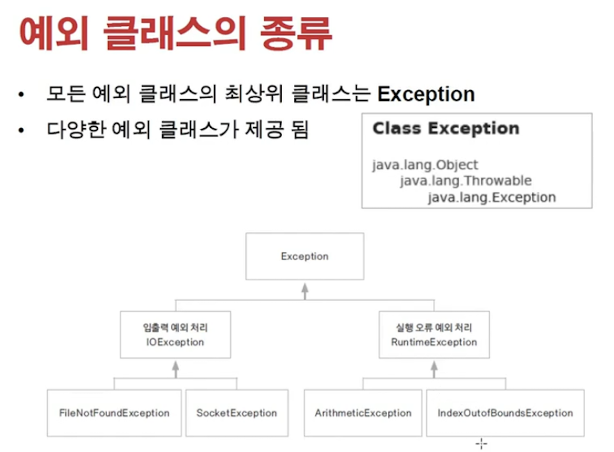
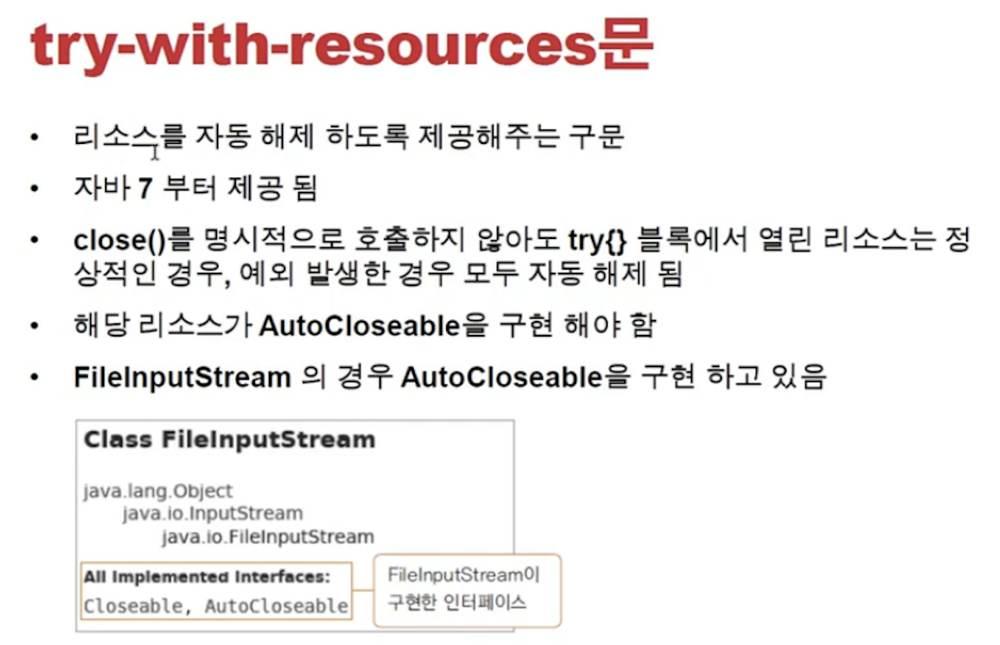
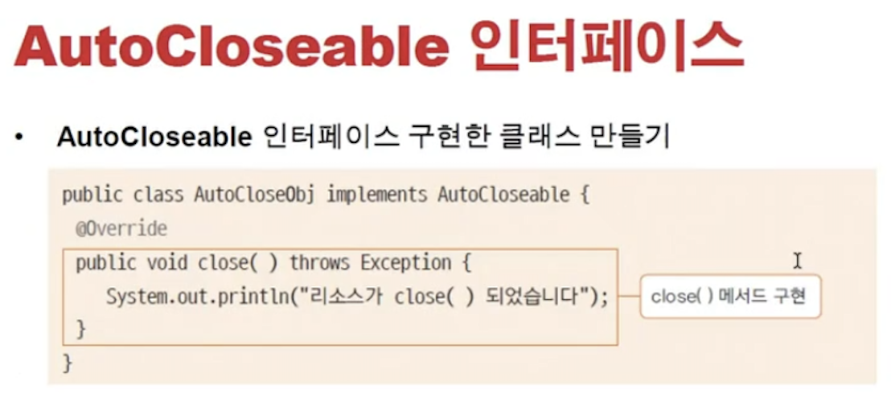
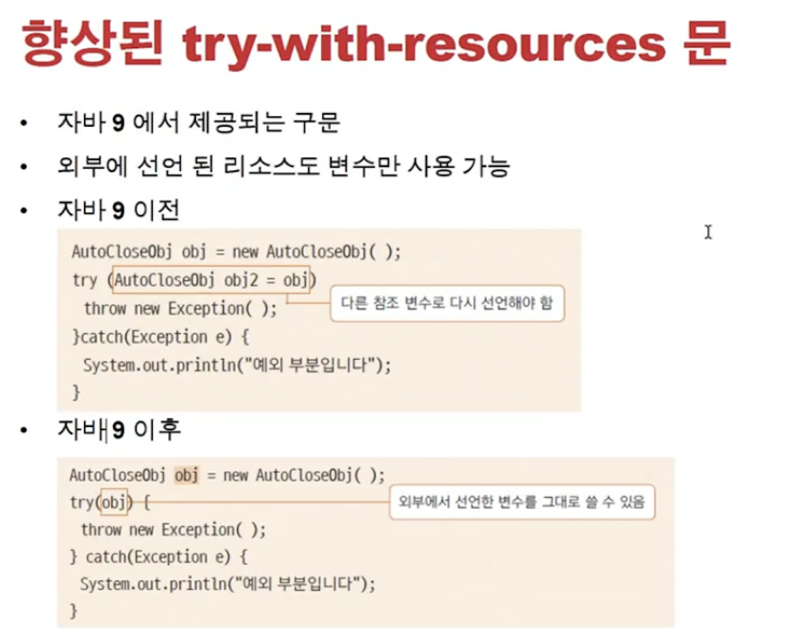
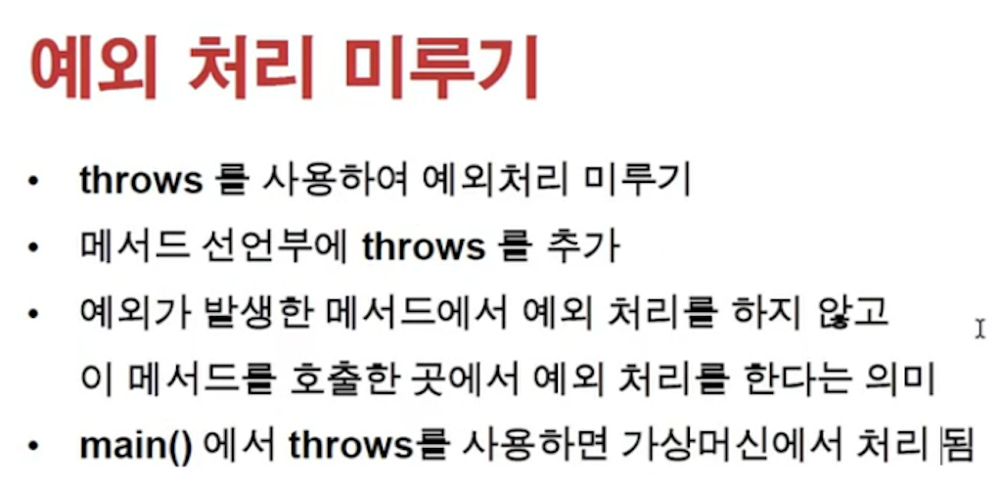
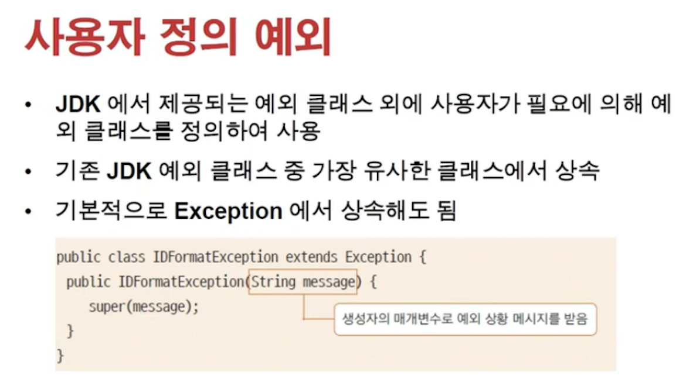
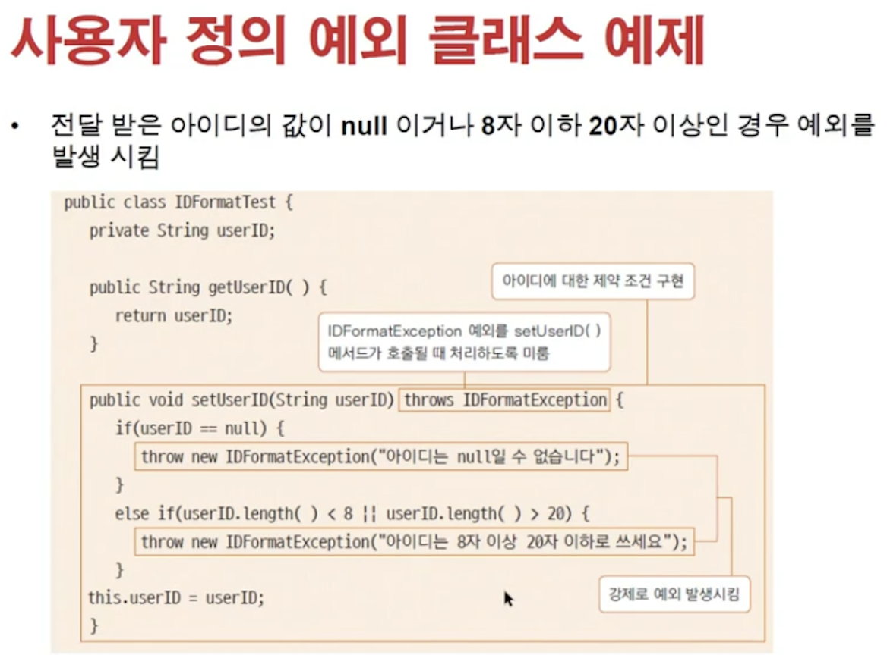

<link href="../../md/style.css" rel="stylesheet">

# 예외 처리



- **`컴파일 오류가 Best!`**
- Runtime Error를 예외처리 하고, Log 파일을 남겨서 기록하고 나중에 확인할 수 있도록 하는 것
- **`로그의 Framework과 Syntax가 다 있음! -> Spring에도 있었음`**
- NullpointException
  1. [참조 예제 1](https://www.daleseo.com/java8-optional-before/)
  2. [참조 예제 2](https://www.daleseo.com/java8-optional-after/)
  3. [참조 예제 3](https://www.daleseo.com/java8-optional-effective/)
  4. [Optional 처리](https://conservative-vector.tistory.com/entry/JAVA-null-체크를-간단하게-해보자)

## 1) 오류와 에러 클래스


<br>

<br>

- Runtime 에러가 나면 프로그램이 죽음 -> 그래서 try catch finally를 사용하는 것(죽는것은 막자라는 생각)
- Finally -> 마지막에(오류 / 정상) 산관없이 무조건 돌도록 하는 것

  - **`Catch에 Return 값이 있더라도, finally 수행 이후에 return 됨 = 한마디로, finally는 무조건 수행되는 것`**
  - **`finally -> 파일 닫기, connection close 등, 마지막에 수행해야 하는 것들을 주로 위치시킴`**

- Example

  - JAVA

    ```JAVA

      public class ExceptionTest {

          FileInputStream fileInputStream;

          public static void main(String[] args) {
              ExceptionTest exceptionTest = new ExceptionTest();
              exceptionTest.createTextStream();

          }

          public void createTextStream() { // Method에서 throw Exception 사용하면, compile로 넘어가기 전에도 에러가 나옴
              try {
                  fileInputStream = new FileInputStream("a.txt");
              } catch (FileNotFoundException e) {
                  e.printStackTrace();
              } finally {
                  try {
                      fileInputStream.close();
                  } catch (IOException e) {
                      e.printStackTrace();
                  } finally {
                      System.out.println("fileInputStream = " + fileInputStream);
                  }
                  System.out.println("finally");
              }

              System.out.println("end");


          }
    ```

  - Result - Terminal

    ```TEXT
      java.io.FileNotFoundException: a.txt (No such file or directory)
        at java.base/java.io.FileInputStream.open0(Native Method)
        at java.base/java.io.FileInputStream.open(FileInputStream.java:219)
        at java.base/java.io.FileInputStream.<init>(FileInputStream.java:157)
        at java.base/java.io.FileInputStream.<init>(FileInputStream.java:112)
        at com.main.Chapter4.exceptionEx.ExceptionTest.createTextStream(ExceptionTest.java:19)
        at com.main.Chapter4.exceptionEx.ExceptionTest.main(ExceptionTest.java:13)
      fileInputStream = null
      Exception in thread "main" java.lang.NullPointerException
        at com.main.Chapter4.exceptionEx.ExceptionTest.createTextStream(ExceptionTest.java:24)
        at com.main.Chapter4.exceptionEx.ExceptionTest.main(ExceptionTest.java:13)
    ```

## 2) try-with-resources 문


<br>

<br>

<br>

- Finally 안쓰고, authocloseable로 파일 관련 작업을 해주기 위함
- try문에 변수선언 및 객체 할당
- Example

  - JAVA

    ```JAVA
      public class AutoCloseObj implements AutoCloseable {
          @Override
          public void close() throws Exception {
              System.out.println("AutoCloseObj.close: Close method is called");
          }
      }

      ...

      public void createObjAutoClose() {
          try (AutoCloseObj autoCloseObj = new AutoCloseObj()) {
              throw new Exception();
          } catch (Exception e) {
              System.out.println("e = " + e);
          } finally {
              System.out.println("finally");
          }
          System.out.println("end");
      }

    ```

  - Result - Terminal
    ```TEXT
      AutoCloseObj.close: Close method is called
      e = java.lang.Exception
      finally
      end
    ```

## 3) Exeption 미루기!



- Example

  - JAVA

    ```JAVA

      public class ThrowsException {

          public static void main(String[] args) {
              ThrowsException throwsException = new ThrowsException();
              try {
                  throwsException.loadClass("b.txt", "java.lang.string");
              } catch (FileNotFoundException e) {
                  e.printStackTrace();
              } catch (ClassNotFoundException e) {
                  e.printStackTrace();
              } catch (Exception e) { // 전역 오류(혹시 모르기 때문에) 는 catch의 마지막에 수행
                  System.out.println("e = " + e);
              } finally {
                  System.out.println("finally");
              }
              System.out.println("end");
          }

          // Throws로 해당 에러들을 미뤄놓았기 때문에, 이 Class를 쓰는 쪽에서 해당 Exception들을 구현해야 함
          public Class loadClass(String fileName, String className) throws FileNotFoundException, ClassNotFoundException {

              FileInputStream fileInputStream = new FileInputStream(fileName);
              // 동적으로 Class 할당
              Class c = Class.forName(className);

              return c;
          }
      }
    ```

  - Result - Terminal
    ```TEXT
      java.io.FileNotFoundException: b.txt (No such file or directory)
        at java.base/java.io.FileInputStream.open0(Native Method)
        at java.base/java.io.FileInputStream.open(FileInputStream.java:219)
        at java.base/java.io.FileInputStream.<init>(FileInputStream.java:157)
        at java.base/java.io.FileInputStream.<init>(FileInputStream.java:112)
        at com.main.Chapter4.exceptionEx.ThrowsException.loadClass(ThrowsException.java:25)
        at com.main.Chapter4.exceptionEx.ThrowsException.main(ThrowsException.java:11)
      finally
      end
    ```

## 4) 사용자 예외처리


<br>


- 위에 처럼 정의를 해줄 수 있음
- Example

  - JAVA

    ```JAVA

      class IDchecker extends Exception {

          public IDchecker(String message) {
              super(message); // 상속 Exception class constructor에 들어가는 메세지 초기화
          }

      }


      class IDdata {
          private String userID;

          public String getUserID() {
              return userID;
          }

          public void setUserID(String userID) throws IDchecker {

              if (userID == null) {
                  throw new IDchecker("아이디는 null 일 수 없습니다!");
              } else if (userID.length() < 8 || userID.length() > 20) {
                  throw new IDchecker("아이디 길이는 8이상 20이하여야 합니다.");
              }

              this.userID = userID;
          }
      }


      public class IDmakerTest {

          public static void main(String[] args) {

              String[] idList = new String[]{null, "1234567", "1234567890"};

              IDdata iDdata = new IDdata();

              for (String s : idList) {
                  System.out.println("===============");
                  System.out.println("s = " + s);
                  try {
                      iDdata.setUserID(s);
                  } catch (IDchecker e) {
                      System.out.println("e = " + e);
                  }

              }

          }
      }
    ```

  - Result - Terminal
    ```TEXT
      ===============
      s = null
      e = com.main.Chapter4.exceptionEx.IDchecker: 아이디는 null 일 수 없습니다!
      ===============
      s = 1234567
      e = com.main.Chapter4.exceptionEx.IDchecker: 아이디 길이는 8이상 20이하여야 합니다.
      ===============
      s = 1234567890
    ```
