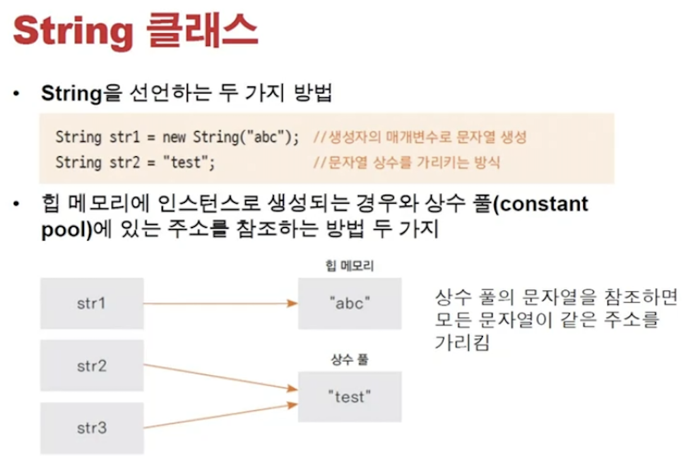
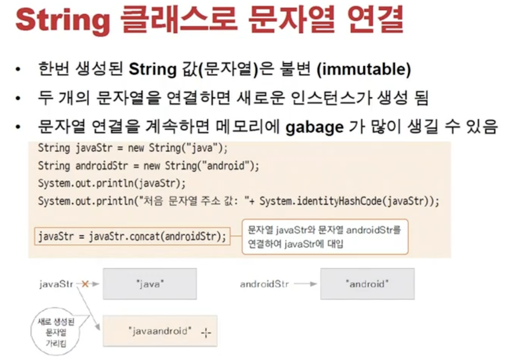
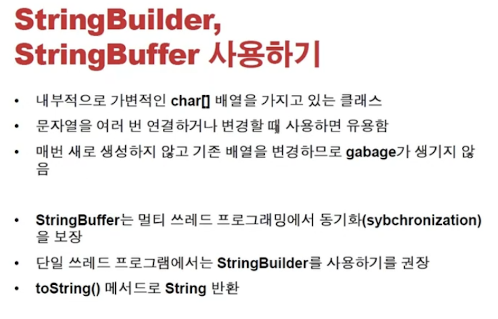
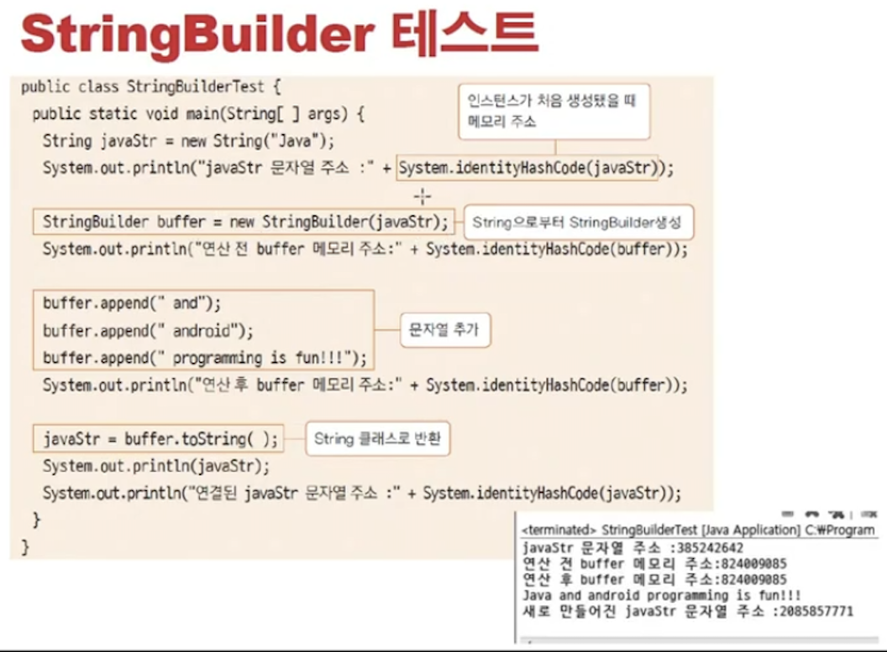
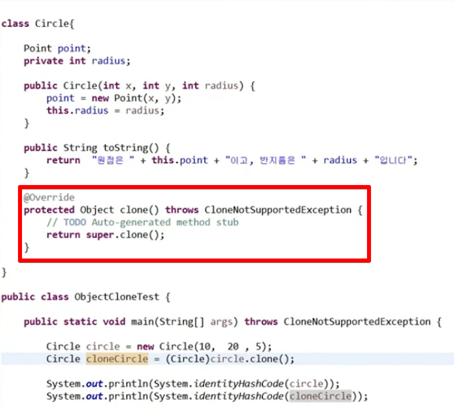
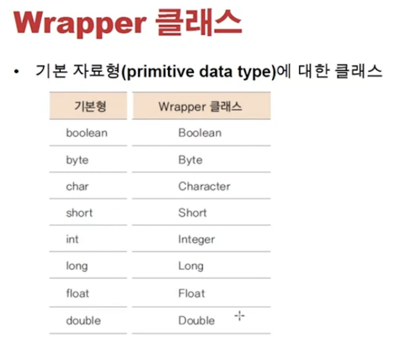
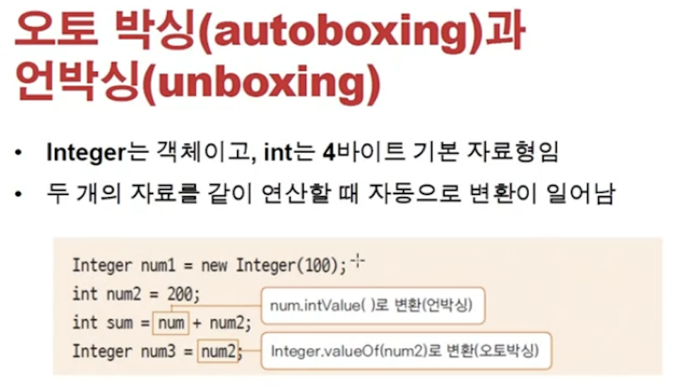
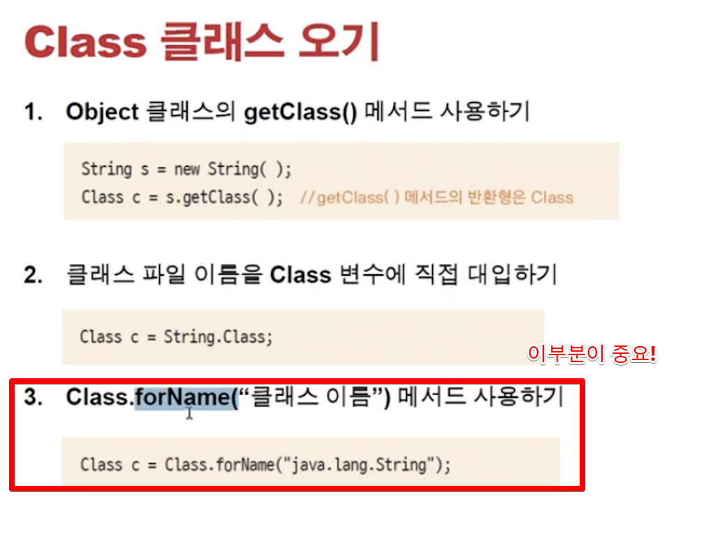
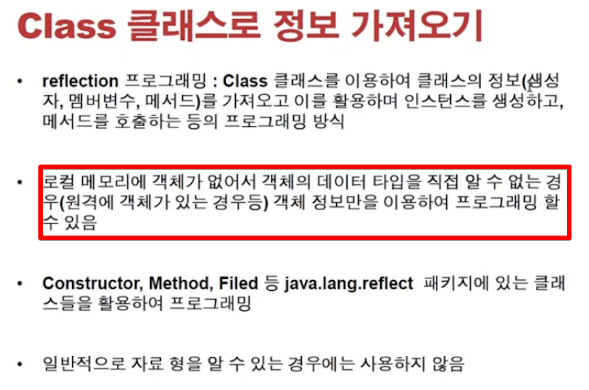
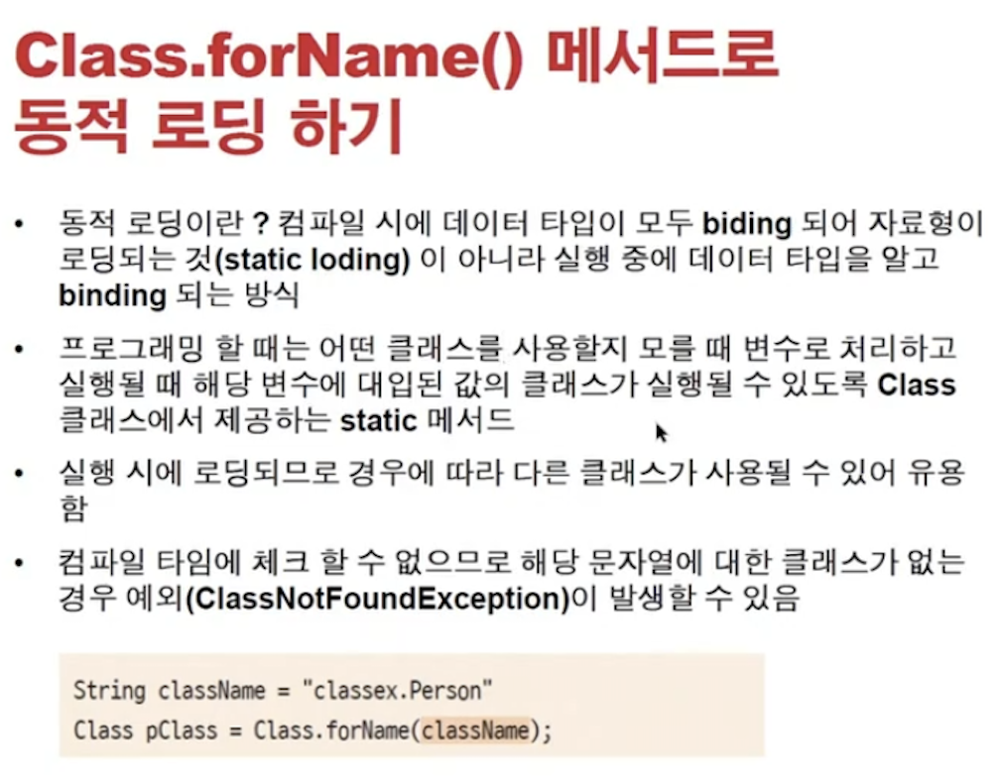

<link href="../../md/style.css" rel="stylesheet">

# 기본 클래스 2 - String, Wrapper, Class

## 1) String 클래스



- String 클래스 사용
- 생성방법
  1. new String("abc") : 클래스로 사용, heap에 할당, 매서드들 사용 가능
  2. "test" : 상수 풀에 할당; 처음 프로그램이 메모리에 적재될 때 data 영역에 같이 올라감

### a) String 비교

- Integer, Long 등의 클래스에서도 동일하게 동작
- String은 한 문자당 2byte
- String은 한번 선언하면 변하지 않는 immutable 특성을 보임
- Example

  - JAVA

    ```JAVA
      public class StringTest {

          public static void main(String[] args) {

              String str1 = new String("abc");
              String str2 = new String("abc");

              System.out.println("str1 == str2 = " + str1 == str2);
              System.out.println("str1.equals(str2) = " + str1.equals(str2));

              String str3 = "test";
              String str4 = "test";

              System.out.println("str3 == str4 = " + str3 == str4);

          }
      }
    ```

  - Result - Terminal
    ```TEXT
      false
      str1.equals(str2) = true
      false
    ```

### b) Immutable 특성



- 밑의 예제에서 str1이 바뀌지만, 원래 인스턴스 변수에 할당되어있던 abc String은 사라지지 않음
- 그냥 교체가 되는 것이고, "abcdef"를 새로 만들고 그것을 할당해줌
- 계속 Concat하면 메모리에 String이 쌓이게 될 수 있음  
  -> String을 계속 연결하는 경우; 프로토콜 생성, return값 생성, 서버->클라이언트 전송 등  
  -> 이런식으로 계속 연결하면 쓰레기 메모리가 많이 생성..! -> **`StringBuilder / StringBuffer 사용`**
- Example

  - JAVA

    ```JAVA
      public static void main(String[] args) {
          func2();


      }

      public static void func2() {
          String str1 = new String("abc");
          String str2 = new String("def");

          str1 = str1.concat(str2);
          System.out.println("str1 = " + str1);
      }
    ```

### c) StringBuilder / StringBuffer



- String과의 차이점 : 객체 내부에 final이 아니기 때문에 수정하여 사용할 수 있음, 가변적인 char[]
- 차이
  - Buffer; 멀티 쓰레드 프로그래밍에서 동기화를 보장! -> 스레드간의 순서를 보장(데이터영역을 공유)  
    -> Thread에 락을 걸어서 진행(semaphore, mutex), 이 자체로 오버헤드 발생
  - Builder; 단일 쓰레드 프로그램에서 권장
- **`Char[]을 사용하기 때문에, 차후 String 값만 뽑아서 쓸려면 toString() 사용할 것`**

<br>

- 예시

  

<br>



> Note : 결론적으로, concat할일이 많을 때, 계속 string 할당하면 적재시 new로 intern메서드가 불리며 heap영역에 계속 올라가게 되므로(+해제되지 않는듯)
> [참조 링크](https://medium.com/@joongwon/string-의-메모리에-대한-고찰-57af94cbb6bc) // gc가 동작하기는 하지만, 메모리 낭비 심하므로! 조심하자!

- Example

  - JAVA

    ```JAVA
      public class StringBuildTest {

          public static void main(String[] args) {

              String str1 = new String("java1");

              StringBuilder str2 = new StringBuilder("java2");
              System.out.println("str2.hashCode() = " + str2.hashCode());

              str2.append(" is perect!");
              str2.append(" also learn Android!");
              System.out.println("str2.hashCode() after append = " + str2.hashCode());

              String str3 = str2.toString();
              System.out.println("str3.hashCode() = " + str3.hashCode());
          }
      }
    ```

  - Result - Terminal
    ```TEXT
      str2.hashCode() = 1057941451
      str2.hashCode() after append = 1057941451
      str3.hashCode() = 1995450153
    ```

## 2) Wrapper Class



- Primitive에 대한 Class 타입이 모두 제공이 됨
- **`AutoBoxing, Unboxing`** 이 컴파일러에서 자동으로 수행 됨

  

  - 현재는 new를 안쓰고, Integer만 가져오고 constructor를 쓰지 않는 것이 좋음

## 3) Class 클래스


<br>



<br>



- Relection과 관련이 있는 프로그래밍 방식
  - 자료형 모르는 경우에만 사용
  - java.lang.reflect 패키지 안의 클래스들 사용
- forName()메서드는 중요: 해당 이름으로 동적으로 클래스를 로딩할 수 있는 방식(컴파일 전에 정적으로 짜놓는 것이 아님!)
- Example

  - JAVA

    ```JAVA

      public class ClassTest {

          public static void main(String[] args) {

              // 만약 외부 클래스를 가져오고, 원격으로 로딩할 때, 정보를 로컬에서 모르는 경우
              // 이를 reflection program 이라고 함
              Person person = new Person();

              // 1. 가져오는 방식 1
              Class pClass1 = person.getClass(); // getClass는 Object의 클래서 -> Class.class 반환
              // 2. 가져오는 방식 2
              Class pClass2 = Person.class;

              // 결과
              System.out.println("pClass1.getName() = " + pClass1.getName());
              System.out.println("pClass2.getName() = " + pClass2.getName());

              // 3. 가져오는 방식 3
              // 1, 2 번은 정적 로딩, Static Loading : 컴파일 시점에 이미 binding이 다 일어남
              // 1,2 번은 이미 Person 클래스에 대해서 알고 있는 것이지만, 3번은 존재하는 클래스를 동적으로 로딩함(해당 코드가 불리는 시점에 평가)
              try {
                  Class pClass3 = Class.forName("com.main.Chapter3.classEx.Person"); // 없는 클래스이면 하위 에러가 뜸!
                  System.out.println("pClass3.getName() = " + pClass3.getName());
              } catch (ClassNotFoundException e) {
                  e.printStackTrace();
              }

          }
      }
    ```

  - Result - Terminal
    ```TEXT
      pClass1.getName() = com.main.Chapter3.classEx.Person
      pClass2.getName() = com.main.Chapter3.classEx.Person
      pClass3.getName() = com.main.Chapter3.classEx.Person
    ```

- 예시

  

  - db 라이브러리를 3개의 후보군을 모두 컴파일 시점에 로드하는 것은 오버헤드, 특정 기준을 가지고 runtime에 reflect 사용하여, 오버헤드를 줄이고 로드할 수 있음

- Example

  - JAVA

    ```JAVA

      public class ImportTest {

          public static void main(String[] args) throws ClassNotFoundException, InstantiationException, IllegalAccessException {

              Class strClass = Class.forName("java.lang.String");

              Constructor[] constructors = strClass.getConstructors();
              for (Constructor constructor : constructors) {
                  System.out.println("constructor = " + constructor);
              }

              Field[] fields = strClass.getFields();
              for (Field field : fields) {
                  System.out.println("field = " + field);
              }

              Method[] methods = strClass.getMethods();
              for (Method method : methods) {
                  System.out.println("method = " + method);
              }

              Class pReflectClass = Class.forName("com.main.Chapter3.classEx.Person");
              Person person = (Person) pReflectClass.newInstance(); // constructor가 불리는 메서드, depricated될 예정
              System.out.println("person = " + person);


          }
      }
    ```

  - Result - Terminal
    ```TEXT
      constructor = public java.lang.String(byte[])
      constructor = public java.lang.String(byte[],int,int)
      constructor = public java.lang.String(byte[],java.nio.charset.Charset)
      constructor = public java.lang.String(byte[],java.lang.String) throws java.io.UnsupportedEncodingException
      constructor = public java.lang.String(byte[],int,int,java.nio.charset.Charset)
      constructor = public java.lang.String(java.lang.StringBuilder)
      constructor = public java.lang.String(java.lang.StringBuffer)
      constructor = public java.lang.String(char[],int,int)
      constructor = public java.lang.String(char[])
      constructor = public java.lang.String(java.lang.String)
      constructor = public java.lang.String()
      constructor = public java.lang.String(byte[],int,int,java.lang.String) throws java.io.UnsupportedEncodingException
      constructor = public java.lang.String(byte[],int)
      constructor = public java.lang.String(byte[],int,int,int)
      constructor = public java.lang.String(int[],int,int)
      field = public static final java.util.Comparator java.lang.String.CASE_INSENSITIVE_ORDER
      method = public boolean java.lang.String.equals(java.lang.Object)
      method = public int java.lang.String.length()
      method = public java.lang.String java.lang.String.toString()
      method = public int java.lang.String.hashCode()
      method = public void java.lang.String.getChars(int,int,char[],int)
      method = public int java.lang.String.compareTo(java.lang.String)
      method = public int java.lang.String.compareTo(java.lang.Object)
      method = public int java.lang.String.indexOf(java.lang.String,int)
      method = public int java.lang.String.indexOf(int)
      method = public int java.lang.String.indexOf(int,int)
      method = public int java.lang.String.indexOf(java.lang.String)
      method = public static java.lang.String java.lang.String.valueOf(int)
      method = public static java.lang.String java.lang.String.valueOf(float)
      method = public static java.lang.String java.lang.String.valueOf(boolean)
      method = public static java.lang.String java.lang.String.valueOf(long)
      method = public static java.lang.String java.lang.String.valueOf(double)
      method = public static java.lang.String java.lang.String.valueOf(java.lang.Object)
      method = public static java.lang.String java.lang.String.valueOf(char)
      method = public static java.lang.String java.lang.String.valueOf(char[])
      method = public static java.lang.String java.lang.String.valueOf(char[],int,int)
      method = public java.util.stream.IntStream java.lang.String.codePoints()
      method = public boolean java.lang.String.isEmpty()
      method = public char java.lang.String.charAt(int)
      method = public int java.lang.String.codePointAt(int)
      method = public int java.lang.String.codePointBefore(int)
      method = public int java.lang.String.codePointCount(int,int)
      method = public int java.lang.String.offsetByCodePoints(int,int)
      method = public byte[] java.lang.String.getBytes(java.nio.charset.Charset)
      method = public void java.lang.String.getBytes(int,int,byte[],int)
      method = public byte[] java.lang.String.getBytes(java.lang.String) throws java.io.UnsupportedEncodingException
      method = public byte[] java.lang.String.getBytes()
      method = public boolean java.lang.String.contentEquals(java.lang.StringBuffer)
      method = public boolean java.lang.String.contentEquals(java.lang.CharSequence)
      method = public boolean java.lang.String.equalsIgnoreCase(java.lang.String)
      method = public int java.lang.String.compareToIgnoreCase(java.lang.String)
      method = public boolean java.lang.String.regionMatches(boolean,int,java.lang.String,int,int)
      method = public boolean java.lang.String.regionMatches(int,java.lang.String,int,int)
      method = public boolean java.lang.String.startsWith(java.lang.String)
      method = public boolean java.lang.String.startsWith(java.lang.String,int)
      method = public boolean java.lang.String.endsWith(java.lang.String)
      method = public int java.lang.String.lastIndexOf(int)
      method = public int java.lang.String.lastIndexOf(java.lang.String,int)
      method = public int java.lang.String.lastIndexOf(java.lang.String)
      method = public int java.lang.String.lastIndexOf(int,int)
      method = public java.lang.String java.lang.String.substring(int,int)
      method = public java.lang.String java.lang.String.substring(int)
      method = public java.lang.CharSequence java.lang.String.subSequence(int,int)
      method = public java.lang.String java.lang.String.concat(java.lang.String)
      method = public java.lang.String java.lang.String.replace(java.lang.CharSequence,java.lang.CharSequence)
      method = public java.lang.String java.lang.String.replace(char,char)
      method = public boolean java.lang.String.matches(java.lang.String)
      method = public boolean java.lang.String.contains(java.lang.CharSequence)
      method = public java.lang.String java.lang.String.replaceFirst(java.lang.String,java.lang.String)
      method = public java.lang.String java.lang.String.replaceAll(java.lang.String,java.lang.String)
      method = public java.lang.String[] java.lang.String.split(java.lang.String)
      method = public java.lang.String[] java.lang.String.split(java.lang.String,int)
      method = public static java.lang.String java.lang.String.join(java.lang.CharSequence,java.lang.CharSequence[])
      method = public static java.lang.String java.lang.String.join(java.lang.CharSequence,java.lang.Iterable)
      method = public java.lang.String java.lang.String.toLowerCase()
      method = public java.lang.String java.lang.String.toLowerCase(java.util.Locale)
      method = public java.lang.String java.lang.String.toUpperCase(java.util.Locale)
      method = public java.lang.String java.lang.String.toUpperCase()
      method = public java.lang.String java.lang.String.trim()
      method = public java.lang.String java.lang.String.strip()
      method = public java.lang.String java.lang.String.stripLeading()
      method = public java.lang.String java.lang.String.stripTrailing()
      method = public boolean java.lang.String.isBlank()
      method = public java.util.stream.Stream java.lang.String.lines()
      method = public java.util.stream.IntStream java.lang.String.chars()
      method = public char[] java.lang.String.toCharArray()
      method = public static java.lang.String java.lang.String.format(java.lang.String,java.lang.Object[])
      method = public static java.lang.String java.lang.String.format(java.util.Locale,java.lang.String,java.lang.Object[])
      method = public static java.lang.String java.lang.String.copyValueOf(char[],int,int)
      method = public static java.lang.String java.lang.String.copyValueOf(char[])
      method = public native java.lang.String java.lang.String.intern()
      method = public java.lang.String java.lang.String.repeat(int)
      method = public final native void java.lang.Object.wait(long) throws java.lang.InterruptedException
      method = public final void java.lang.Object.wait(long,int) throws java.lang.InterruptedException
      method = public final void java.lang.Object.wait() throws java.lang.InterruptedException
      method = public final native java.lang.Class java.lang.Object.getClass()
      method = public final native void java.lang.Object.notify()
      method = public final native void java.lang.Object.notifyAll()
      person = com.main.Chapter3.classEx.Person@60addb54
    ```
