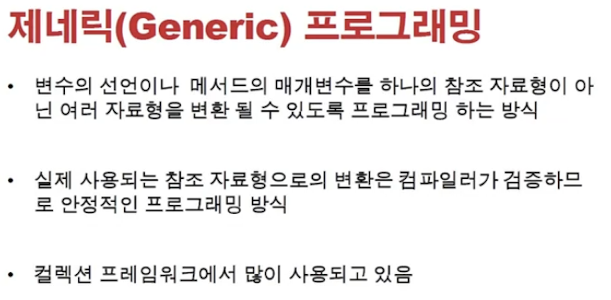
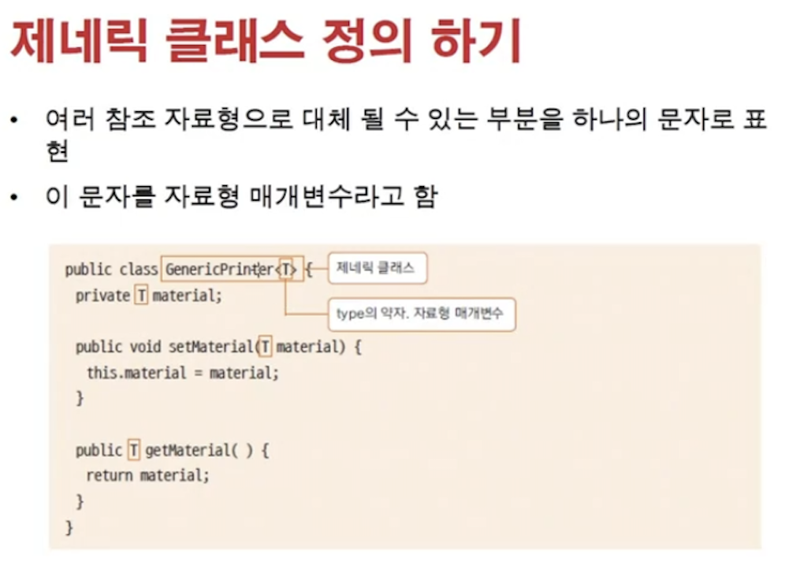
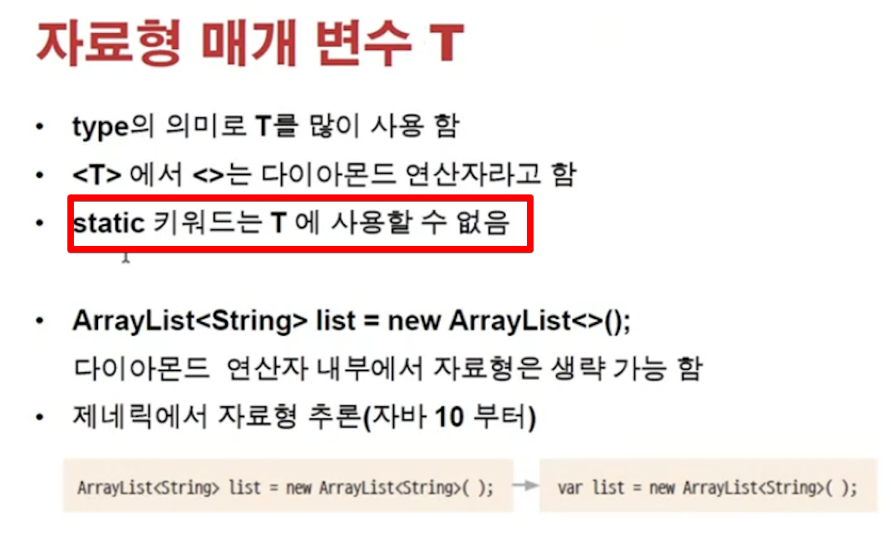
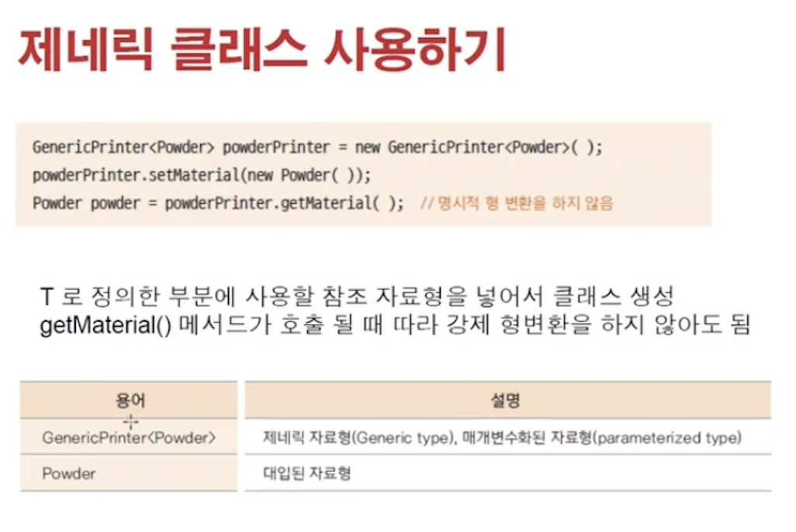
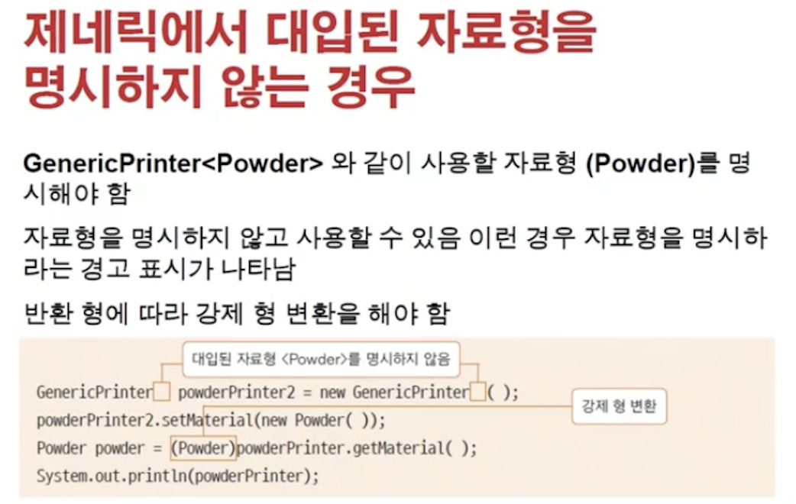
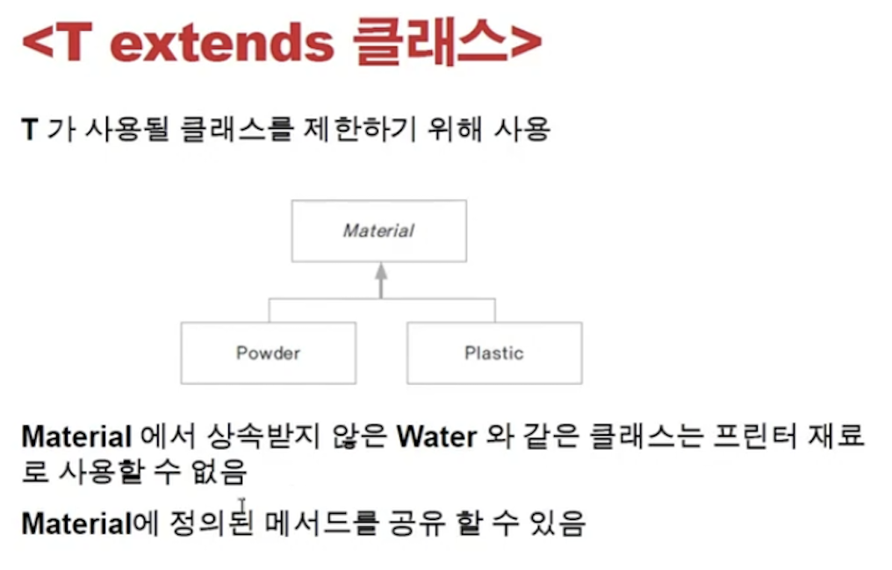
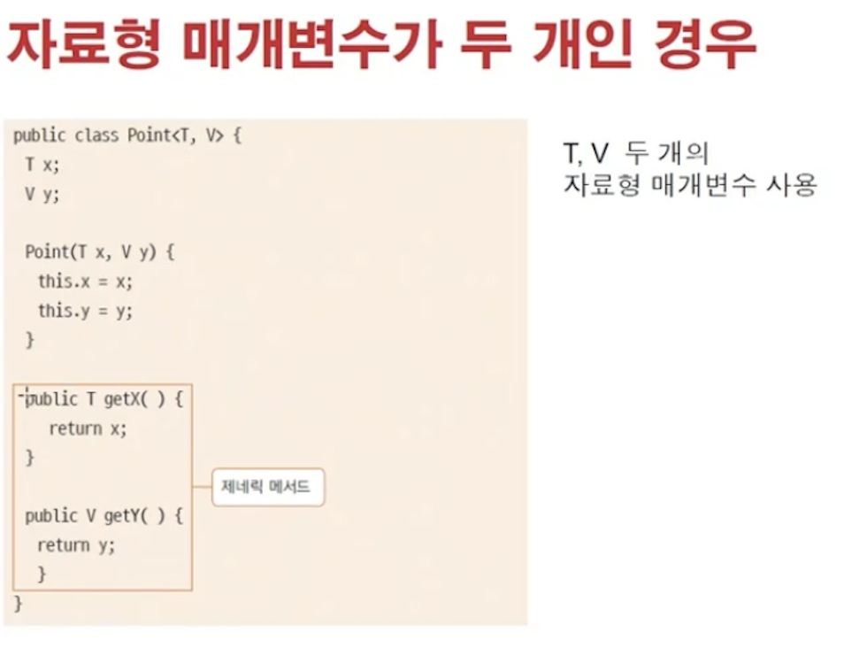
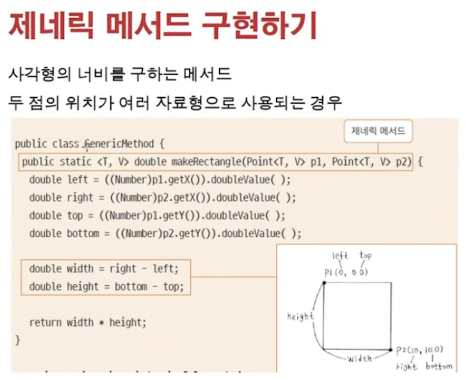
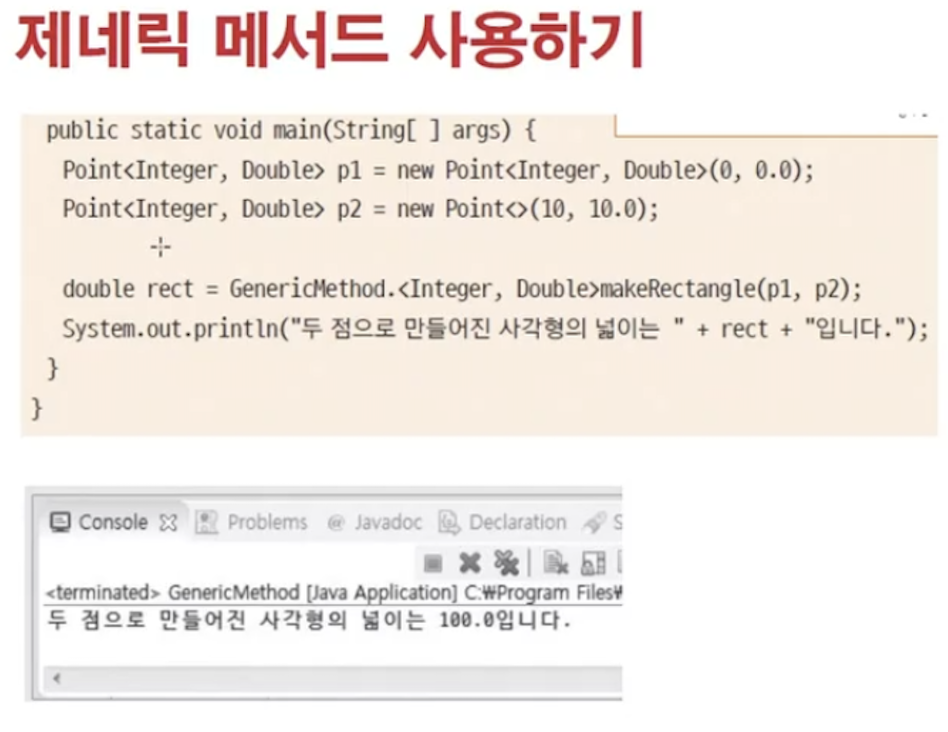

<link href="../../md/style.css" rel="stylesheet">

# 제네릭 프로그래밍



- 여러 자료형이 변환될 수 있도록 프로그래밍 하는 방식
- 컴파일러가 검증
- 어떤 타입을 받는지, 그리고 그 타입에 대해서 구현하도록 하는, 여러 타입을 받을 수 있도록 하는 방식

## 1) Syntax



- 자료형도 변수로 받는 프로그래밍 기법이라고 보면 됨
- Example

  - JAVA

    ```JAVA
      public class ThreeDimensionGeneric<T> {

          // 자료형 매개변수 받기
          private T material;

          public static void main(String[] args) {
              ThreeDimensionGeneric<Powder> printer = new ThreeDimensionGeneric<Powder>(); // 이렇게 타입을 명시해주어서 사용해야 함
              printer.setMaterial(new Powder());

              Powder powder = printer.getMaterial();
          }

          public T getMaterial() {
              return this.material;
          }

          public void setMaterial(T material) {
              this.material = material;
          }

      }
    ```

## 2) 특정 타입만 허용

- extend를 활용
- Abstract 활용하여 하위 상속 클래스에서 추가 기능을 구현하여, 제너릭 내부 외부에서 사용할 수도 있음
- Example

  - JAVA

    ```JAVA
      public class ThreeDimensionGeneric<T extends Material> { // 이부분 추가하여 Material 상속받은 타입만 오도록 제한

          // 자료형 매개변수 받기
          private T material;

          public static void main(String[] args) {
              ThreeDimensionGeneric<Powder> printer = new ThreeDimensionGeneric<Powder>();
              printer.setMaterial(new Powder());

              Powder powder = printer.getMaterial();
          }

          public T getMaterial() {
              return this.material;
          }

          public void setMaterial(T material) {
              this.material = material;
          }

      }
    ```

## 3) 제너릭 타입의 특징



- Static은 동적으로 T가 사용되기 때문에 사용할 수 없음, 받는 순간 결정되는 param같은 것

<br>



<br>



<br>



<br>



## 3) 제너릭 예시



<br>


