<link href="../../md/style.css" rel="stylesheet">

# 컬렉션 프레임워크

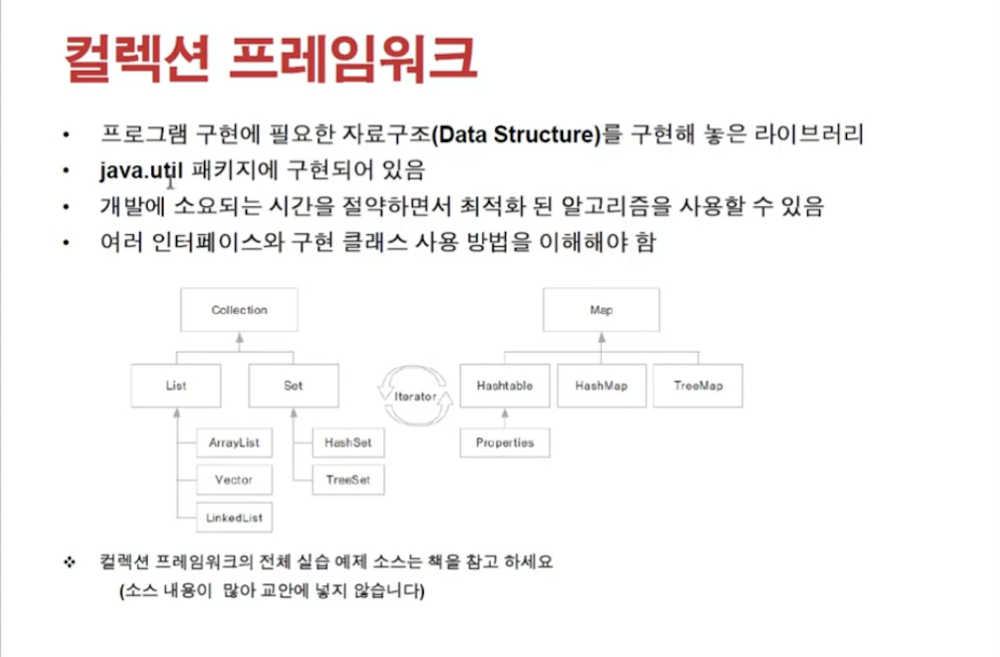

## 1) Array

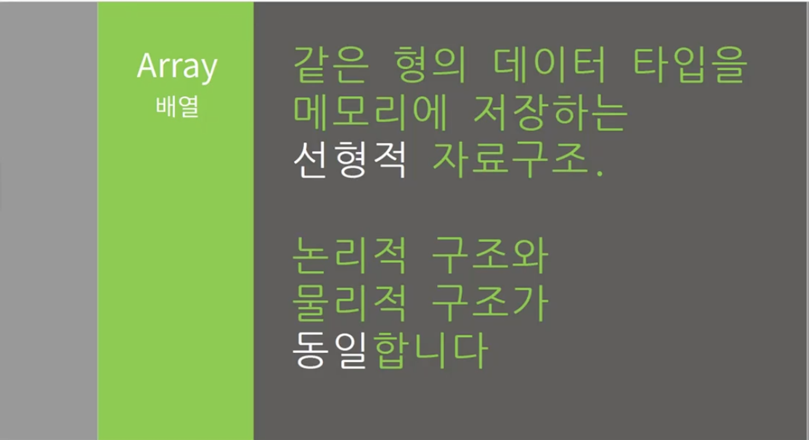
<br>
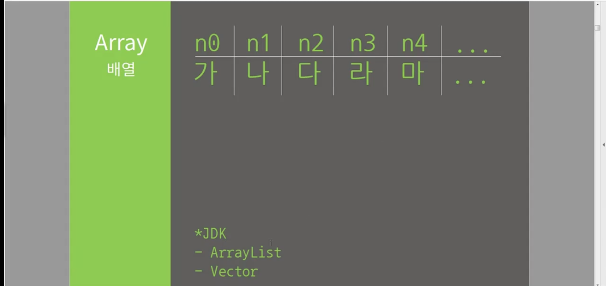

- 자료가 4byte씩 붙어서 존재
- Index가 유일무의한 값으로 index 값이 의미가 있음
- Access 는 O(1) : indexing이 매우 빠름 - list마냥 for문으로 탐색하지 않아도 됨
- 삭제를 하면 해당 메모리가 낭비됨(맨 처음 선언시 정해진 크기만큼 붙어서 메모리에 할당되므로)
- 만약 자료를 추가해야한다면(새 영역에): 다른 부분에 array선언하고 복사해서 넓어진 것으로 활용해야 함

## 2) ArrayList

- 이전은 Vector를 사용하였음 - Thread에 사용되는 것
- Array와 동일하게 동작하나 가변성이 있음

## 3) LinkedList

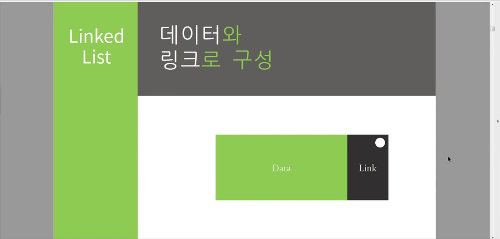
<br>
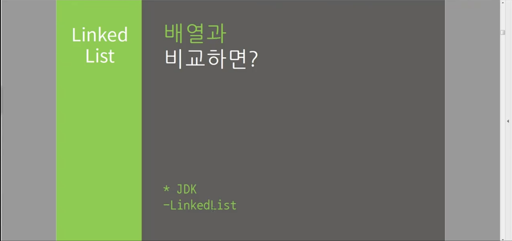

- 메모리를 포인터 형식으로 링크를 걸어 데이터 삽입 삭제가 용이하게 된 것
- 탐색에 최악 O(n)이 소요
- Array와의 차이점
  1. 삽입 삭제가 용이 -> IO 빈번하면 사용!
  2. 크기를 설정하고 사용하는 것이 아님, 노드끼리 address를 서로 가르킴 : 메모리상에서 떨어져서 존재

## 4) Stack & Queue

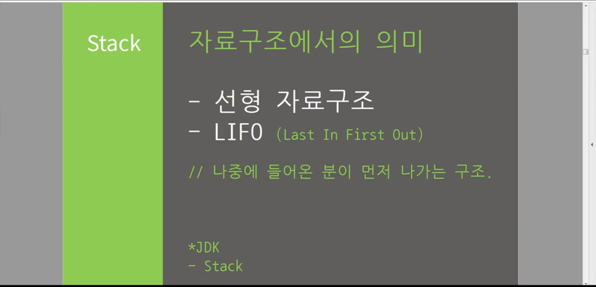

- 참조 (JDK Stack 클래스 사용시)

  - Peek 스택 맨위 원소 반환
  - Push / Pop + Pop에 없을 때 pop인 경우 underflow 주의

- 참조 (JDK Queue 클래스 사용시)

  - Queue는 ArrayList, Vector, LinkdedList 등을 활용

- 배열 or LinkedList를 사용(라이브러리 사용하는 Python과 다른 점인데, 직접구현해서 사용하는게 기본인듯) -> JDK에서 제공도 됨
- push / pop 사용

  - ArrayList
    1. Add : 맨 뒤에 삽입
    2. Remove
       1. (ArrayList.size - 1) : 맨뒤 Remove
       2. (0) : 맨 앞 Remove

- LIFO 구조
- 가장 최근 정보 참조할 때 사용

## 5) Binary Tree

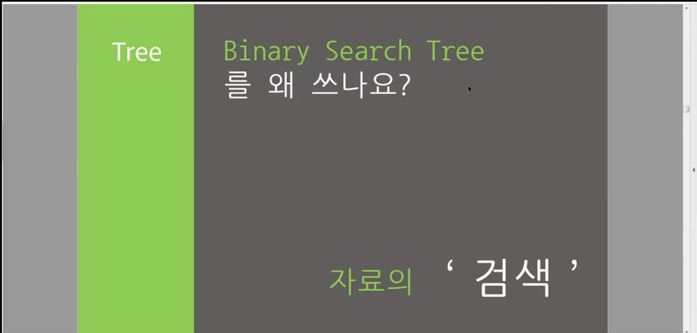
<br>
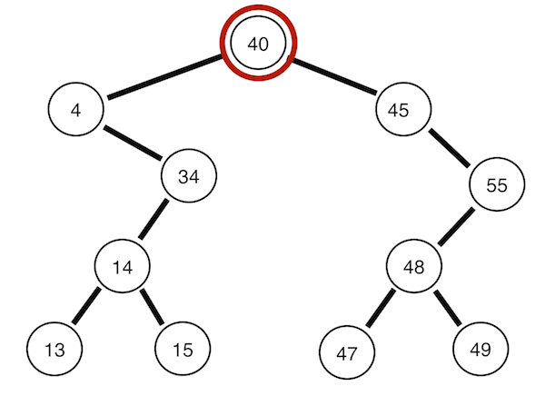
<br>
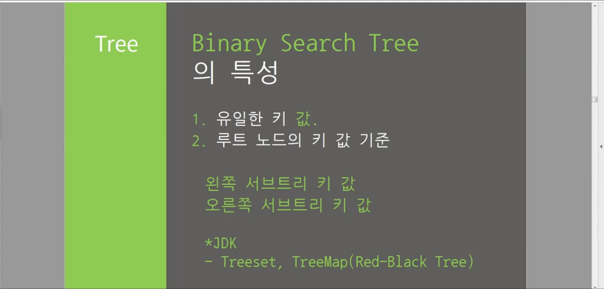

- **`검색을 위한 자료구조!`**
- **`탐색 방법중 다음이 있음 : In-Order, Pre-Order, Post-Order 의 3개 Traverse 방식이 있음`**

```Python
  class BinarySearchTree(object):
      ...
      def pre_order_traversal(self):
          def _pre_order_traversal(root):
              if root is None:
                  pass
              else:
                  print(root.data)
                  _pre_order_traversal(root.left)
                  _pre_order_traversal(root.right)
          _pre_order_traversal(self.root)

  class BinarySearchTree(object):
      ...
      def in_order_traversal(self):
          def _in_order_traversal(root):
              if root is None:
                  pass
              else:
                  _in_order_traversal(root.left)
                  print(root.data)
                  _in_order_traversal(root.right)
          _in_order_traversal(self.root)

```

- [참조 링크](http://ejklike.github.io/2018/01/09/traversing-a-binary-tree-2.html)

- O(log(N)), 최악 O(N)
- Binary 트리
  - 잎의 개수가 최대 2개인 경우
  - 중복을 허용햐지 않고, 큰 수를 오른쪽 또는 왼쪽에 맞춰서 Leaf가 달리도록 구성
- Tree의 데이터가 치우치는경우, LinkedList와 동일해질 수 있음

## 6) Hashmap

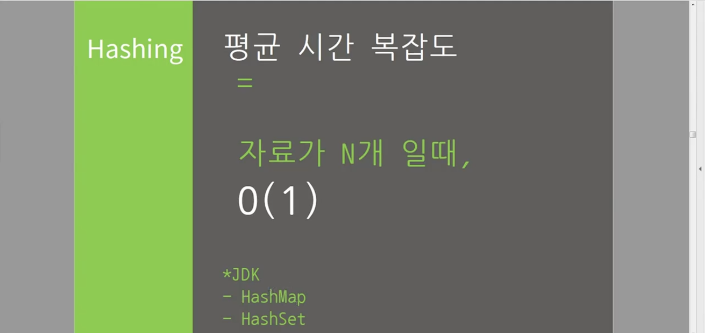
<br>
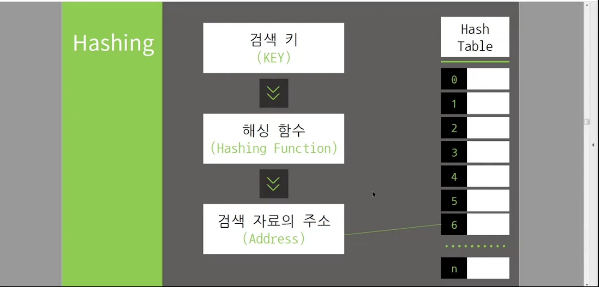

- hashFunction으로 key를 사용하여 index를 생성 이후 값을 출력
- 이 값을 index로 하여 value를 저장해주고, 이때 table은 array로 사용
- O(1)
