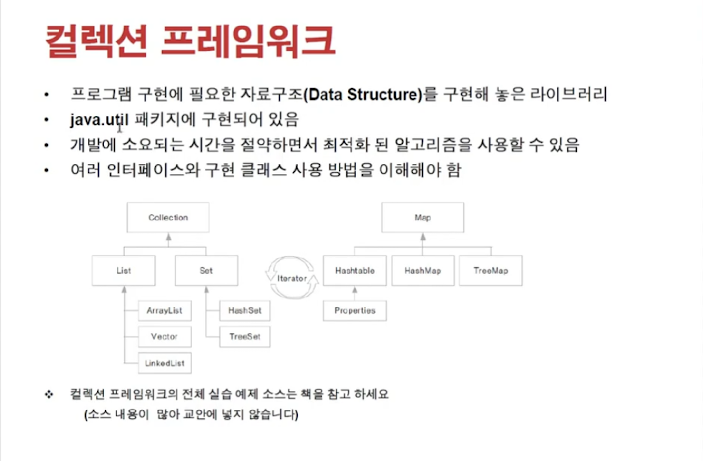
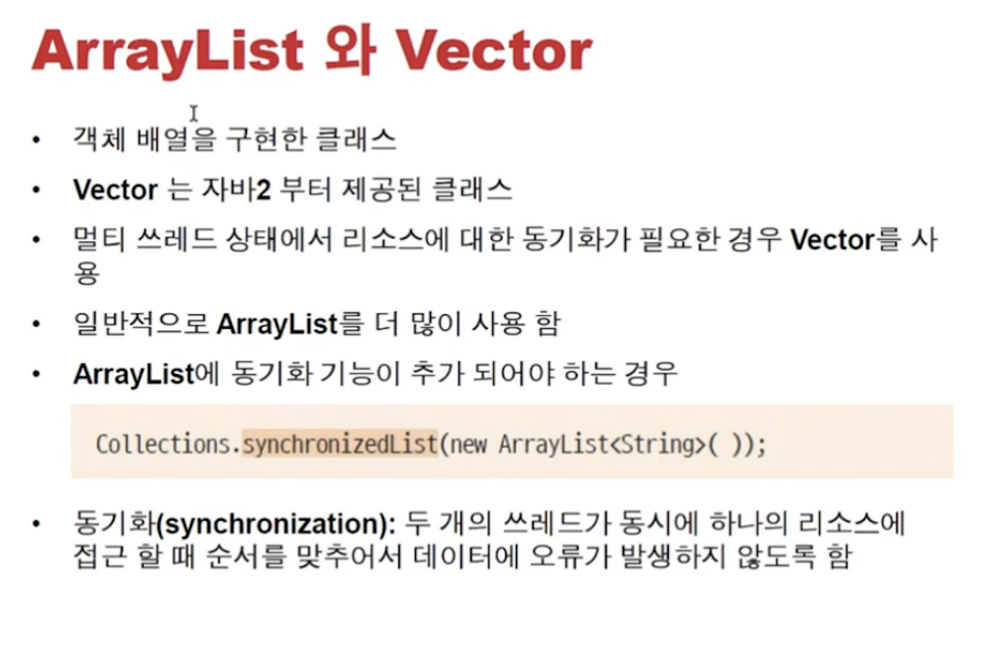

<link href="../../md/style.css" rel="stylesheet">

# ArrayList 컬렉션 프레임워크



- 선형자료구조(단일 객체 관리)

  - Tree : 데이터 검색, Red-Black tree로 구현되어서 tree의 균형을 잘 잡도록 함

  1. List
     - 단일 객체들을 이어서 관리
     - 앞/뒤의 요소가 1대1로 관리됨

  2) Set

  - 단일 객체인 자료가 집합으로 관리
  - 중복되는 요소가 없음
  - 유일데이터 관리에 자주 사용; ID, 사번 등

- 쌍자료구조(key value Pair)

  1. Map
     - hashTable : 동기화 지원 hash
     - hashMap : 그냥 hash, 동기화 없음
     - Properties : File에서 읽어서 key,value pair로 저장할 수 있는 방식; Configuration을 읽을 때 주로 사용(I/O와 주로 관련)

- 이 모든 방식은 Iterator로 access하여 순회할 수 있음
  - For 말고 다른 접근 방식임!

## 1) Collection 인터페이스


<br>


### List 인터페이스


- 몇번째 객체값인지 get으로 access 가능
- 배열 구현학 위함

#### a) ArrayList와 Vector 클래스



- Example

  - JAVA

    ```JAVA

      public class Member {


          private int memberID;
          private String memberName;

          public Member(int memberID, String memberName) {
              this.memberID = memberID;
              this.memberName = memberName;
          }

          public int getMemberID() {
              return memberID;
          }

          public void setMemberID(int memberID) {
              this.memberID = memberID;
          }

          public String getMemberName() {
              return memberName;
          }

          public void setMemberName(String memberName) {
              this.memberName = memberName;
          }

          @Override
          public String toString() {
              return "회원님의 ID 는 " + this.memberID + "," + "이름은 " + this.memberName + "입니다.";
          }
      }


      public class MemberArrayList {

          ArrayList<Member> arrayList;

          public MemberArrayList() {
              this.arrayList = new ArrayList<Member>();

          }

          public void addMember(Member member) {
              this.arrayList.add(member);
          }

          public boolean removeMemberByID(int memberID) {
              // for문으로 처리해도 무방
              // arrayList.removeIf(member -> member.getMemberID() == memberID);
              for (int i = 0; i < arrayList.size(); i++) {

                  Member tempMember = arrayList.get(i);
                  if (tempMember.getMemberID() == memberID) {
                      arrayList.remove(i);
                      return true;
                  }
              }
              System.out.println("Member not existing!");
              return false;
          }

          public void showAll() {
              for (Member member : arrayList) {
                  System.out.println("member = " + member);
              }
              System.out.println("arrayList = " + arrayList);
          }

      }

    ```

  - Result - Terminal

    ```TEXT
      member = 회원님의 ID 는 1,이름은 member1입니다.
      member = 회원님의 ID 는 3,이름은 member3입니다.
      arrayList = [회원님의 ID 는 1,이름은 member1입니다., 회원님의 ID 는 3,이름은 member3입니다.]
    ```

- ArrayList 동기화 기능 필요한 경우
  - ```JAVA
    Colections.synchronizedList(new ArrayList<String>());
    ```
    등을 사용
  - 멀티 쓰레드 환경에서 발생
  - OS의 Scheduler가 스레드가 공유하는 메모리를 관리해주는데, 이때 관리받을 수 있도록 프로그램 영역 안에서 처리해주는 방법
  - Lock을 거는 것을 의미
  - **`일반 클래스에서 메서드에 마찬가지 작업을 하기 위해서는 제한자 옆에 synchronized 를 명시해주면 됨`**
    - 안드로이드에서는 화면 제어 및 Control 영역이 두개 있기 때문에 종종 씀
    - 웹 프로그래밍 영역에서는 web-server가 이 스레드 영역을 알아서 처리해주므로, 크게 쓸일이 없음!

#### b) LinkedList 클래스


#### c) Stack과 Queue


<br>
<br>

## 2) Map 인터페이스


<br>

