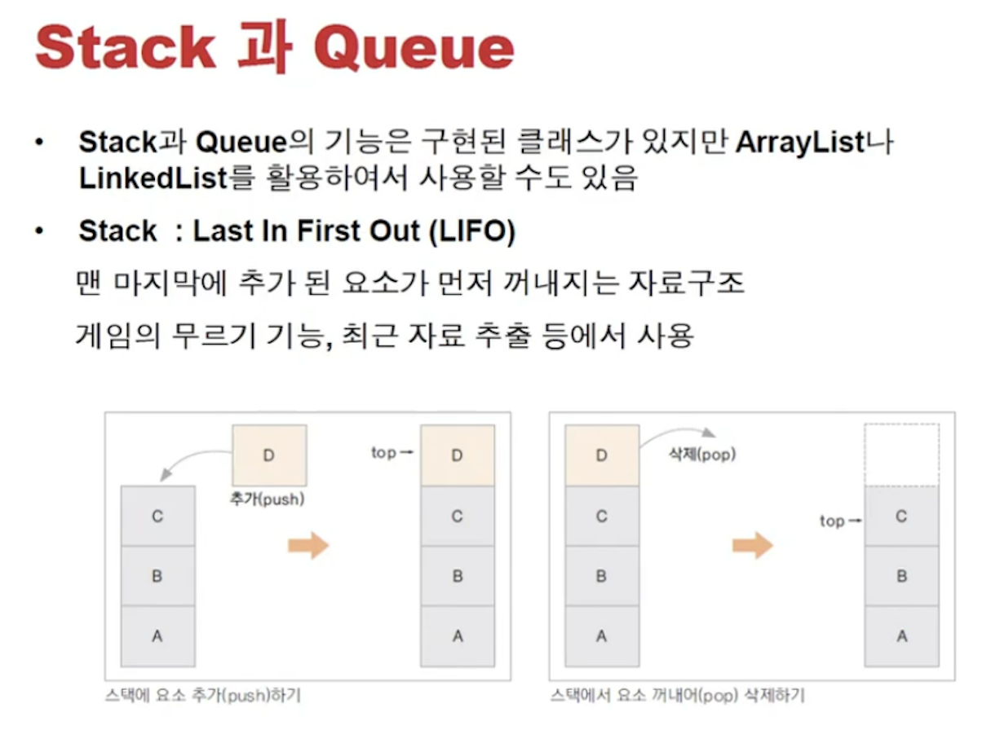
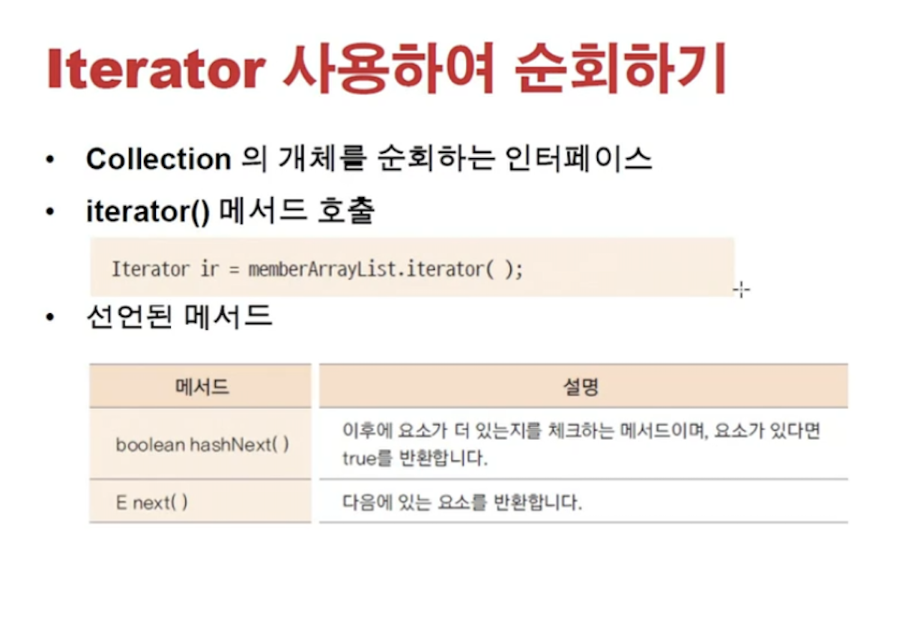
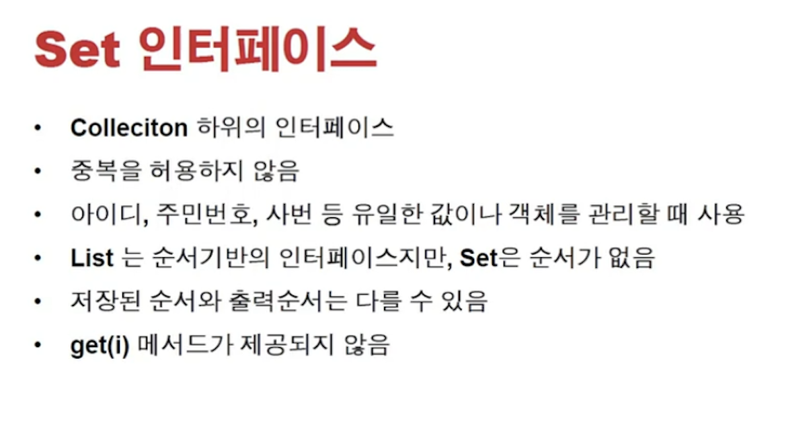

<link href="../../md/style.css" rel="stylesheet">

# Stack 과 Queue

## 1) Stack



- Example

  - JAVA

    ```JAVA

      public class StackEx {

          private ArrayList<String> arrayStack;

          public StackEx() {
              this.arrayStack = new ArrayList<String>();
          }

          public void push(String data) {
              this.arrayStack.add(data);
          }

          public String pop() {
              if (!this.arrayStack.isEmpty()) { //underflow 방지
                  String popData = this.arrayStack.remove(this.arrayStack.size() - 1);
                  return popData;
              } else {
                  System.out.println("No items exist!");
                  return null;
              }
          }

          public void showAll() {
              for (String s : arrayStack) {
                  System.out.println("s = " + s);
              }
              System.out.println("arrayStack = " + arrayStack);
          }
      }

      @Test
      void push() {

          stackEx.showAll();
          stackEx.push("Push Example");
          stackEx.showAll();
      }

      @Test
      void pop() {
          stackEx.showAll();
          stackEx.pop();
          stackEx.showAll();
      }
    ```

  - Result - Terminal

    ```TEXT
      s = Hi1
      s = Hi2
      s = Hi3
      arrayStack = [Hi1, Hi2, Hi3]
      s = Hi1
      s = Hi2
      s = Hi3
      s = Push Example
      arrayStack = [Hi1, Hi2, Hi3, Push Example]


      s = Hi1
      s = Hi2
      s = Hi3
      arrayStack = [Hi1, Hi2, Hi3]
      s = Hi1
      s = Hi2
      arrayStack = [Hi1, Hi2]
    ```

## 2) Queue

- Example

  - JAVA

    ```JAVA

      public class QueueEx {
          private ArrayList<String> arrayQueue = new ArrayList<>();

          public void enQueue(String data) {

              arrayQueue.add(data);
          }

          public String deQueue() {
              if (arrayQueue.isEmpty()) {
                  return null;
              } else {
                  return arrayQueue.remove(0);
              }
          }

          public void showAll() {
              for (String s : arrayQueue) {
                  System.out.println("s = " + s);

              }
              System.out.println("arrayQueue = " + arrayQueue);
          }
      }


      class QueueExTest {
          QueueEx queueEx = new QueueEx();

          @BeforeEach
          void setUp() {
              queueEx.enQueue("Data1");
              queueEx.enQueue("Data2");
              queueEx.enQueue("Data3");
          }

          @Test
          void enQueue() {
              queueEx.showAll();
              queueEx.enQueue("enQueueData1");
              queueEx.showAll();
          }

          @Test
          void deQueue() {
              queueEx.showAll();
              String tmpDeque = queueEx.deQueue();
              queueEx.showAll();
              Assertions.assertEquals(tmpDeque, "Data1");
          }
      }
    ```

  - Result - Terminal
    ```TEXT
      s = Data1
      s = Data2
      s = Data3
      arrayQueue = [Data1, Data2, Data3]
      s = Data1
      s = Data2
      s = Data3
      s = enQueueData1
      arrayQueue = [Data1, Data2, Data3, enQueueData1]
      s = Data1
      s = Data2
      s = Data3
      arrayQueue = [Data1, Data2, Data3]
      s = Data2
      s = Data3
      arrayQueue = [Data2, Data3]
    ```

## 3) Iterator



- Collection 순회용
- List 인터페이스가 있는 애들; ArrayList, LinkedList, Array 등은 for로 순회가 됨
- 하지만 Set 같은 경우는 List 인터페이스 없어서 순회가 안됨!

  - 이 경우 get 메서드가 없음..!
  - 중복을 허용하지 않고, hash 방식으로 구현 -> **`이 종류를 순회할 때 iterator 를 사용!`**

- Example

  - JAVA

    ```JAVA
      public boolean removeMemberByIdIterator(int memberId) {
          Iterator<Member> iterator = arrayList.iterator(); // 제너릭으로 Object대신, 가진 item의 타입을 받음
          while (iterator.hasNext()) {
              Member member = iterator.next(); // item 가져오는 부분
              int tempMemberId = member.getMemberID();

              if (memberId == tempMemberId) {
                  arrayList.remove(member);
                  return true;
              }
          }
          System.out.println("Member not existing!");
          return false;
      }
    ```

  - Result - Terminal
    ```TEXT
      member = 회원님의 ID 는 1,이름은 member1입니다.
      member = 회원님의 ID 는 2,이름은 member2입니다.
      member = 회원님의 ID 는 3,이름은 member3입니다.
      arrayList = [회원님의 ID 는 1,이름은 member1입니다., 회원님의 ID 는 2,이름은 member2입니다., 회원님의 ID 는 3,이름은 member3입니다.]
      member = 회원님의 ID 는 1,이름은 member1입니다.
      member = 회원님의 ID 는 3,이름은 member3입니다.
      arrayList = [회원님의 ID 는 1,이름은 member1입니다., 회원님의 ID 는 3,이름은 member3입니다.]
    ```

## 4) Set -> HashSet



- Collection Iterator로 접근해야 함
  - Iterator 접근은 while / for 로 수행
- 근데 또 구현을 보면 그냥 for/while로 접근해도 무방한듯?
- Example

  - **`hashSet은 내가 구현한 class에 대해서 Equals, hashCode를 꼭 overriding 할것!`**
  - String 같은 기존 class는 구현이 되어있으므로, 추가 구현 필요는 없음, 만든 클래스에 대해서 구현할 것!

  - JAVA

    ```JAVA

      public class Member {


          private int memberID;
          private String memberName;

          public Member(int memberID, String memberName) {
              this.memberID = memberID;
              this.memberName = memberName;
          }

          public int getMemberID() {
              return memberID;
          }

          public void setMemberID(int memberID) {
              this.memberID = memberID;
          }

          public String getMemberName() {
              return memberName;
          }

          public void setMemberName(String memberName) {
              this.memberName = memberName;
          }

          @Override
          public int hashCode() {
              return memberID; //UUID.randomUUID().hashCode();
          }

          @Override
          public boolean equals(Object obj) {
              if (!(obj instanceof Member)) { // 멤버값인지 먼저 체크해야 함!
                  return false;
              } else {
                  return ((Member) obj).memberID == this.memberID; // downCasting!
              }
          }

          @Override
          public String toString() {
              return "회원님의 ID 는 " + this.memberID + "," + "이름은 " + this.memberName + "입니다.";
          }
      }

      ...

      public class MemberHashSet {
          /*
          * HashSet의 add : 중복이면 메서드가 false return, 없는 값일 경우 true return
          * */
          private HashSet<Member> hashSet;

          public MemberHashSet() {
              this.hashSet = new HashSet<Member>();
          }


          public void addData(Member member) {

              this.hashSet.add(member);
          }

          public boolean removeData(Member member) {
              return false;
          }


          public void showAll() {
              for (Member member : hashSet) {
                  System.out.println("member = " + member);
              }
              System.out.println("hashSet = " + hashSet);
          }

      }

    ```
