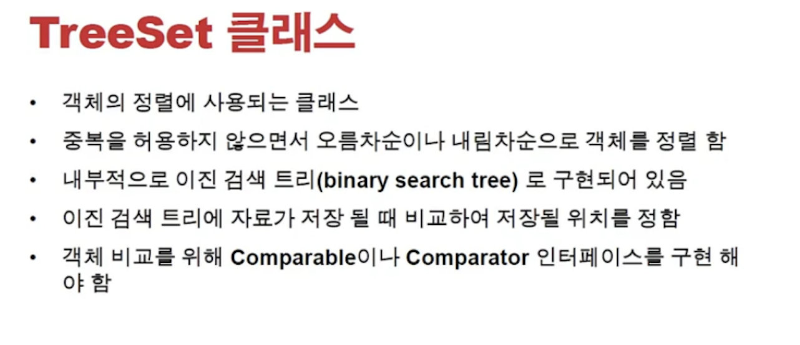
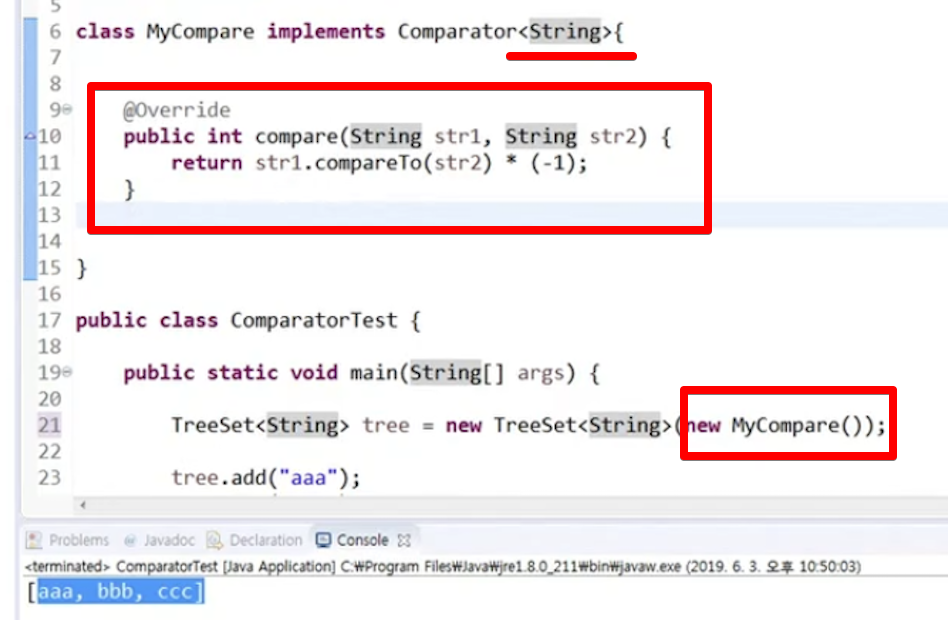
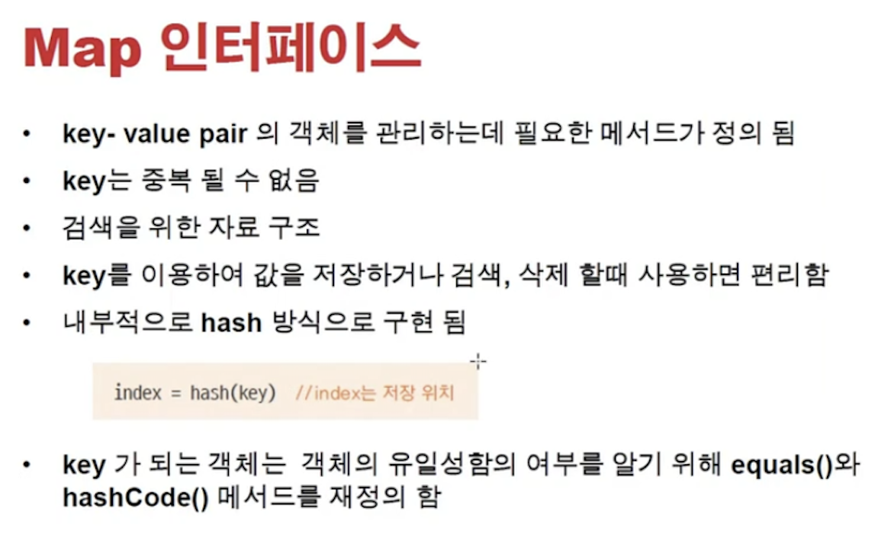
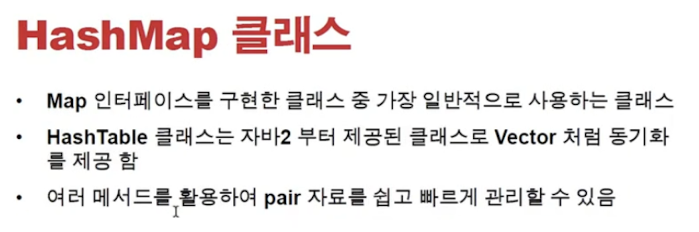
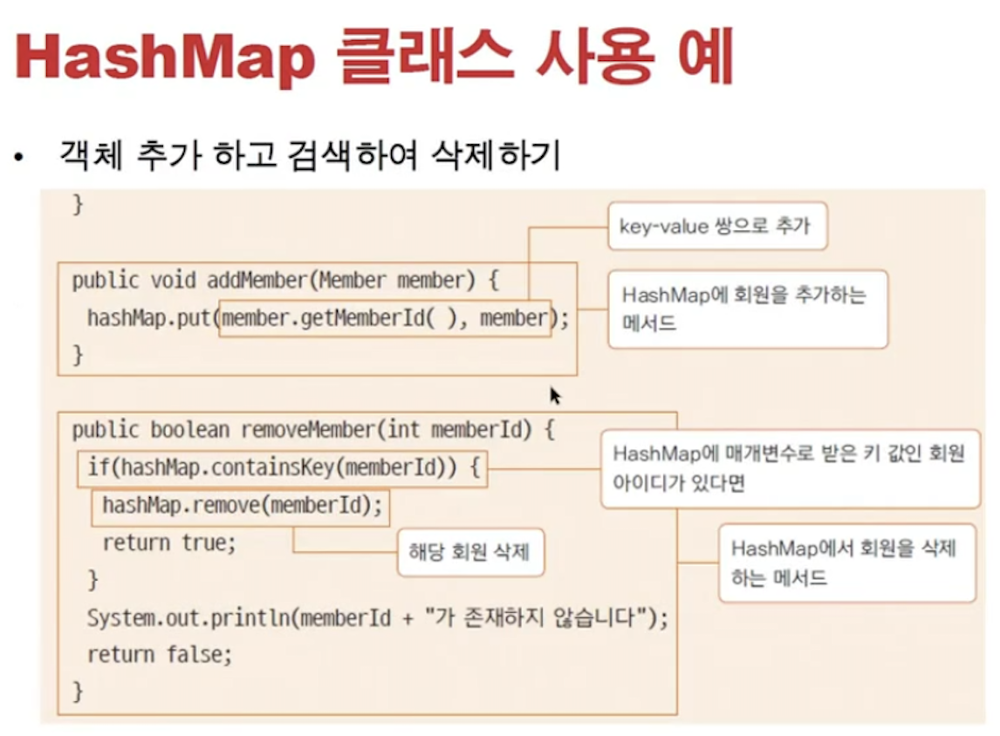
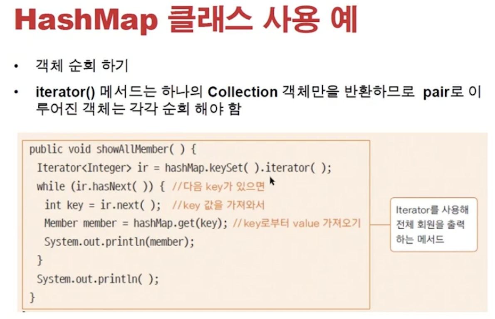
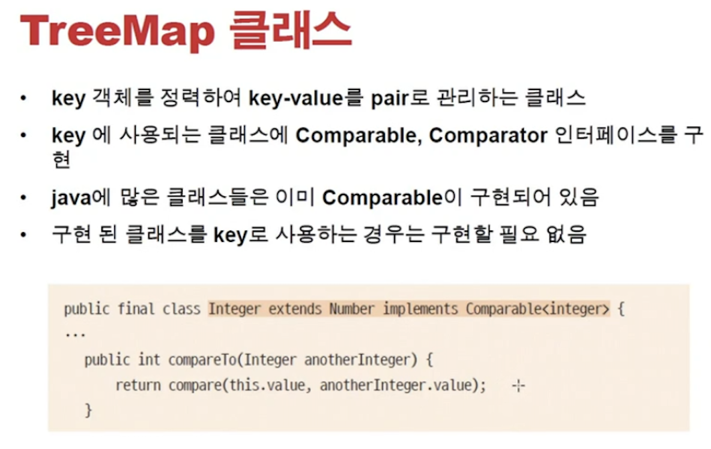

<link href="../../md/style.css" rel="stylesheet">

# TreeSet, HashMap, TreeMap

## 1) TreeSet 클래스



- Comparable을 추가해주어야 함!
- **`Key값이 비교가 되어야 Tree형식으로 넣을 수 있으므로 -> 다음과 같이 구현해야 함`**
- Example

  - String 값을 사용하는 경우, Compareable이 이미 구현되어있음
  - 즉, 내가 만든 Class에서 hash"Tree" 사용할 때 구현해주어야 함
  - Comparator는 반드시 compare를 overriding 해주어야 함
  - **`둘중 하나 쓰면 되는데, 나는 Comparable이 더 나은 implementation인듯!`** <br>
    **`-> 또 사용하는 다른 이유 : 이미 Compareable이 있는 클래스 경우 Comparator를 구현하여 비교 자체를 overriding할 수 있음`** <br>
    

    - 이미 String 클래스는 Comparable이 구현된 클래스
    - 여기에서 Comparator를 implement하여 비교를 overriding 하기!

  - JAVA

    ```JAVA
      public class Member implements Comparable<Member>, Comparator<Member> { // Member 제네릭으로 CompareTo에서 Object가 아닌, Member로 넘어오도

      ...

      @Override
      public int compareTo(Member member) { // 이부분을 overriding 해줄 것, 비교부분을 구현하는 것

          return (this.memberID - member.memberID); // "현재가 크고, 양수가 반환되면 오름차순으로 구성됨" -> tree root가 가장 크도록
          // return (this.memberId - member.memberId) *  (-1); // "현재가 크고, 음수가 반환되면 내림차순으로 구성됨" -> tree root가 가장 작도록
          // return (this.memberName.compareTo(member.memberName)); // String으로 된 것의 오름차순(기본)
          // return (this.memberName.compareTo(member.memberName) * (-1)); // String으로 된 것의 내림차순(기본)

      }

      @Override
      public int compare(Member o1, Member o2) { // Member now, Memeber to compare
          return o1.memberName.compareTo(o2.memberName);
      }
      }


    ```

## 2) Map 인터페이스



- key의 유일성이 필요함; Equals, hashCode 재정의가 필요
- 위는 hashSet과 동일; Value 값에 대한 판단만 함
- **`Map에서는 key, Value 두개가 들어감`**

### a) HashMap 클래스

- **`가장 많이 사용하는 경우의 클래스 -> 기억할 것!`**
- HashTable 은 Vector와 비슷하게, Thread를 지원


<br>

<br>


- 순회 iterator로 해도 되고, enhanced - for loop의 iteration 사용해도

<br>

- Example

  - JAVA

    ```JAVA

      public class MemberHashMap {

          private final HashMap<Integer, Member> hashMap;

          public MemberHashMap() {
              this.hashMap = new HashMap<Integer, Member>();
          }

          public void addMember(Member member) {
              this.hashMap.put(member.getMemberID(), member);
          }

          public boolean removeMember(int memberID) {
              if (this.hashMap.containsKey(memberID)) {
                  //this.hashMap.get(memberID); // 삭제가 아니고, 값을 가져오는 것
                  this.hashMap.remove(memberID);
                  return true;
              }

              System.out.println("Member dose not exist!");
              return false;

          }

          public void showAll() {
              for (Integer integer : hashMap.keySet()) {
                  System.out.println("hashMap.get(integer) = " + hashMap.get(integer));

              }
              System.out.println("hashMap = " + hashMap);
          }

      }

      ...

      class MemberHashMapTest {

          MemberHashMap memberHashMap = new MemberHashMap();

          @BeforeEach
          void setUp() {

              memberHashMap.addMember(new Member(1, "Member1"));
              memberHashMap.addMember(new Member(2, "Member2"));
              memberHashMap.addMember(new Member(3, "Member3"));

          }

          @Test
          void addMember() {
              System.out.println("MemberHashMapTest.addMember");
              memberHashMap.showAll();
              memberHashMap.addMember(new Member(4, "AddMember 1"));
              memberHashMap.showAll();
          }

          @Test
          void removeMember() {
              System.out.println("MemberHashMapTest.removeMember");
              memberHashMap.showAll();
              memberHashMap.removeMember(2);
              memberHashMap.showAll();
          }
      }
    ```

  - Result - Terminal

    ```TEXT
      MemberHashMapTest.removeMember
      hashMap.get(integer) = 회원님의 ID 는 1,이름은 Member1입니다.
      hashMap.get(integer) = 회원님의 ID 는 2,이름은 Member2입니다.
      hashMap.get(integer) = 회원님의 ID 는 3,이름은 Member3입니다.
      hashMap = {1=회원님의 ID 는 1,이름은 Member1입니다., 2=회원님의 ID 는 2,이름은 Member2입니다., 3=회원님의 ID 는 3,이름은 Member3입니다.}
      hashMap.get(integer) = 회원님의 ID 는 1,이름은 Member1입니다.
      hashMap.get(integer) = 회원님의 ID 는 3,이름은 Member3입니다.
      hashMap = {1=회원님의 ID 는 1,이름은 Member1입니다., 3=회원님의 ID 는 3,이름은 Member3입니다.}

      MemberHashMapTest.addMember
      hashMap.get(integer) = 회원님의 ID 는 1,이름은 Member1입니다.
      hashMap.get(integer) = 회원님의 ID 는 2,이름은 Member2입니다.
      hashMap.get(integer) = 회원님의 ID 는 3,이름은 Member3입니다.
      hashMap = {1=회원님의 ID 는 1,이름은 Member1입니다., 2=회원님의 ID 는 2,이름은 Member2입니다., 3=회원님의 ID 는 3,이름은 Member3입니다.}
      hashMap.get(integer) = 회원님의 ID 는 1,이름은 Member1입니다.
      hashMap.get(integer) = 회원님의 ID 는 2,이름은 Member2입니다.
      hashMap.get(integer) = 회원님의 ID 는 3,이름은 Member3입니다.
      hashMap.get(integer) = 회원님의 ID 는 4,이름은 AddMember 1입니다.
      hashMap = {1=회원님의 ID 는 1,이름은 Member1입니다., 2=회원님의 ID 는 2,이름은 Member2입니다., 3=회원님의 ID 는 3,이름은 Member3입니다., 4=회원님의 ID 는 4,이름은 AddMember 1입니다.}

    ```

### b) TreeMap 클래스


