<link href="../../md/style.css" rel="stylesheet">

# 내부 클래스 - 람다식

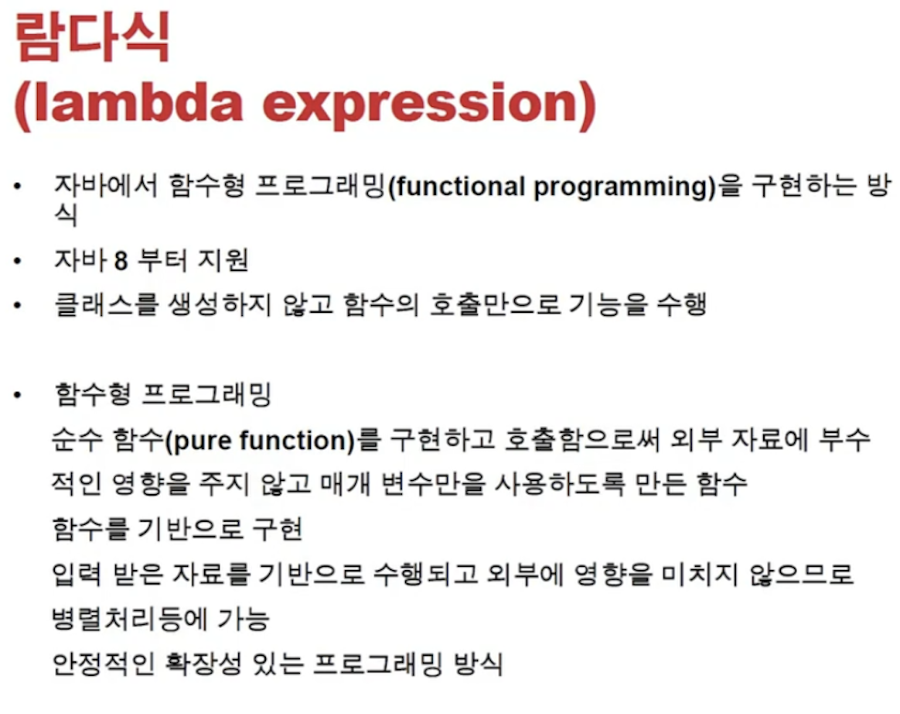
<br>
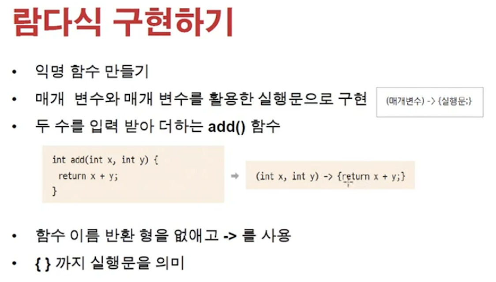

- Fuctional Programming 이 대두되면서 등장
- Java 8 이상부터 지원
- 함수식: 외부입력 데이터 상관없이 "동일한 연산"을 수행
- 복사해서 수행 후, 이를 돌려주므로, "side effect"가 없음
- **`람다식 사용 이유`**

  - **`깔끔한 코드 작성을 통해 반복적인 메서드를 클래스에서 가져오지 않고 인터페이스 + Lambda syntax로 깔끔하게 사용하기 위함`**
  - [참조 링크](https://galid1.tistory.com/509)

    > Note: 내부적으로는 익명 객체가 생성되는 과정과 동일(내부에서 자동으로 익명 클래스의 형식으로 동작)
    > 객체 없이 자바는 동작하지 않는다!
    > 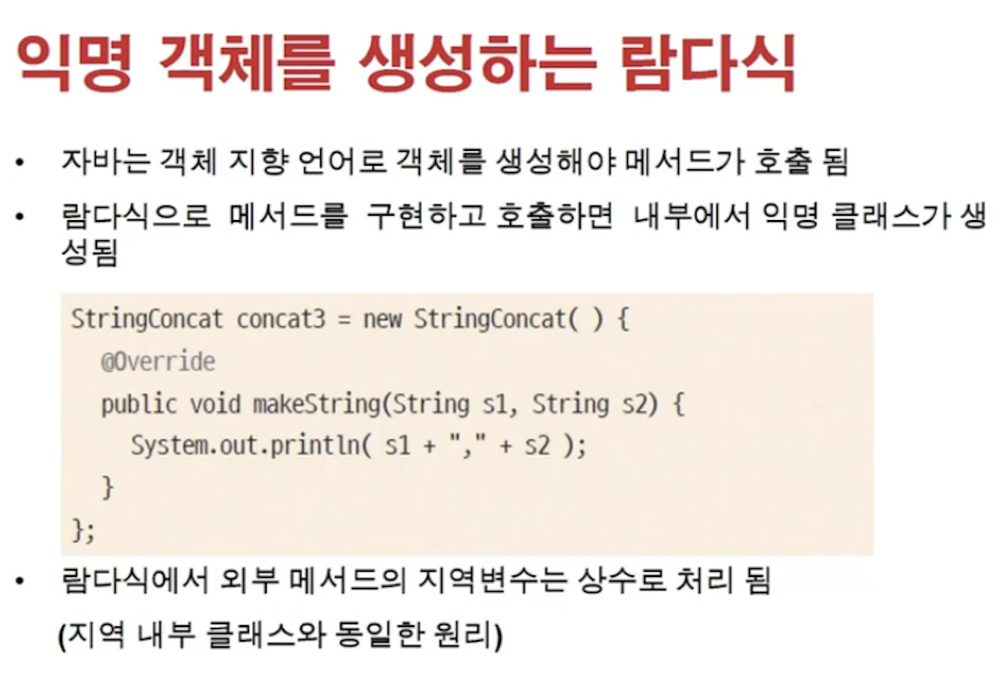

      <br>
      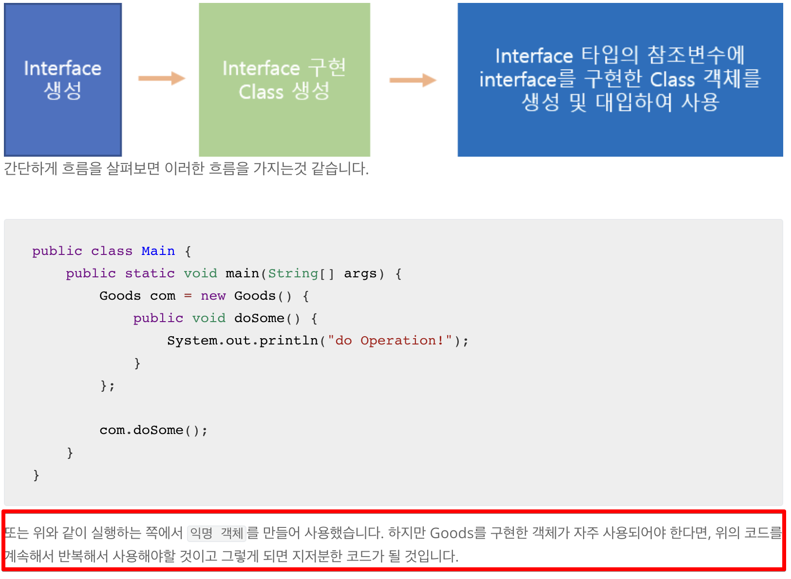
      <br>
      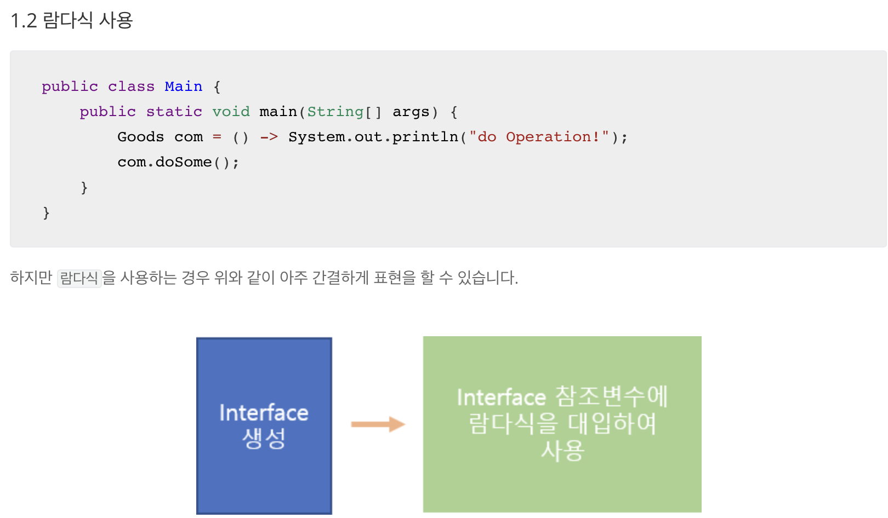
      <br>

- **`람다식을 위한 functional interface라고도 함`**

## 1) 문법

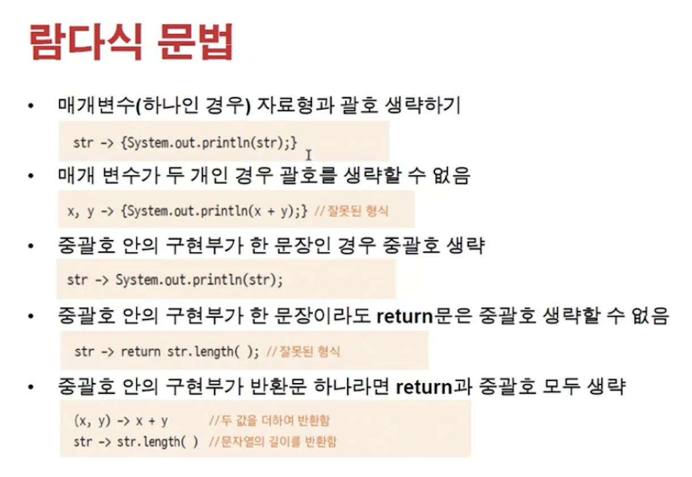
<br>
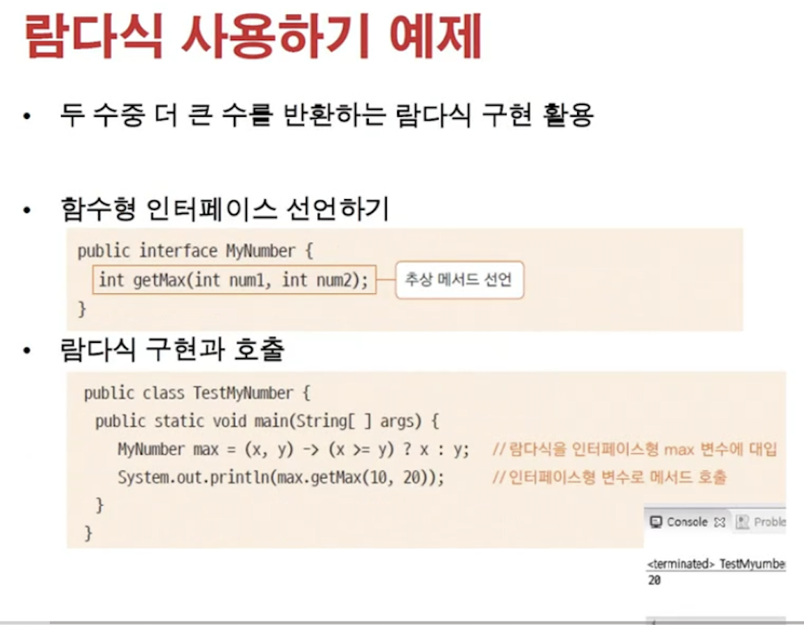

- 인터페이스에 다음을 붙여주면 여러 메서드를 추가하는 불상사를 막을 수 있음(lambda식 생성을 위해서) <br>

  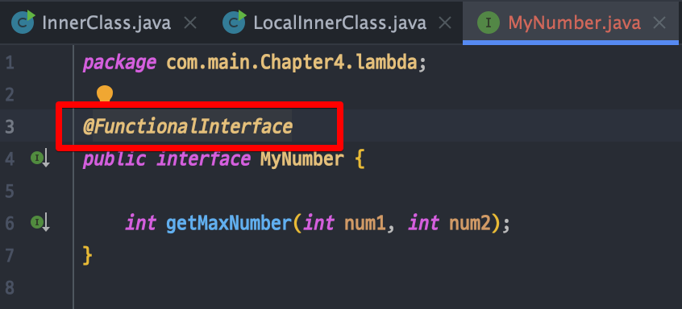

## 2) 예시

- Example

  - JAVA

    ```JAVA
      public class MyStringService {

          public static void main(String[] args) {
              MyStringService myStringService = new MyStringService();
              String tempResult = myStringService.makeString("This is ", "Java");
              System.out.println("tempResult = " + tempResult);
          }

          public String makeString(String s1, String s2) {
              StringConcat stringConcat = (str1, str2) -> str1.concat(str2);
              String stringOutput = stringConcat.makeString(s1, s2);

              System.out.println("stringOutput = " + stringOutput);
              return stringOutput;
          }
      }
    ```

  - Result - Terminal
    ```TEXT
      stringOutput = This is Java
      tempResult = This is Java
    ```

## 3) 함수형 프로그래밍 특징

<br>
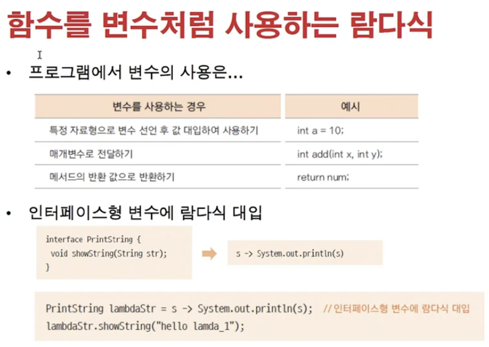
<br>
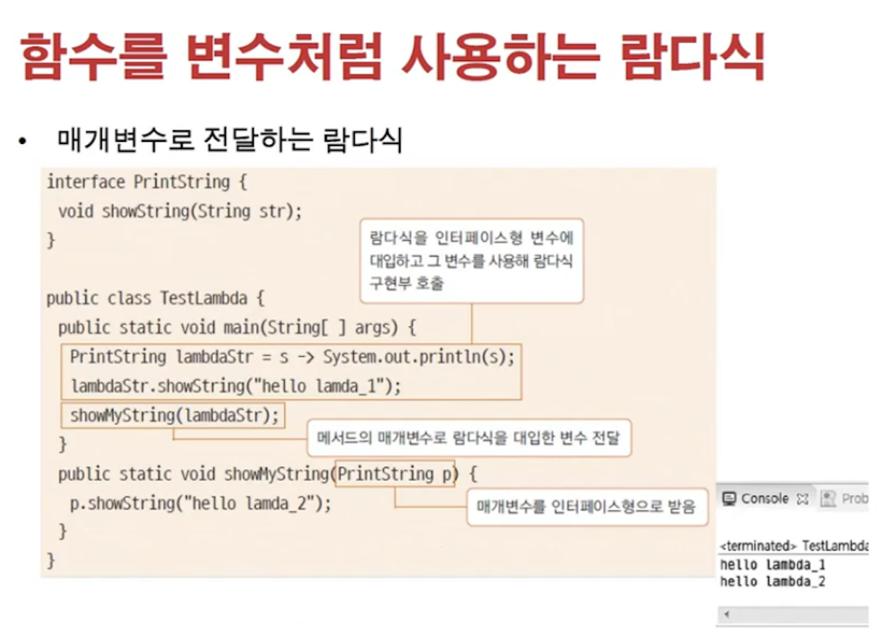
<br>
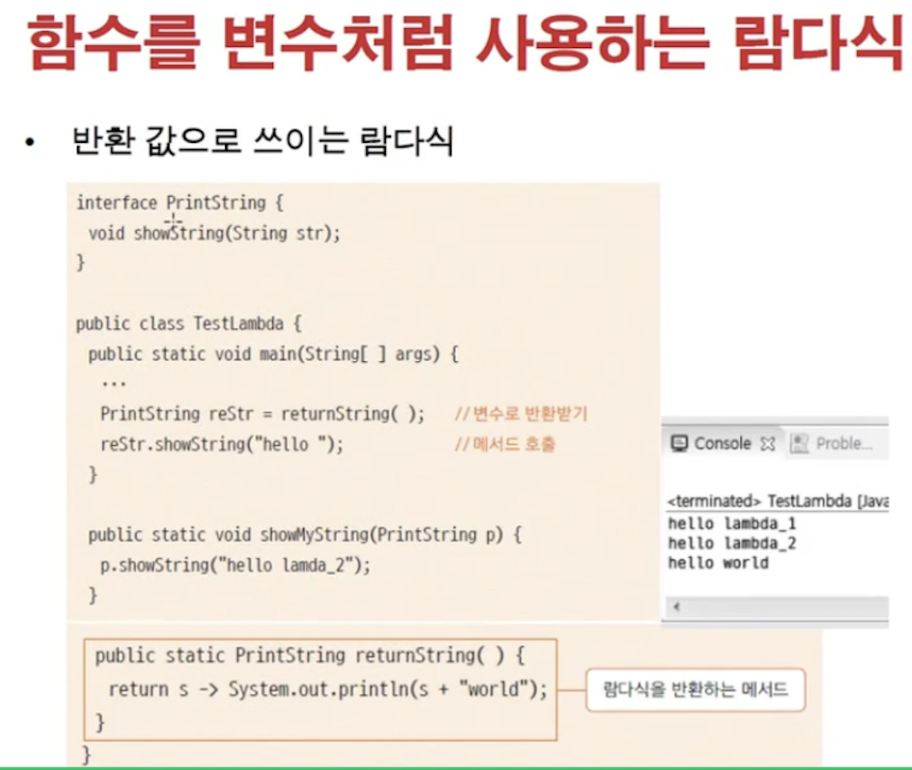
<br>

- **`인터페이스형 변수에 람다식 대입`**
- Example

  - JAVA

    ```JAVA

      interface PrintString {
          void showString(String str);
      }


      public class LambdaTest {

          public static void main(String[] args) {
              // 1) 정직한 방식
              PrintString printString = s -> System.out.println("s = " + s);
              printString.showString("TEST!");

              // 2) Lambda 생성하고 받은 후, 출력 부를 함수로 wrapping
              showMyString(printString, "hi");

              // 3) Lambda 생성 및 출력을 둘다 wrapping
              showMyString(returnPrint(), "bye");
          }

          private static void showMyString(PrintString lambda, String string) {
              // lambda를 받을 수 있음, first class citizen
              lambda.showString("TEST! - 2" + string);

          }

          public static PrintString returnPrint() {
              return s -> System.out.println("s = " + s);

          }

      }
    ```

  - Result - Terminal
    ```TEXT
      s = TEST!
      s = TEST! - 2hi
      s = TEST! - 2bye
    ```
